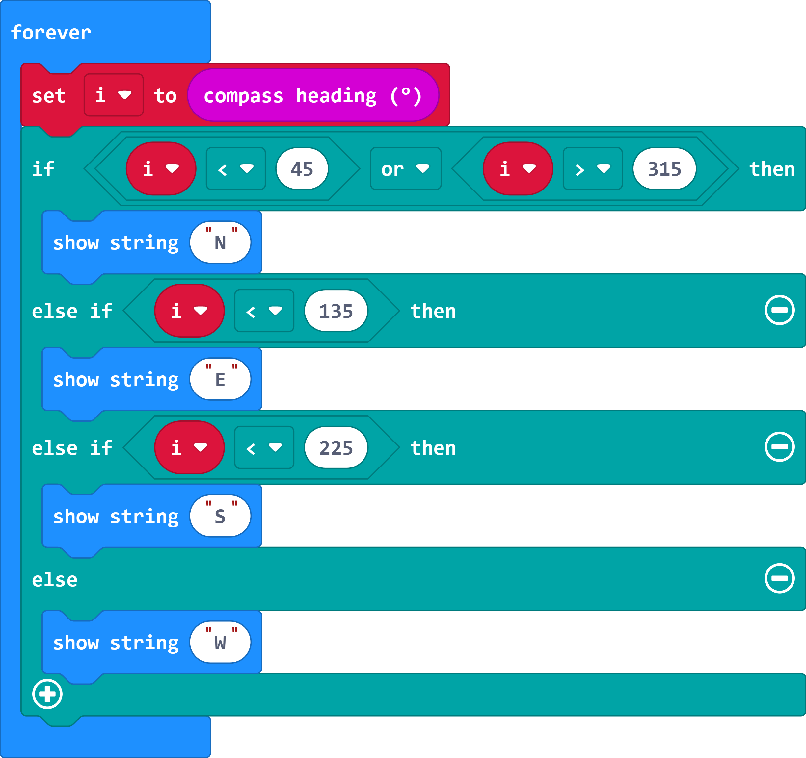

# Case 06: Compass

## Purpose

 Use the Smart Coding Kit to create a wearable compass.

## Products Link

 1 x [ELECFREAKS micro:bit Smart Coding Watch Kit](https://shop.elecfreaks.com/products/elecfreaks-micro-bit-smart-coding-watch-kit-without-micro-bit-board?_pos=2&_sid=ce4e7cb69&_ss=r)

## Software

[ MakeCodemakecode](https://makecode.microbit.org/#)

## Programming

 Save the returned value of the compass direction as varible i and judge it, if i<45 or i>315, display “N”; if i<135, display “E”; if i<225, display “S”, or display “W”.

### Link
 Link：[https://makecode.microbit.org/_9j6J7YTtyaVL](https://makecode.microbit.org/_9j6J7YTtyaVL)

 You can also download it direcly below:

    <iframe
        src="https://makecode.microbit.org/_9j6J7YTtyaVL"
        frameborder="0"
        sandbox="allow-popups allow-forms allow-scripts allow-same-origin"
        style={{
            position: 'absolute',
            width: '100%',
            height: '100%',
        }}
    />

## Result

The current direction displays on the micro:bit.

## Exploration

## FAQ

## Relevant File
