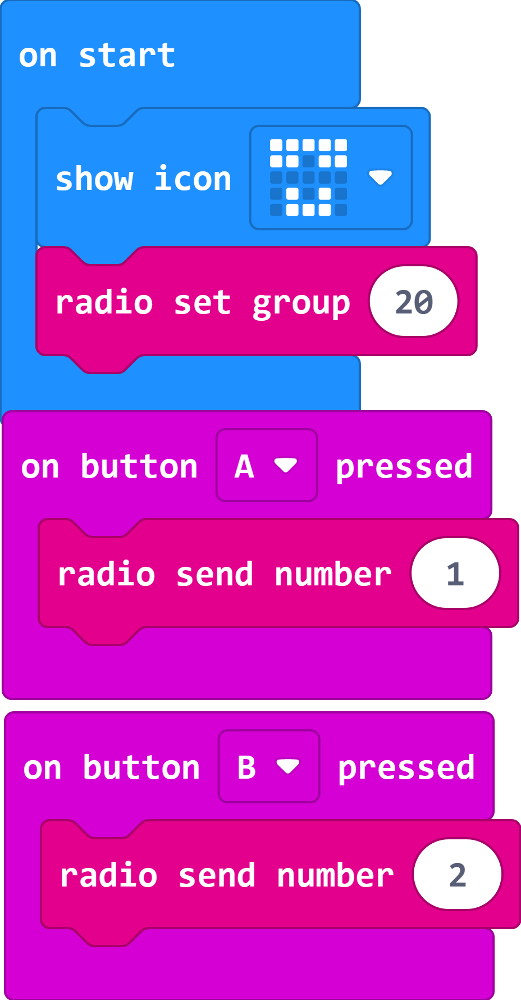
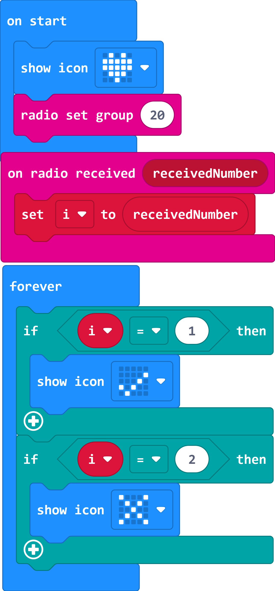

# Case 07: Wireless Communication

## Purpose

 Use the Smart Coding Kit to send signals.

## Products Link

2 x [ELECFREAKS micro:bit Smart Coding Watch Kit](https://www.elecfreaks.com/micro-bit-smart-coding-kit.html)

## Software

[MicroSoftmakecode](https://makecode.microbit.org/#)

## Programming

### Step 1
 Sending end

 Show icon

 Set the wireless group

 Send number 1 when button A being pressed

 Send number 2 when button B being pressed

  

### Step 2
 Receiving end

 Show icon

 Set the wireless group

 Save the received number as variable i

 Judge the received number and display the icon accordingly.

  

### Link
 Sending end
 Link：[https://makecode.microbit.org/_fp6ToudKxJ2q](https://makecode.microbit.org/_fp6ToudKxJ2q)
 You can also download it direcly below:

    <iframe
        src="https://makecode.microbit.org/_fp6ToudKxJ2q"
        frameborder="0"
        sandbox="allow-popups allow-forms allow-scripts allow-same-origin"
        style={{
            position: 'absolute',
            width: '100%',
            height: '100%',
        }}
    />

 Receiving end

 Link：[https://makecode.microbit.org/_PRKLaPWo8fcx](https://makecode.microbit.org/_PRKLaPWo8fcx)

 You can also download it direcly below:

    <iframe
        src="https://makecode.microbit.org/_PRKLaPWo8fcx"
        frameborder="0"
        sandbox="allow-popups allow-forms allow-scripts allow-same-origin"
        style={{
            position: 'absolute',
            width: '100%',
            height: '100%',
        }}
    />

## Result

 While button A or B in the sending end being pressed, an icon of `√` or `×` displays on the receiving end.

## Exploration

## FAQ

## Relevant File
