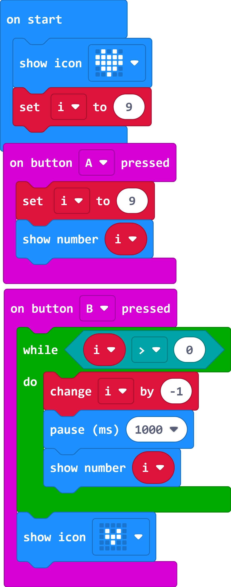

# SCase 09: Countdown

## Purpose

 Use the Smart Coding Kit to create a countdown machine.

## Products Link

 1 x [ELECFREAKS micro:bit Smart Coding Watch Kit](https://www.elecfreaks.com/micro-bit-smart-coding-kit.html)

## Software

[MicroSoftmakecode](https://makecode.microbit.org/#)

## Programming

 Show the icon while on start and set the variable `i` as 9.

 While button A being pressed, set the variable `i` as 9.

 While button B being pressed, start the countdown and display the icon when it comes to 0.

  

### Link
 Link：[https://makecode.microbit.org/_Fyofsp7fwMEX](https://makecode.microbit.org/_Fyofsp7fwMEX)

 You can also download it direcly below:

    <iframe
        src="https://makecode.microbit.org/_Fyofsp7fwMEX"
        frameborder="0"
        sandbox="allow-popups allow-forms allow-scripts allow-same-origin"
        style={{
            position: 'absolute',
            width: '100%',
            height: '100%',
        }}
    />

## Result

 Show the icon while on start
 While button A being pressed, the number 9 displays on the micro:bit
 While button B being pressed, the countdown starts and number 0 displays on the micro:bit

## Exploration

## FAQ

## Relevant File
