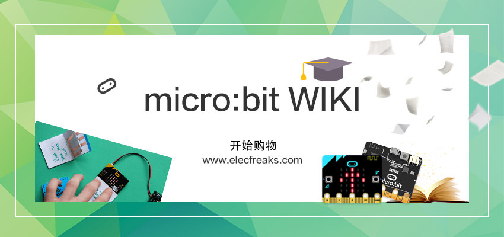

import microbit_microbit_wiki_Icon from './images/microbit-wiki.png';

import microbit_smart_coding_kit_Icon from './getting-started/microbit-smart-coding-kit/images/smart-coding-kit-icon.png';
import microbit_basic_kit_Icon from './getting-started/microbit-basic-kit/images/basic-kit-icon.png';

import microbit_tinker_kit_Icon from './getting-started/microbit-tinker-kit/images/tinker-kit-icon.png';
import microbit_starter_kit_Icon from './circuit-design/microbit-starter-kit/images/starter-kit-icon.png';
import microbit_experiment_box_kit_Icon from './circuit-design/microbit-experiment-box-kit/images/experiment-box-kit-icon.png';

import microbit_motorbit_smart_car_kit_Icon from './microbit-smart-car/microbit-motorbit-smart-car-kit/images/motorbit-smart-car-kit-icon.png';
import microbit_ringbit_car_v2_Icon from './microbit-smart-car/microbit-ringbit-car-v2/images/ringbit-car-v2-icon.png';
import microbit_samrt_cutebot_Icon from './microbit-smart-car/microbit-samrt-cutebot/images/samrt-cutebot-icon.png';
import microbit_tpbot_Icon from './microbit-smart-car/microbit-tpbot/images/tpbot-icon.png';
import microbit_wonder_rugged_car_Icon from './microbit-smart-car/microbit-wonder-rugged-car/images/wonder-rugged-car-icon.png';

import microbit_smart_agriculture_kit_Icon from './wisdom-life/microbit-smart-agriculture-kit/images/smart-agriculture-kit-icon.png';
import microbit_smart_city_kit_Icon from './wisdom-life/microbit-smart-city-kit/images/smart-city-kit-icon.png';
import microbit_smart_health_kit_Icon from './wisdom-life/microbit-smart-health-kit/images/smart-health-kit-icon.png';
import microbit_smart_home_kit_Icon from './wisdom-life/microbit-smart-home-kit/images/smart-home-kit-icon.png';
import microbit_smart_science_iot_kit_Icon from './wisdom-life/microbit-smart-science-iot-kit/images/smart-science-iot-kit-icon.png';

import nezha_inventors_kit_Icon from './building-blocks/nezha-inventors-kit/images/48-in-1-nezha-inventors-kit-icon.png';
import wonder_building_kit_Icon from './building-blocks/wonder-building-kit/images/32-in-1-wonder-building-kit-icon.png';
import ringbit_bricks_pack_Icon from './building-blocks/ringbit-bricks-pack/images/6-in-1-ringbit-bricks-pack-icon.png';

import magic_wand_kit_Icon from './interesting-case/magic-wand-kit/images/magic-wand-kit-icon.png';
import straw_manipulator_Icon from './interesting-case/straw-manipulator/images/straw-manipulator-icon.png';

import expansion_board_Icon from './expansion-board/images/expansion-board-icon.png';

import octopus_sensors_Icon from './sensor/octopus-sensors/images/octopus-sensors-icon.png';
import planet_x_sensors_Icon from './sensor/planet-x-sensors/images/planet-x-sensors-icon.png';

# Micro:bit Related Products

## Getting Started

---

<cardbox>
  <card
    href="./getting-started/microbit-smart-coding-kit/"
    title="Smart Coding Kit"
    description="小小科学家(Starter Kit)套件是ELECFREAKS团队出品的micro:bit入门套件。
ElecFreaks Micro：bit 小小科学家专为那些学习电路和编程知识的人们而设计。 该套件提供了一些基本的电子元件，如LED，按钮，蜂鸣器，温度传感器，舵机和电机等。 Micro：bit小小科学家套件可以帮助您进入一个美好的电子世界。"
    img={microbit_smart_coding_kit_Icon}
  />
  <card
    href="./getting-started/microbit-basic-kit/"
    title="Basic Kit"
    description="小小发明家套件包含LED灯、蜂鸣器、土壤湿度传感器、碰撞开关、舵机等十多种常用电子模块，用这些模块可以搭建超过30个案例，基于该套件的全套课程已经在新加坡开展了3年的教学实践，深得师生的好评。"
    img={microbit_basic_kit_Icon}
  />
  <card
    href="./getting-started/microbit-tinker-kit/"
    title="Tinker Kit"
    description="smart home套件是ELECFREAKS团队研发的智能家居主题micro:bit套件。
smart home套件精选TMP36温度传感器、声音传感器、碰撞传感器、舵机、电机等智能家居常用的传感器与执行部件。你可以自行搭建窗台、衣柜、鱼缸与实际生活场景结合起来，使编程变得更加实用与有趣！使用micro:bit图形化编程让这些场景智能化工作，创造属于自己的智能温馨家庭。"
    img={microbit_tinker_kit_Icon}
  />
</cardbox>

## Circuit Design
---

<cardbox>
  <card
    href="./circuit-design/microbit-starter-kit/"
    title="Starter Kit"
    description="小小科学家(Starter Kit)套件是ELECFREAKS团队出品的micro:bit入门套件。
ElecFreaks Micro：bit 小小科学家专为那些学习电路和编程知识的人们而设计。 该套件提供了一些基本的电子元件，如LED，按钮，蜂鸣器，温度传感器，舵机和电机等。 Micro：bit小小科学家套件可以帮助您进入一个美好的电子世界。"
    img={microbit_smart_coding_kit_Icon}
  />
  <card
    href="./circuit-design/microbit-experiment-box-kit/"
    title="Experiment Box Kit"
    description="小小发明家套件包含LED灯、蜂鸣器、土壤湿度传感器、碰撞开关、舵机等十多种常用电子模块，用这些模块可以搭建超过30个案例，基于该套件的全套课程已经在新加坡开展了3年的教学实践，深得师生的好评。"
    img={microbit_basic_kit_Icon}
  />
</cardbox>

## 智能小车
---

<cardbox>
  <card
    href="./microbit-smart-car/microbit-samrt-cutebot/"
    title="Samrt Cutebot"
    description="小小科学家(Starter Kit)套件是ELECFREAKS团队出品的micro:bit入门套件。
ElecFreaks Micro：bit 小小科学家专为那些学习电路和编程知识的人们而设计。 该套件提供了一些基本的电子元件，如LED，按钮，蜂鸣器，温度传感器，舵机和电机等。 Micro：bit小小科学家套件可以帮助您进入一个美好的电子世界。"
    img={microbit_samrt_cutebot_Icon}
  />
  <card
    href="./microbit-smart-car/microbit-tpbot/"
    title="Tpbot"
    description="小小发明家套件包含LED灯、蜂鸣器、土壤湿度传感器、碰撞开关、舵机等十多种常用电子模块，用这些模块可以搭建超过30个案例，基于该套件的全套课程已经在新加坡开展了3年的教学实践，深得师生的好评。"
    img={microbit_tpbot_Icon}
  />
  <card
    href="./microbit-smart-car/microbit-ringbit-car-v2/"
    title="Ringbit Car V2"
    description="小小发明家套件包含LED灯、蜂鸣器、土壤湿度传感器、碰撞开关、舵机等十多种常用电子模块，用这些模块可以搭建超过30个案例，基于该套件的全套课程已经在新加坡开展了3年的教学实践，深得师生的好评。"
    img={microbit_ringbit_car_v2_Icon}
  />
  <card
    href="./microbit-smart-car/microbit-wonder-rugged-car/"
    title="Wonder Rugged Car"
    description="小小发明家套件包含LED灯、蜂鸣器、土壤湿度传感器、碰撞开关、舵机等十多种常用电子模块，用这些模块可以搭建超过30个案例，基于该套件的全套课程已经在新加坡开展了3年的教学实践，深得师生的好评。"
    img={microbit_wonder_rugged_car_Icon}
  />
  <card
    href="./microbit-smart-car/microbit-motorbit-smart-car-kit/"
    title="Motorbit Smart Car Kit"
    description="小小发明家套件包含LED灯、蜂鸣器、土壤湿度传感器、碰撞开关、舵机等十多种常用电子模块，用这些模块可以搭建超过30个案例，基于该套件的全套课程已经在新加坡开展了3年的教学实践，深得师生的好评。"
    img={microbit_motorbit_smart_car_kit_Icon}
  />
</cardbox>

## Wisdom Life
---

<cardbox>
  <card
    href="./wisdom-life/microbit-smart-home-kit/"
    title="Smart Home Kit"
    description="小小科学家(Starter Kit)套件是ELECFREAKS团队出品的micro:bit入门套件。
ElecFreaks Micro：bit 小小科学家专为那些学习电路和编程知识的人们而设计。 该套件提供了一些基本的电子元件，如LED，按钮，蜂鸣器，温度传感器，舵机和电机等。 Micro：bit小小科学家套件可以帮助您进入一个美好的电子世界。"
    img={microbit_smart_home_kit_Icon}
  />
  <card
    href="./wisdom-life/microbit-smart-science-iot-kit/"
    title="Smart Science Iot Kit"
    description="小小发明家套件包含LED灯、蜂鸣器、土壤湿度传感器、碰撞开关、舵机等十多种常用电子模块，用这些模块可以搭建超过30个案例，基于该套件的全套课程已经在新加坡开展了3年的教学实践，深得师生的好评。"
    img={microbit_smart_science_iot_kit_Icon}
  />
  <card
    href="./wisdom-life/microbit-smart-agriculture-kit/"
    title="Smart Agriculture Kit"
    description="smart home套件是ELECFREAKS团队研发的智能家居主题micro:bit套件。
smart home套件精选TMP36温度传感器、声音传感器、碰撞传感器、舵机、电机等智能家居常用的传感器与执行部件。你可以自行搭建窗台、衣柜、鱼缸与实际生活场景结合起来，使编程变得更加实用与有趣！使用micro:bit图形化编程让这些场景智能化工作，创造属于自己的智能温馨家庭。"
    img={microbit_smart_agriculture_kit_Icon}
  />
  <card
    href="./wisdom-life/microbit-smart-city-kit/"
    title="Smart City Kit"
    description="smart home套件是ELECFREAKS团队研发的智能家居主题micro:bit套件。
smart home套件精选TMP36温度传感器、声音传感器、碰撞传感器、舵机、电机等智能家居常用的传感器与执行部件。你可以自行搭建窗台、衣柜、鱼缸与实际生活场景结合起来，使编程变得更加实用与有趣！使用micro:bit图形化编程让这些场景智能化工作，创造属于自己的智能温馨家庭。"
    img={microbit_smart_city_kit_Icon}
  />
  <card
    href="./wisdom-life/microbit-smart-health-kit/"
    title="Smart Health Kit"
    description="smart home套件是ELECFREAKS团队研发的智能家居主题micro:bit套件。
smart home套件精选TMP36温度传感器、声音传感器、碰撞传感器、舵机、电机等智能家居常用的传感器与执行部件。你可以自行搭建窗台、衣柜、鱼缸与实际生活场景结合起来，使编程变得更加实用与有趣！使用micro:bit图形化编程让这些场景智能化工作，创造属于自己的智能温馨家庭。"
    img={microbit_smart_health_kit_Icon}
  />
</cardbox>

## Building Blocks
---

<cardbox>
  <card
    href="./building-blocks/nezha-inventors-kit/"
    title="Nezha Inventors Kit"
    description="小小科学家(Starter Kit)套件是ELECFREAKS团队出品的micro:bit入门套件。
ElecFreaks Micro：bit 小小科学家专为那些学习电路和编程知识的人们而设计。 该套件提供了一些基本的电子元件，如LED，按钮，蜂鸣器，温度传感器，舵机和电机等。 Micro：bit小小科学家套件可以帮助您进入一个美好的电子世界。"
    img={nezha_inventors_kit_Icon}
  />
  <card
    href="./building-blocks/wonder-building-kit/"
    title="Wonder Building Kit"
    description="小小发明家套件包含LED灯、蜂鸣器、土壤湿度传感器、碰撞开关、舵机等十多种常用电子模块，用这些模块可以搭建超过30个案例，基于该套件的全套课程已经在新加坡开展了3年的教学实践，深得师生的好评。"
    img={wonder_building_kit_Icon}
  />
  <card
    href="./building-blocks/ringbit-bricks-pack/"
    title="Ringbit Bricks Pack"
    description="smart home套件是ELECFREAKS团队研发的智能家居主题micro:bit套件。
smart home套件精选TMP36温度传感器、声音传感器、碰撞传感器、舵机、电机等智能家居常用的传感器与执行部件。你可以自行搭建窗台、衣柜、鱼缸与实际生活场景结合起来，使编程变得更加实用与有趣！使用micro:bit图形化编程让这些场景智能化工作，创造属于自己的智能温馨家庭。"
    img={ringbit_bricks_pack_Icon}
  />
</cardbox>

## Interesting Case
---

<cardbox>
  <card
    href="./microbit/interesting-case/magic-wand-kit/"
    title="Magic Wand Kit"
    description="小小科学家(Starter Kit)套件是ELECFREAKS团队出品的micro:bit入门套件。
ElecFreaks Micro：bit 小小科学家专为那些学习电路和编程知识的人们而设计。 该套件提供了一些基本的电子元件，如LED，按钮，蜂鸣器，温度传感器，舵机和电机等。 Micro：bit小小科学家套件可以帮助您进入一个美好的电子世界。"
    img={magic_wand_kit_Icon}
  />
  <card
    href="./microbit/interesting-case/straw-manipulator/"
    title="Straw Manipulator"
    description="小小发明家套件包含LED灯、蜂鸣器、土壤湿度传感器、碰撞开关、舵机等十多种常用电子模块，用这些模块可以搭建超过30个案例，基于该套件的全套课程已经在新加坡开展了3年的教学实践，深得师生的好评。"
    img={straw_manipulator_Icon}
  />
</cardbox>

## Expansion Board
---

<cardbox>
  <card
    href="./microbit/expansion-board/"
    title="Expansion Board"
    description="小小科学家(Starter Kit)套件是ELECFREAKS团队出品的micro:bit入门套件。
ElecFreaks Micro：bit 小小科学家专为那些学习电路和编程知识的人们而设计。 该套件提供了一些基本的电子元件，如LED，按钮，蜂鸣器，温度传感器，舵机和电机等。 Micro：bit小小科学家套件可以帮助您进入一个美好的电子世界。"
    img={expansion_board_Icon}
  />
</cardbox>

## Sensor
---

<cardbox>
  <card
    href="./microbit/sensor/octopus-sensors/"
    title="Octopus Sensors"
    description="小小发明家套件包含LED灯、蜂鸣器、土壤湿度传感器、碰撞开关、舵机等十多种常用电子模块，用这些模块可以搭建超过30个案例，基于该套件的全套课程已经在新加坡开展了3年的教学实践，深得师生的好评。"
    img={octopus_sensors_Icon}
  />
  <card
    href="./microbit/sensor/planet-x-sensors/"
    title="Planet X Sensors"
    description="小小发明家套件包含LED灯、蜂鸣器、土壤湿度传感器、碰撞开关、舵机等十多种常用电子模块，用这些模块可以搭建超过30个案例，基于该套件的全套课程已经在新加坡开展了3年的教学实践，深得师生的好评。"
    img={planet_x_sensors_Icon}
  />
</cardbox>
