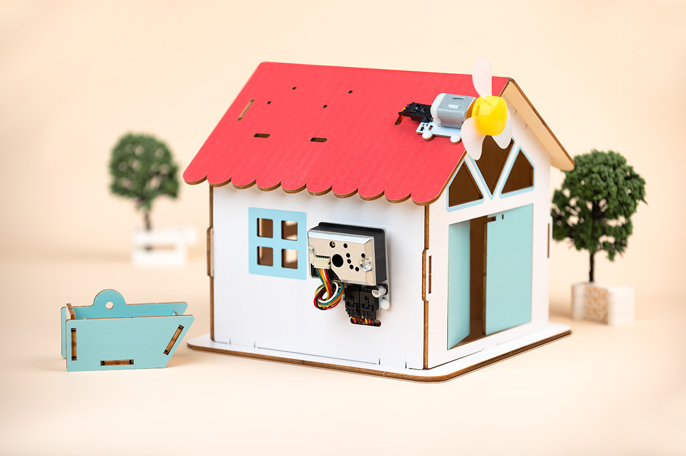

# Products Introduction

Indoor air quality is a topic of great concern to us. In this case, we will simulate the process of detecting and improving indoor air quality using a dust sensor and motor fan from the Octopus series.

In this case, the dust sensor and motor fan are mounted on top of a wooden house. The dust sensor detects the dust concentration in the indoor air in real time and transmits the data to the micro:bit, which sends out a signal to activate the motor fan when the dust concentration exceeds a set threshold. The motor fan is mounted on the side of the tiny house and when it receives the signal, it automatically starts and starts blowing the air in the room. Through the operation of the fan, the indoor air is circulated, thus effectively purifying the indoor air and improving the air quality.

This smart air purifier case not only helps students understand and learn about the principles of sensors and motors, but also develops their awareness of environmental protection and health consciousness. Students can customise the air quality criteria by adjusting the threshold of the dust sensor and can control the operation of the motor fan by writing code.

Through this case, students will be able to build a simple but practical smart device with their own hands, experience the fun of creativity, and enhance their scientific and technological skills and innovative thinking in practice.

