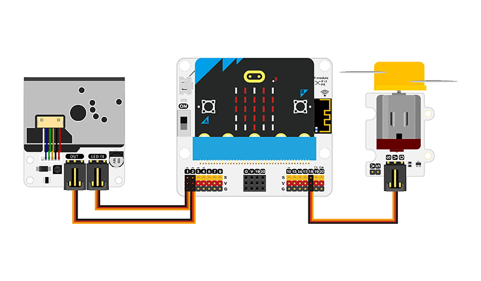

# Smart-Air-Purifier

## Function Introduction

The dust sensor detects the dust concentration in the indoor air in real time and transmits the data to the micro:bit, which sends a signal to the motor fan to start when the dust concentration exceeds a set threshold. The motor fan is mounted on the side of the tiny house and when it receives the signal, it automatically starts and starts blowing the air in the room. Through the operation of the fan, the indoor air is circulated, thus effectively purifying the indoor air and improving the air quality.

## Preparation

1 × micro:bit V2

1 × Classroom Smart Air Purifier Kit

1 × micro USB Cable

1 × Smart Home Material Pack

## Courses Objectives

(1) Understand the Air Quality Index.

(2) Learn about factors that affect ambient air quality and how to improve indoor air quality.

(3) Make an air purifier case.

## Extended Information ##

**Air Quality Index**

Air Quality Index (AQI) is an index that quantitatively describes the state of air quality. The larger the value is, the more serious the air pollution and the greater the risk to human health will be. The main pollutants involved in air quality evaluation are fine particulate matter (PM2.5), respirable particulate matter (PM10), sulphur dioxide (SO2), nitrogen dioxide (NO2), ozone (O3), carbon monoxide (CO), etc. The AQI is suitable for expressing the short-term air quality condition and trend of change in a city, etc. The reference standards for AQI grading and calculation are the "Ambient Air Quality Standards" ( GB3095-2012) and the Technical Provisions on Ambient Air Quality Index (AQI) (Trial) HJ633-2012, and the AQI indicator has been implemented in China since 2012.

| Air Quality Index | Air Quality Index Level | Air Quality Index Category | Colour |                   Health Impact Situation                    | Recommended Measures                                         |
| :---------------: | :---------------------: | :------------------------: | :----: | :----------------------------------------------------------: | ------------------------------------------------------------ |
|       0~50        |         Grade 1         |         Excellent          | Green  | Air quality is satisfactory, basically free of air pollution | Normal activities are allowed for all groups of people       |
|      51~100       |         Level 2         |            Good            | Yellow | Air quality is acceptable but some pollutants may have a weak impact on the health of a very small number of unusually sensitive people | A very small number of unusually sensitive people should reduce outdoor activities |
|      101~150      |        Tertiary         |      Mildly Polluted       | Orange | Mildly worsening of symptoms in susceptible groups, irritation in healthy groups | Children, the elderly, and people with heart or respiratory illnesses should reduce prolonged and intense outdoor exercise |
|      151~200      |         Level 4         |     Moderate Pollution     |  Red   | Symptoms of susceptible groups are further aggravated and may affect the heart and respiratory system of healthy people | Avoid prolonged and intense outdoor exercise for children, the elderly and people with heart or respiratory illnesses, and reduce outdoor exercise in moderation for the general population |
|      201~300      |         Level 5         |      Heavy Pollution       | Purple | Significantly worsening symptoms in people with heart and lung disease, reduced exercise tolerance, and widespread symptoms in the healthy population | Children, the elderly, and people with heart and lung disease should stay indoors, stop outdoor exercise, and reduce outdoor exercise in the general population |
|       >300        |         Level 6         |      Severe Pollution      | Maroon | Reduced exercise tolerance, strong symptoms and early onset of certain illnesses in the healthy population | Children, the elderly and the sick should stay indoors, avoid physical exertion, and the general population should avoid outdoor activities |

**Factors affecting air quality**

Air quality is affected by a variety of factors, including the following:

1. Atmospheric pollutants: These include particulate matter (PM2.5 and PM10), ozone (O3), nitrogen dioxide (NO2), sulphur dioxide (SO2) and others. These pollutants mainly come from industrial emissions, traffic exhaust, combustion processes such as coal and fuel oil.
2. Anthropogenic activities: Human activities such as industrial production, transport and energy consumption produce large amounts of pollutant emissions, which directly or indirectly affect air quality.
3. Weather conditions: Weather conditions such as temperature, wind speed and direction affect air quality. For example, high temperatures and low wind speeds can cause pollutants to accumulate in the air and reduce air quality.
4. Geographical location: Geographical location also has an impact on air quality. For example, peri-urban areas are usually affected by urban emissions, while oceans and mountains usually have better air quality.

For your reference, here are some links to the factors that influence air quality:

1. Air Quality Index (AQI): [https://zh.wikipedia.org/wiki/%E7%A9%BA%E6%B0%94%E8%B4%A8%E9%87%8F%E6%8C%87%E6%95%B0](https://zh.wikipedia.org/wiki /AQI)
2. Air Pollutants: [https://zh.wikipedia.org/wiki/%E7%A9%BA%E6%B0%94%E6%B1%A1%E6%9F%93%E7%89%A9](https://zh.wikipedia.org/wiki/空气污染物)
3. Air Pollution Sources: [https://zh.wikipedia.org/wiki/%E5%A4%A7%E6%B0%94%E6%B1%A1%E6%9F%93%E6%BA%90](https://zh.wikipedia.org/wiki/大气污染源)
4. Air Quality Monitoring: [https://zh.wikipedia.org/wiki/%E7%A9%BA%E6%B0%94%E8%B4%A8%E9%87%8F%E7%9B%91%E6%B5%8B](https://zh.wikipedia.org/wiki/空气质量 Monitoring)

**Ways to Enhance Indoor Air Quality**

Enhancing indoor air quality is important for our health and comfort. Here are some ways to enhance indoor air quality:

1. Regular Ventilation: Opening the windows regularly for ventilation can remove pollutants from the room and bring in fresh air. Especially when the weather is good, try to ventilate as much as possible.

2. Use an air purifier: Air purifiers can filter particles and pollutants from the air and improve air quality. Choose a purifier that suits the size of the room, and clean and replace the filter cartridge regularly.

3. Reduce indoor sources of pollution: Minimise indoor sources of pollution such as tobacco smoke, chemical cleaners, volatile organic compounds (VOCs), etc. Choose environmentally friendly and low VOC furniture, decoration materials and cleaning products.

4. Indoor plants: Indoor plants help improve air quality by absorbing harmful substances in the air and releasing oxygen. Common air-purifying plants include hanging orchids, ivy and aloe vera.

5. Pay attention to maintaining cleanliness: Keep the indoor area clean and hygienic, clean the floor, furniture, curtains, etc. on a regular basis to reduce the accumulation of dust and pollutants.

6. Control humidity: Maintain appropriate indoor humidity. Excessive humidity tends to breed mould and bacteria, while excessively low humidity can lead to dry skin. Use a humidifier or dehumidifier to regulate humidity.

7. Avoid the use of harmful chemicals: Try to avoid products containing harmful chemicals such as formaldehyde and benzene, such as glues, dyes and cleaning agents.

8. Clean air conditioners and filters regularly: Clean and replace air conditioners and air filters regularly to maintain their proper functioning and filtration.

These methods can help improve indoor air quality, but specific measures should be adjusted and implemented according to the actual situation and needs.

## Exploration

(1) How to detect the ambient air quality and determine the air quality level?

(2) How to determine the conditions that trigger the fan to turn and stop turning?

(3) Change the position of the motor fan to find the optimal indoor air flow solution?

### Hardware Connections

Connect the LED IN of the Dust sensor to P1 and OUT to P2, connect the motor fan to P3 on the IoT:bit. 

## Programming

### Preparation

Go to makecode editor: https://makecode.microbit.org/.

Click "Create Proejects" and give it a name, then click "Create".

Click "Extensions" in the drawer and search with "iot-environment-kit" to download it, you can find them in the drawer afterwards. 

### Samples Code

Link: https://makecode.microbit.org/S78289-58742-68994-22523

## Cases Display

## Think

The change of indoor temperature and humidity is also a topic of great concern to us. Through the study of this case, please think about how to realise the work of using the Octopus series of temperature and humidity sensors to detect changes in the indoor temperature and humidity values and issue an alarm when a certain threshold is reached?

## FAQ

1. The motor fan of Octopus needs to be powered by the USB charging port in the IOT:bit expansion board, otherwise it will not work. 
2. Please turn on the power switch of IOT:bit. 
3. When inserting and removing the micro:bit into and out of the IOT:bit's slot, please press and hold the micro:bit on the left and right sides to make it easier to operate.

## For more information, please visit:

ELECFREAKS official website: [ELECFREAKS web](https://www.elecfreaks.com/).
