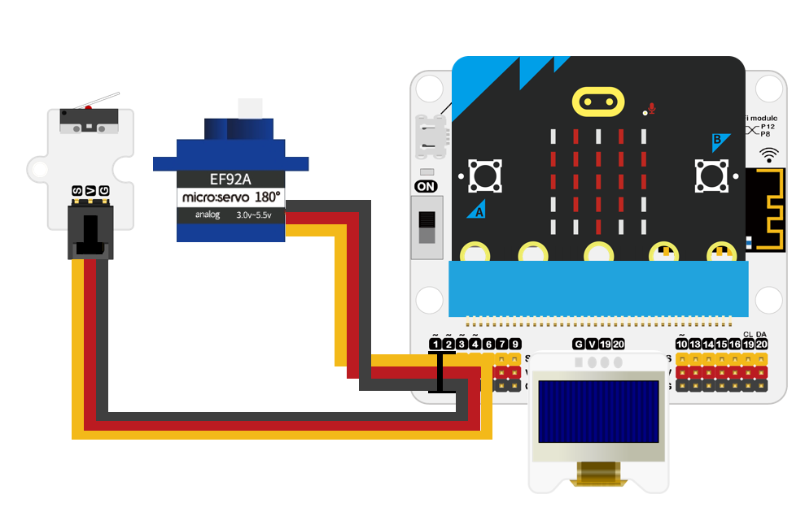
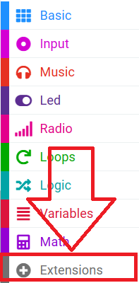
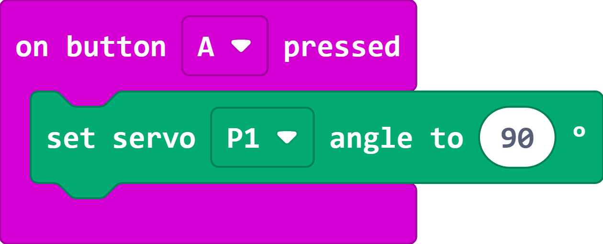
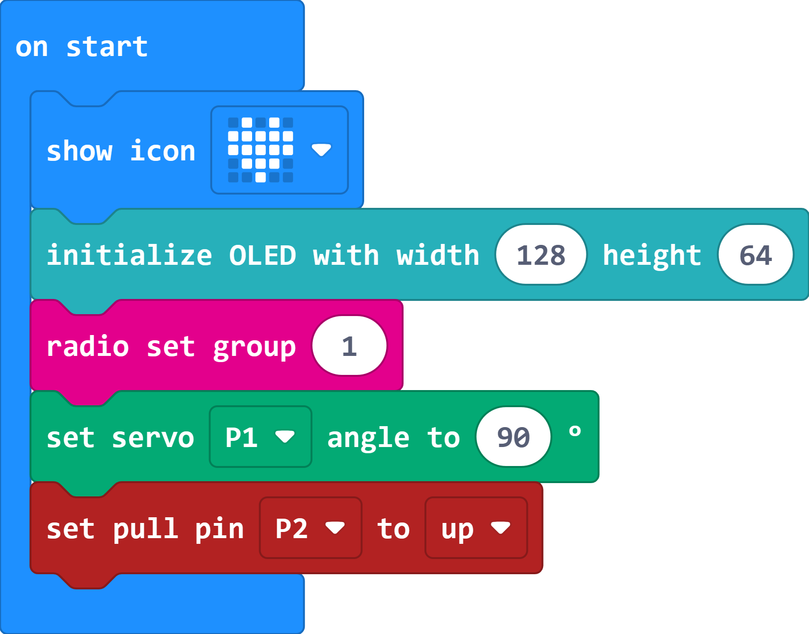
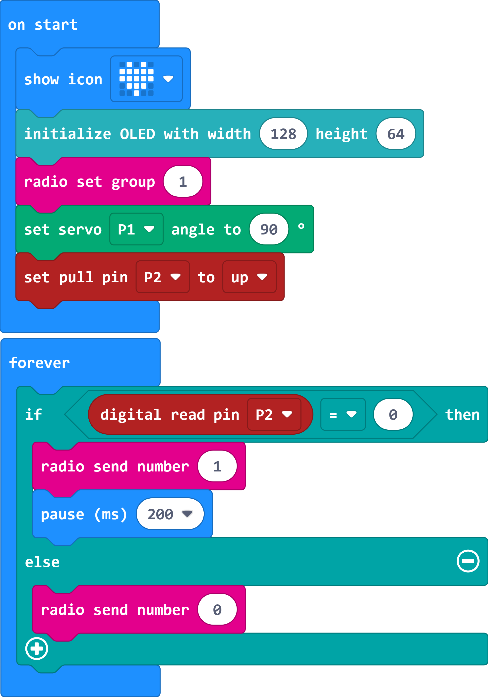
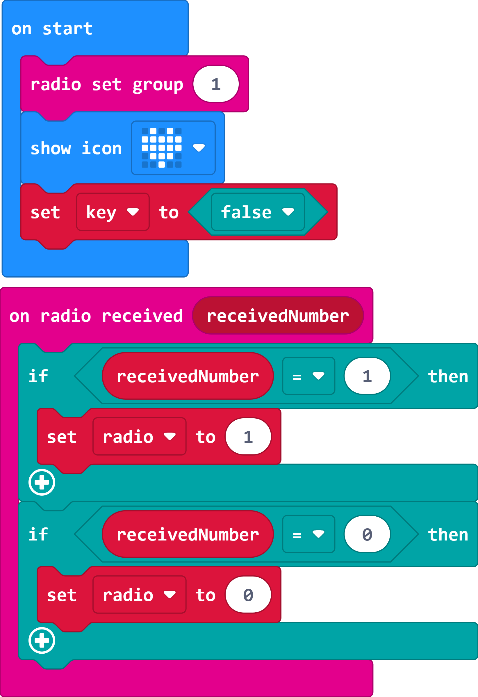
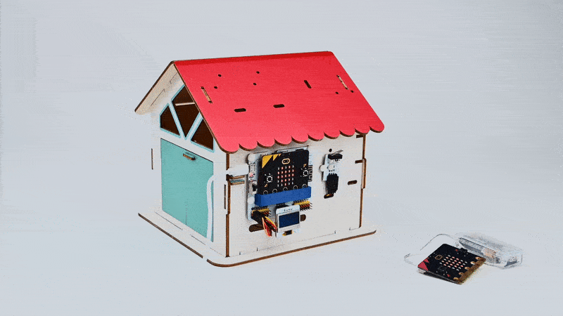

# Remote Door Opener

## Introduction

When someone visits the house, press the crash sensor, at this time the micro:bit at the lock end sends a signal to inform the micro:bit at the remote control end, when it receives the signal, it will display a pattern, at this time, if you press button A of the remote control end, the micro:bit at the lock end will display a smiley face, and it will control the servo to open the door, and display "Welcome" on the OLED display. If press button B, the micro:bit on the door lock side will display the x icon and display "Refused to enter" on the OLED display.

## Materials Requested

2 × micro:bit V2

1 × Classrom Smart Home Kit

1 × micro USB Cable

1 × Smart Home Material Pack

## Objectives 

Understand the wireless communication capabilities of the micro:bit.

Understand how the crash sensor and servo work.

Understand the working methods of OLED displays.

## Exploration

Is it possible to communicate with more than one micro:bit at the same time?

How do I prevent interference when using the micro:bit's wireless communication function?

How do the crash sensor and servo work?

## Extended Information

*** The working principle of the crash sensor ***

The crash sensor relies on the internal mechanical structure to complete the circuit conduction and interruption. When the external probe arm of the crash sensor is collided, the probe arm is pressed down by the force, which drives the reed inside the crash sensor to toggle, so that the circuit's conduction state is changed.

*** Servo Working Principle ***

A servo motor, often called a servo, is a small device with an output shaft. When we send a control signal to the servo, the output shaft can be turned to a specific position. As long as the control signal remains constant, the servo keeps the angular position of the shaft unchanged. If the control signal changes, the position of the output shaft changes accordingly. Servos are often used in everyday life for remote-controlled aircraft, remote-controlled cars, robots and other fields.

The control line is used to transmit the angle control signal. This angle is determined by the duration of the control signal pulse, which is called pulse code modulation (PCM). Control of a servo generally requires a time base pulse of about 20 ms. The high level portion of this pulse is generally in the range of 0.5 ms to 2.5 ms, with a total interval of 2 ms. The width of the pulse will determine how far the motor will turn. For example, for a 1.5 ms pulse, the motor will turn to a 90° position (often referred to as the neutral position, which for a 180° servo would be the 90° position). If the pulse width is less than 1.5 milliseconds, then the motor is axially orientated towards 0 degree. If the pulse width is greater than 1.5 milliseconds, the axial direction is towards 180 degrees. Taking the 180 degree servo as an example, the corresponding control relationship is like this:

>0.5ms————-0 degree；
>1.0ms————45 degrees；
>1.5ms————90 degrees；
>2.0ms———–135 degrees；
>2.5ms———–180 degrees；

## Hardware Connections

Connect the crash sensor to P2 and the servo to P1 on the IoT:bit board. 

## Software Programming

### Add extensions

Go to [makecode](https://makecode.microbit.org/)

Click "Create Project" and give a name of your project, then click "Create". 

Click "Extensions"

Search with "servo" and download the servo extension. 

### Installation Instructions

Before installing the servo, the servo angle needs to be adjusted.

When button A is pressed, the servo connected to P1 is controlled to rotate to 90 degrees.

Program and download the program:

The initialized program for the position of the servo: [https://makecode.microbit.org/S33825-77887-10264-59836](https://makecode.microbit.org/S33825-77887-10264-59836)

Press button A on the micro:bit to control the servo to rotate to 90 degrees.

Turn the drive lever so that the room door is in the closed position, and then install the drive lever to the servo after the adjustment is completed.

### Code Interpretation

*** Door lock end programm ***

While in the on start block,

set to show an icon of heart to ensure that the programm has been downloaded successfully;

Initialise the OLED display;

set the wireless communication group as 1;

initialise the servo angle to 90°;

set the P2 pin pull-up.

In the "Forever" block, judge if the crash sensor connected to pin P2 is pressed or not.

If yes, the number 1 is sent wirelessly with a delay of 200ms to prevent key jitter.

Otherwise, the number 0 is sent wirelessly.

When a signal is received for wireless communication;

If the received signal is "Open";

then the OLED display shows "Welcome";

control the servo connected to P1 to rotate to 0° to open the door, pause for 5000ms, and then control the servo to rotate to 90° to close the door;

clear the OLED display and the micro:bit shows the heart icon;

otherwise, if the received signal is "Refused";

the OLED display shows "Refused to enter";

The micro:bit displays an error icon and pauses for 5000ms;

clear the OLED display and the micro:bit shows the heart icon;

Program link: [https://makecode.microbit.org/S43729-79384-22654-20945](https://makecode.microbit.org/S43729-79384-22654-20945)

*** Program for the remote control side ***

In "On start" block, 

set the wireless communication group to 1;

set the micro:bit displays the heart icon to ensure that the programm has been downloaded successfully;

set the variable `key` to false.

When a signal is received for wireless communication;

if the received signal is 1;

then set the value of the variable `radio` to 1;

if the received signal is 0;

then set the value of the variable `radio` to 0;

Judge the value of the variable `radio` in the "forever" block.

When the value of the variable `radio` is 1, 

set the micro:bit displays a diamond icon;

set the variable `key` to ture;

 when the variable `key` is ture, enter a loop that judges whether key A or key B is pressed;

when key A is pressed, the micro:bit displays the smile face icon, and wireless communication sends `Open`, set the variable `key` to false;

when key B is pressed, the micro:bit displays an error icon, wireless communication sends `Refused`, and sets the variable `key` to false;

when the variable `key` is false, the loop is automatically jumped out and the micro:bit displays the heart icon.

Link: [https://makecode.microbit.org/S60091-73106-37070-71707](https://makecode.microbit.org/S60091-73106-37070-71707)

## Cases Display

When someone visits the house, press the crash sensor, at this time the micro:bit at the lock end sends a signal to inform the micro:bit at the remote control end, when it receives the signal, it will display a pattern, at this time, if you press button A of the remote control end, the micro:bit at the lock end will display a smiley face, and it will control the servo to open the door, and display "Welcome" on the OLED display.

If press button B, the micro:bit on the door lock side will display the x icon and display "Refused to enter" on the OLED display.

