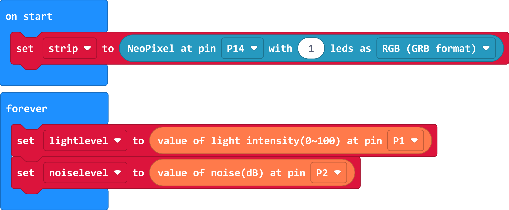
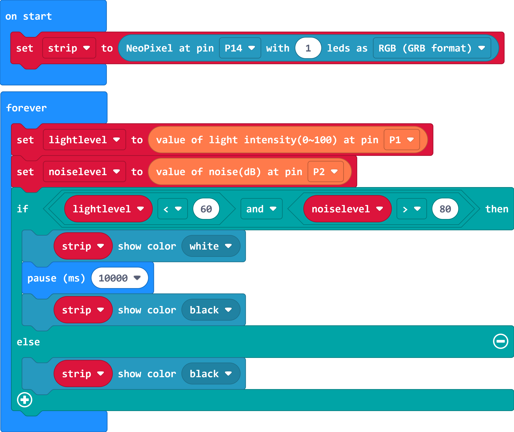
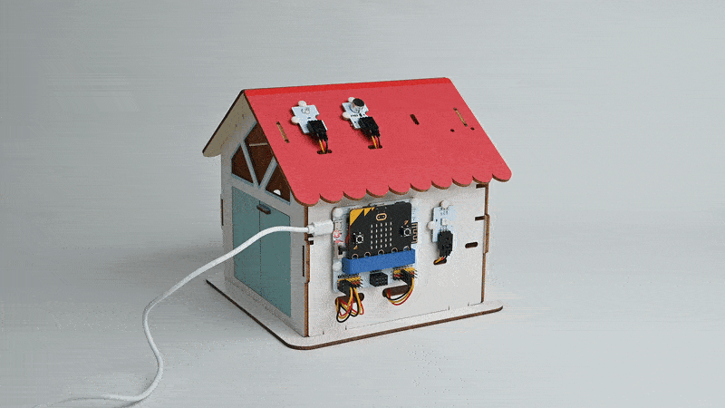

# Smart Voice-Controlled Light

## Introduction

Detects ambient noise when the light is dimmed, the RGB light turns on when the ambient noise is higher than the set threshold, and it automatically turn off after ten seconds.


## Materials Requested

1 × micro:bit V2

1 × Classrom Smart Home Kit

1 × micro USB Cable

1 × Smart Home Material Pack

## Objectives

Understand the basic concepts of sound production and propagation.

Understand the classification of noise.

Make examples of sound and light controlled lights.

## Extended Information

*** How sound is produced and transmitted ***

Sound is caused by the vibration of an object, which travels through a medium (e.g., air, water, solid, etc.).

1. Vibration source: the production of sound begins with the vibration of an object. When an object vibrates, it will vibrate back and forth with a certain frequency and amplitude. The source of vibration can be any object capable of generating vibration, such as the speaker diaphragm in a sound box, the strings of a musical instrument or the drum surface.

2. Pressure wave propagation: When an object vibrates, it causes the molecules in the surrounding medium (e.g., air) to vibrate as well, creating pressure changes. These pressure changes propagate outwards in the form of waves, forming sound waves.

3. Sound wave characteristics: sound waves are mechanical waves, with the following characteristics:

- Frequency: The frequency of a sound wave is the number of vibrations per second of the vibration source, the unit is Hertz (Hz). Frequency determines the pitch of the sound, high-frequency sound waves sound more treble, low-frequency sound waves sound more bass.
- Amplitude: The amplitude of a sound wave is the maximum deviation from the position of the vibrating source, which determines the volume or intensity of the sound. The greater the amplitude is, the louder the sound will be.
- Wavelength: The wavelength of a sound wave is the distance corresponding to one complete cycle of the wave, usually expressed in metres (m). There is a relationship between wavelength and frequency: wavelength is equal to the speed of sound divided by frequency.
- Velocity: The speed at which a sound wave travels in a given medium is called the speed of sound, and it varies in different media. In air, it is about 343 metres per second.

4. Auditory perception: When a sound wave reaches the human ear, it causes vibrations in the eardrum and structures within the ear, and these vibrations are transmitted to the brain through the auditory system. The brain interprets these vibrations and recognises them as sound, enabling us to hear and understand the sounds around us.

The generation and propagation of sound is a complex physical process, and we can use this principle to design and control sound for a variety of applications such as communications, music and sound effects.

*** Classification of Noise ***

30-40 dBA: Quiet library or low noise environment.
40-50 dBA: Quiet office or low-noise living area.
50-60 dBA: Normal office, city traffic noise or household electrical noise.
60-70 dBA: Busy office, street traffic noise or general industrial noise.
70-80 dBA: Higher traffic noise, industrial machinery noise or noisy activity areas.
80 dBA or more: Very high noise, such as aircraft take-off sound, machinery cutting sound, etc.

Noise classification is of great significance for environmental protection, occupational health and safety and other aspects. By understanding noise classification, we can better understand and manage the impact of noise on people's health and quality of life, and take appropriate control measures to reduce the adverse effects of noise on the environment and human body.

## Exploration

How to detect the brightness of ambient light?

How to detect the intensity of noise?

How do you ensure that sound triggers a light switch only when the light is low?

## Hardware Connections

Connect the light sensor to P1 and the noise sensor to P2 on IoT:bit board. 

``````

## Software Programming

### Add extensions

Go to [makecode](https://makecode.microbit.org/)

Click "Create projects" and give it a name in the box, then click "Create".


Click "Extensions"


Search with "iot-environment-kit" in the box and dowoload it. 


### Code Interpretation

While in the "On start" block, set the rainbow LED with 1 LED and get it connected with P14 port. 


Save the returned value from the light sensor connecting to P1 as the variable "lightlevel", save the returned value from the noise sensor connecting to P2 as the variable "noiselevel".



If the light value is below 60 and the noise value over 80, set to light up in white and turn it off after 10S. 


Or turn it off. 



Link: [https://makecode.microbit.org/_2ve1HC6q5C5p](https://makecode.microbit.org/_2ve1HC6q5C5p)

## Case Display


Detects ambient noise when the light is dimmed, the RGB light turns on when the ambient noise is higher than the set threshold, and it automatically turn off after ten seconds.


