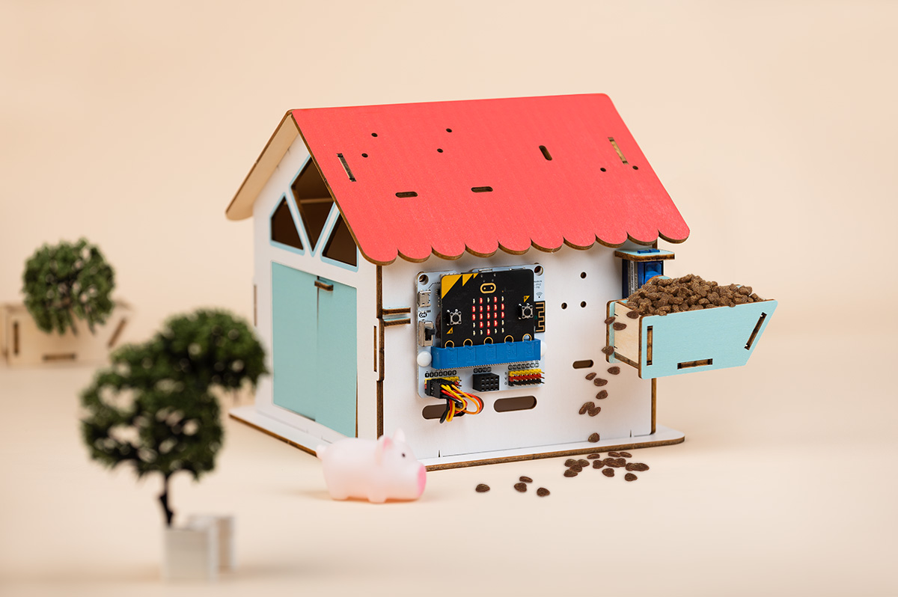
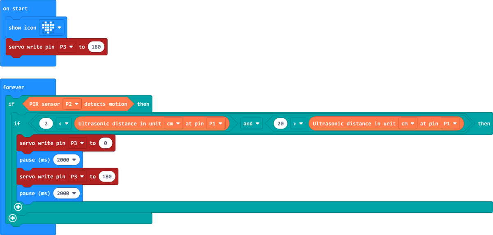

# Smart Pet Feeder

## Functions Introduction

Firstly, the PIR sensor is responsible for detecting whether it is a pet approaching; secondly, the SONAR:BIT  is used to detect whether the pet reaches within 20 cm in front of the wooden tiny house. When both of these conditions are met, the servo will rotate, which will cause the food storage box that stores the pet food to dump out the pet food. After the process of dumping the pet food is completed, the servo will return to its original position and wait for the next feeding.

## Preparation

1 × micro:bit V2

1 × Classroom Smart Pet Feeder Kit

1 × micro USB Cable

1 × Smart Home Material Pack

## Courses Objectives

(1) Understand the working principle of infrared detection sensors.

(2) Understand the principle of ultrasonic wave.

(3) Understand how servos are controlled.

(4) Make a pet feeder case.

## Extended Information ##

**Body Infrared Detection**

The principle of human infrared detection is to use the infrared radiation emitted by the human body for detection.

The infrared radiation emitted by the human body mainly comes from the thermal radiation of the body surface, and its wavelength is generally between 8-14 microns, which is known as the far-infrared band. The temperature of the human body is usually higher than the ambient temperature, so it will emit infrared radiation. The intensity of infrared radiation is related to the temperature of the human body. When the human body is stationary, the intensity of infrared radiation is relatively stable. When the body is moving, the intensity of the infrared radiation changes due to the different temperatures in different parts of the body.

Human infrared detection usually uses infrared sensors to receive and measure the infrared radiation emitted by the human body. An infrared sensor usually consists of an infrared detector and a signal processing circuit. The infrared detector converts the infrared radiation into an electrical signal, while the signal processing circuit amplifies and processes the electrical signal to detect the presence and movement of the human body.

Human infrared detection is mainly used in security systems, automatic lighting systems and other fields. By detecting the infrared radiation of the human body, the monitoring and tracking of the human body can be realised, so as to achieve the function of automatically switching on and off the lights and alarms.

**Ultrasonic principle**

Ultrasonic wave is a kind of high-frequency sound wave, we can't hear it.

Its generation and propagation is achieved by a special material, which is called piezoelectric material. When we add a voltage or current to the piezoelectric material, it starts to vibrate, just like a spring. This vibration produces mechanical waves, also known as ultrasound.

As it travels, ultrasound encounters various objects, such as air, water, and metal. It undergoes phenomena such as refraction, reflection and scattering, just as light reflects off a mirror. These phenomena affect the path and intensity of ultrasound propagation. When ultrasound reaches the receiver, it causes the piezoelectric material in the receiver to vibrate, creating an electrical charge. The receiver converts this charge into an electrical signal, which we can then amplify and process with instruments to get information about the ultrasound.

Ultrasound has a wide range of applications. In medicine, doctors can use ultrasound to examine the organs and tissues inside the body, for example to see how a baby is doing in its mother's tummy. In industry, ultrasound can be used to check the quality of materials, for example, to find cracks in metals. In everyday life, we can also use ultrasound to clean things, such as glasses or crockery.

## Exploration

(1) When pets are continuously in front of the wooden house, how many times do you reasonably control the dumping of pet food?

(2) How to reasonably plan the number of times a pet is fed per day?

(3) How to reasonably use other equipment to change the work to feed the pet water?

## Hardware Connection

Connect the PIR sensor to P2, the Sonar:bit to P1 and the 180 degrees servo to P3 on IoT:bit. 

## Programming

### Preparation

Go to makecode ediator: https://makecode.microbit.org/

Click create "New Project", give it a name and click "Create". 

Click "Extensions" in the makecode drawer and search with "iot-environment-kit" to download the extension, you may find them in the drawer afterwards. 

In the same way, search with "servo" and download the third extension in below picture. 

### 180° Servo Adjustment

For better subsequent programming, the initial angle and direction of rotation of the servo need to be set. In this case, the initial angle of the servo should be set to 180°.

#### Servo initial setting program

Link: https://makecode.microbit.org/S06902-77501-41447-67913。

### Samples program

Link: https://makecode.microbit.org/S05304-43123-83650-69002。

## Cases display

## Think

Although we have made a smart pet feeder so that we can get more rest time, but this case does not control the number of times the pet is fed, can you modify the programme so that when the smart pet feeder is fed a certain number of times a day, or control the feeding times by connecting to the internet?

## FAQ

1. The pins on the IOT:bit expansion board are sharp, be careful with your fingers when plugging or unplugging the sensor interface to avoid injury.
2. Turn on the power switch of the IOT:bit. 3.
3. When inserting and removing the micro:bit into and out of the IOT:bit slot, please hold down the left and right sides of the micro:bit to make it easier to operate.

## For more information, please visit:

ELECFREAKS website：[ELECFREAKS web](https://www.elecfreaks.com/).
