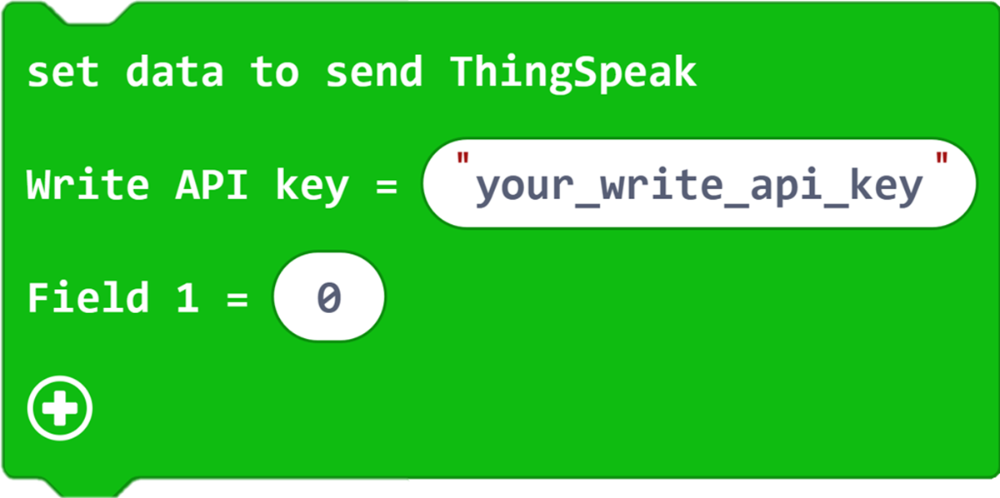

# Blocks Introduction

| Block Type | Diagram | Parameter | Functions |
| :-: | :-: | :-: | :-: |
| **IOT:bit** |  | Parameter 1 type: drop-down option : P0, P1, P2, P12, P13, P14, P15, P16, USB_TX, USB_RX  Parameter 2 type: drop-down option Parameter 2 ranges: P0, P1, P2, P8, P13, P14, P15, P16, USB_TX, USB_RX Parameter 3 type: drop-down option Parameter 3 ranges: 115200, 57600, 38400, 31250, 28800, 19200, 14400, 9600, 4800, 2400, 1200 | Initialize wifi module |
|  |  | Parameter 1 type: string Parameter 1 range: 0~9, a~z, A~Z, special characters Parameter 2 type: string Parameter 2 range: 0~9 , a~z, A~Z, special characters | This command is to set the name and password for connecting to WiFi and is used to connect to the network.  **Note: The 8266 module does not support the 5G router WIFI signal temporarily, please connect the 2.4G router WIKI signal** | Connect to wifi |
| **ThingSpeak** |  | No | Connect thingspeak platform |
|  |  | Parameter 1 type: string Parameter 1 range: 0~9, a~z, A~Z, special characters Parameter 2 type: integer Parameter 2 range: 0~9 | Set the Write API KEY of the ThingSpeak platform and set the upload data |
|  |  | No | Connect to ThingSpeak |
| **OLED** |  | Parameter 1 type: integer Parameter 1 range: 0~9 | Initialize OLED display |
| |  | No | Clear OLED Display |
| |  ||Parameter 1 type: string Parameter 1 range: 0~9, a~z, A~Z, special characters  | OLED display shows string |
| **Sensor** |  | Parameter 1 type: drop-down option Parameter 1 range: P0 ~ P16 | Display current wind speed (m/s) |
| |  | Parameter 1 type: drop-down option Parameter 1 range: P0 ~ P16 | Display the current intensity of ultraviolet rays (0 ~ 15) |
| |  | Parameter 1 type: drop-down option Parameter 1 range: P0 ~ P16 | Display current dust concentration (μg/m³) |
| |  | Parameter 1 type: drop-down option Parameter 1 range: temperature (°C), temperature (°F), humidity (0~100)  Parameter 2 type: drop-down option Parameter 1 range :P0 ~ P16 | Display current temperature (℃) or humidity (0~100) |
