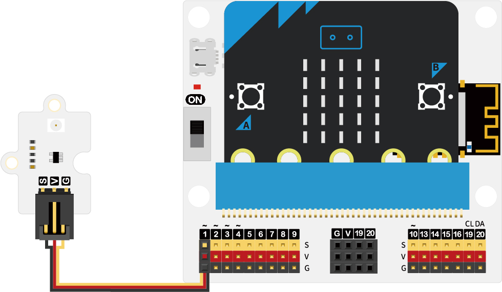

# **Case I: Ultraviolet Radiation Monitoring Device**

## Introduction

The purpose of this project is to guide students to create a UV-level display device using the UV sensor and micro:bit in the Smart Weather Station Kit. Using a bar graph, the device can display the current UV level and remind people to take appropriate protective measures. Through this project, students will learn how to use the sensor and micro:bit to collect data and visualize the display.

## **Teaching Objectives **

Understanding the use of UV sensors
Health risks at different UV levels

## **Teaching Preparation**

Make sure you have the following necessary materials in place：

| Picture | Name |
| :-: | :-: |
|  | smart climate kit |
|  | micro:bit V2 |
|  | C） |
|  | USB cable |

These materials will provide you with a complete experience and ensure that you can follow through and learn smoothly. If you are ready for the above, we can move on to the next step.

## **Teaching Process**

### **Introduce**

Have you ever wondered how to program a smart device that can help us monitor the intensity of UV rays and alert us to take appropriate protective measures? Programming is a way of making a computer or device perform tasks according to our instructions. In this lesson, we will explore together how to make a smart UV-level display device using programming and sensor technology.
Using the UV sensor and micro:bit from the Smart Weather Station Kit, we will program the sensor's data into a visual UV-level display. This device monitors the intensity of UV light in real time and shows us the current UV level in the form of a bar graph.
Ready? Now, let's embark on this fun learning journey and explore how to make a smart UV-level display device using programming and sensor technology！

### **Exploration**

1. How do you write a program to enable a UV rating display device to read UV sensor data and convert it to a UV rating?

2. Learn how to write code to read sensor data using the programming environment on micro:bit.

- Understand how to map the values measured by the sensor to the corresponding UV rating range.
- How to design a bar graph display to visualize the current UV rating?

1. Discover how to use the LEDs on the micro:bit or other output features to display a bar graph.

- Learn how to control the brightness of the LEDs or display different patterns depending on the UV level.
- Can other interesting features be programmed in addition to the UV level display?

1. Discover how to add sounds or alarms to alert people to UV intensity.

- Learn how to add buttons or touch sensors to the display for interactive features.

### Hardware Connection

Connect the UV sensor to the P1 interface.

### **Software Programming**

*****Adding Extensions**  ***

Go to " [makecode.microbit.org](https://makecode.microbit.org/) " and click New Project.

Enter the project name in the pop-up window and click "Create".

Click on "Extensions" in the code drawer.

In the pop-up interface, type "IOT", press the enter key to search, and choose to load the IOT software library.

*** **Sample Code** ***

1. The heart icon is displayed when powering on.

2. Displays the current UV intensity connected to the P1 interface.

3. When the UV intensity is greater than 5, the crying icon is displayed, otherwise the smiley icon is displayed.

Link: [https://makecode.microbit.org/_3XE2YF8hKbjs](https://makecode.microbit.org/_3XE2YF8hKbjs)

You can also download the program directly from the following page.

    <iframe
        src="https://makecode.microbit.org/_3XE2YF8hKbjs"
        frameborder="0"
        sandbox="allow-popups allow-forms allow-scripts allow-same-origin"
        style={{
            position: 'absolute',
            width: '100%',
            height: '100%',
        }}
    />

*** **Download the program** ***

Use the USB cable to connect the PC to the micro:bit V2.

After a successful connection, a disk drive named `MICROBIT` is recognized on the computer.

Click on the bottom left corner of the，Chose`Connect Device`.

Click。

Ckick 。

Select `BBC micro:bit CMSIS-DAP` in the pop-up window, and then select "Connect", so far, our micro:bit has been connected successfully.

Click to download the program

Students are divided into small groups and work together to create and program cases.

Students are encouraged to cooperate, communicate and share their experiences with each other.

Each group will have the opportunity to show the cases they made and demonstrate to the other groups.

**Expected results: when connected to the power supply, the micro:bit LED matrix displays a heart icon first, then a smiley face or crying face icon depending on the current UV intensity level.**

（GIF动图）

### ** Reflection **

Review the course content and remind students what knowledge and skills they have acquired.
Lead students in a discussion about the problems and difficulties they encountered during the production process and how they resolved them.
Guide students to think about the health risks at different UV levels and explore the importance of sun protection measures.

## **Extended Knowledge**

There are different health risks at different ultraviolet (UV) levels, so it is important to take sun protection measures. Here are the health risks at different UV levels and the importance of sun protection measures:
Low UV levels (UV index 1-2):
HEALTH RISKS: Health risks at low UV levels are relatively low, but there is still a risk of daily UV exposure.
SUN PROTECTION: Although low, basic sun protection is still recommended. Use sunscreen, hats, sunglasses, and shades to protect skin and eyes.
Moderate UV Levels (UV Index 3-5):
HEALTH RISKS: Moderate UV levels increase the risk of higher levels of UV damage to the skin and eyes.
SUN PROTECTION: It is important to take more comprehensive sun protection measures. Use a broad-spectrum sunscreen with SPF (sun protection factor) and UVA/UVB protection on exposed skin. Wear a wide-brimmed hat, sunglasses, and sunwear for extra protection.
High UV levels (UV index 6-7):
HEALTH RISKS: High UV levels and prolonged exposure to the sun may lead to sunburn, solar dermatitis, and solar skin aging.
Sun protection: It is vital to take intensive sun protection measures. Choose a broad-spectrum sunscreen with a high SPF and apply it regularly, especially during outdoor activities. Avoid exposure to strong sunlight by choosing clothing that provides good shade.
Very high UV levels (UV index 8 or higher):
Health Risks: Very high UV levels can lead to severe sunburn, solar keratitis, skin cancer, etc. after a relatively short period of exposure to the sun.
Sun protection: Take strict sun protection measures to maximize skin and eye protection. Avoid exposure to strong sunlight and seek shade. Use a broad-spectrum sunscreen with a high SPF, and wear a wide-brimmed hat, sunglasses, and a sunshade.
Regardless of UV levels, sun protection measures are vital to prevent skin damage, sunburn and skin cancer. Make it a habit to regularly use sunscreen, sun shades and other sun protection measures to protect yourself from UV rays.
