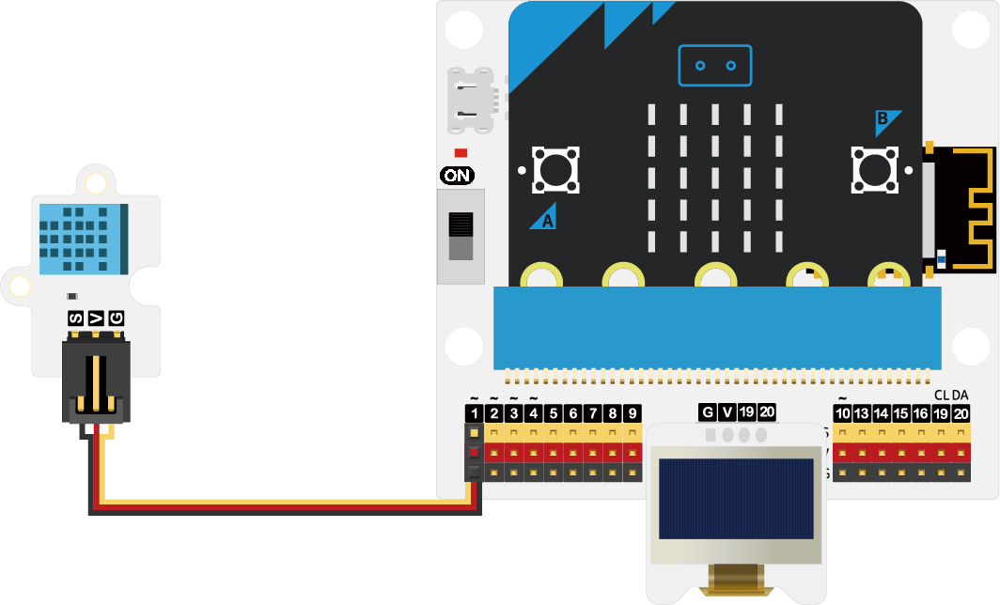
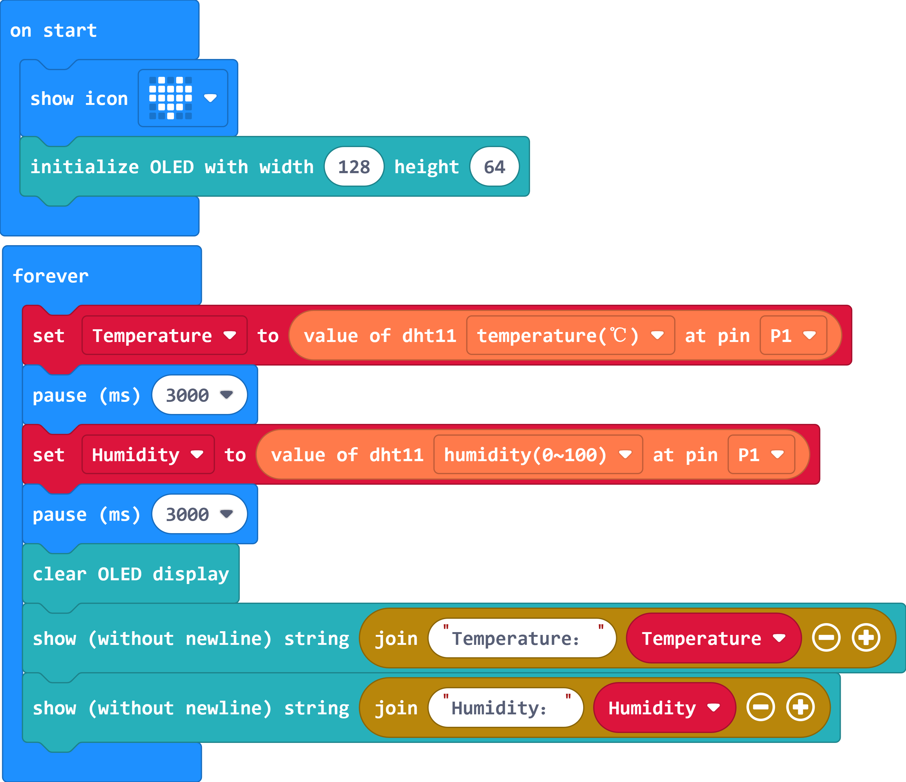

# **Case 03: Environmental Temperature and Humidity Monitoring Device**

## Introduction

The purpose of this course is to guide students in creating an environmental temperature and humidity detection device that will help them understand the effects of temperature and humidity on the human body by recording data under different temperature and humidity conditions and displaying the data locally using an OLED display. Through this inquiry activity, students will learn how to use the DHT11 temperature and humidity sensor and Micro:bit for data acquisition and display.

## **Teaching 0bjectives **

Understanding the use of the DHT11 temperature and humidity sensor

Understanding the effects of ambient temperature and humidity on the human body

## **Teaching Preparation**

Please make sure you have the following necessary materials ready:

| Picture | Name |
| :-: | :-: |
|  | Smart Weather Station Kit |
|  | micro:bit V2 |
|  | PC |
|  | USB cable |

These materials will provide you with a complete experience and ensure that you can follow through and learn smoothly. If you are ready for the above, we can move on to the next step.

## **Teaching Process**

### **Introduce**

Have students ever experienced feeling stuffy or too dry in certain environments? How do these environmental conditions affect our comfort and health?
By creating an ambient temperature and humidity detection device, we will be able to monitor and record the temperature and humidity data of our environment in real time and optimize our indoor environments based on this data. In this lesson, we will learn how to build this device using a DHT11 temperature and humidity sensor and a Micro:bit, and display the collected data through an OLED display. Let's start exploring together!

### **Exploration**

1. The effects of ambient temperature and humidity on the human body.

2. Learn how to write code to read sensor data using the programming environment on micro:bit.
3. How to visualize temperature and humidity data on an OLED display.

### Hardware Connection

The DHT11 temperature and humidity sensor is connected to the P1 interface and the OLED display is connected on the IoT:bit.

### **Software Programming**

Add Extensions

Go to " [makecode.microbit.org](https://makecode.microbit.org/) " and click New Project.

Enter the project name in the pop-up window and click "Create".

Click on "Extensions" in the code drawer.

In the pop-up interface, type "IOT", press the enter key to search, and choose to load the IOT software library.

*** Example code \***

1. The heart icon is displayed when the power is turned on.

2. Initialize the OLED display.

3. Get the current ambient temperature and humidity, with an interval of 3 seconds between acquiring the ambient temperature and humidity.

4. Displays the current temperature and humidity via the OLED display.

Link：[https://makecode.microbit.org/_7rgAMv5paF8w](https://makecode.microbit.org/_7rgAMv5paF8w)

You can also download the program directly from the following page.

    <iframe
        src="https://makecode.microbit.org/_7rgAMv5paF8w"
        frameborder="0"
        sandbox="allow-popups allow-forms allow-scripts allow-same-origin"
        style={{
            position: 'absolute',
            width: '100%',
            height: '100%',
        }}
    />

*** **Download Programs*****

Use the USB cable to connect the PC to the micro:bit V2.

After a successful connection, a disk drive named `MICROBIT` is recognized on the computer.

Click on the bottom left corner and select `Connect Device`.

Click。

Click。

Select `BBC micro:bit CMSIS-DAP` in the pop-up window, and then select Connect, so far, our micro:bit has been connected successfully.

Click to download the program.

### ***\*Teamwork and Showcases\**** 

Students are divided into small groups and work together to create and program the case.

Students are encouraged to cooperate, communicate and share their experiences with each other.

Each group will have the opportunity to show the cases they have made and demonstrate to other groups.

*** Expected results: when connected to the power supply, the micro:bit displays the heart icon first and then the current temperature and humidity on the OLED display.** *****

（GIF动图）

### **Reflection** 

Review the content of the lesson to remind students what knowledge and skills they have acquired.

Lead students in a discussion about the problems and difficulties they encountered during the production process and how they resolved them.

Guide students to think about the effects of different temperatures and humidity on the human body

## **Extended Knowledge** 

### **The Effect of Different Temperature and Humidity on the Human Body** 

Different temperature and humidity conditions have different effects on the human body. Here are some common temperature and humidity conditions and their effects on the human body:

High temperature and high humidity (sweltering)

Dehydration: In high temperature and high humidity, the body tends to lose a lot of water, leading to symptoms of dehydration, such as thirst, dizziness and fatigue. Discomfort: A stuffy environment can cause discomfort, increased sweating, easy fatigue and insomnia. High temperature and low humidity (dry heat)

Dehydration: In high temperatures, the body tends to lose a lot of water through sweating, while water evaporation speeds up in low humidity environments, making the risk of dehydration increased. Skin problems: Dry environments can lead to dry, rough skin with problems such as chapping and allergies. Low temperature and high humidity (cold and damp):

Discomfort: Cold and humid environments tend to make people feel cold and uncomfortable, which can lead to localized cold in the body, increasing the risk of colds and respiratory illnesses. Low temperature and low humidity (dry and cold):

Dry skin: Dry and cold environments may lead to loss of moisture in the skin, making it dry, tight and even itchy and cracked. Respiratory problems: At low temperatures, dry air may irritate the mucous membranes of the respiratory tract, triggering uncomfortable symptoms such as coughing, sore throat and nasal congestion. It is important to note that everyone has a different ability to feel and adapt to temperature and humidity, so reactions may vary between individuals. In addition, the effect of temperature and humidity on the human body is also affected by other factors, such as individual health conditions, intensity and duration of activities. Therefore, maintaining appropriate indoor temperature and humidity is essential for human comfort and health.
