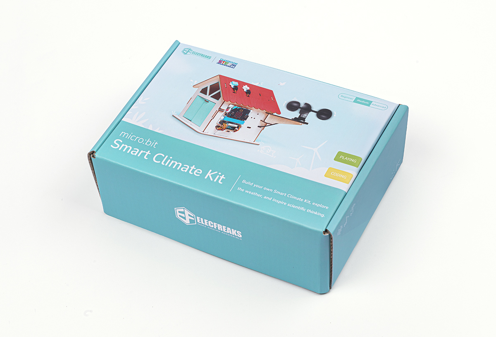
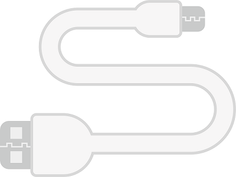
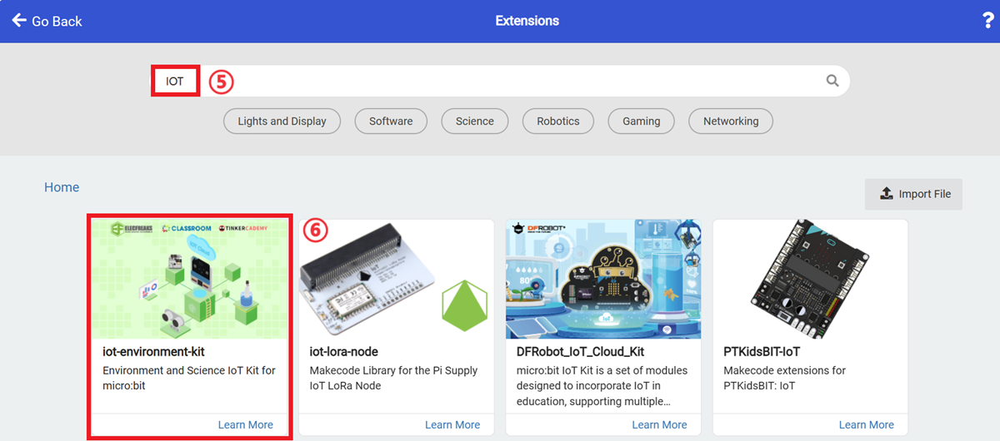

# Case 04: Environmental Dust Monitoring Device

## Introduction

The aim of this course is to guide students to create an environmental dust monitoring device using the Smart weather Station Kit and display the dust concentration in the environment in real time via an OLED display. Through this hands-on project, students will gain an in-depth understanding of the concept of environmental dust, the factors that affect it, and how to measure and monitor it. In addition, students will learn about the importance of dust to the environment and human health through inquiry activities and extended knowledge.

## Teaching Objectives

Understand the concept of environmental dust and its impact on the environment.

Learn to create an environmental dust monitoring device using a dust sensor and Micro:bit.

Find out how an OLED display can show the concentration of dust in the environment in real time.

Explore the importance of dust to the environment and human health.

## Teaching Preparations

Before teaching, please make sure you have the following necessary materials ready:

| Picture | Name |
| :-: | :-: |
|  | smart climate kit |
|  | micro:bit V2 |
|  | PC |
|  | USB Cable |

These materials will provide you with a complete experience and ensure that you can follow through and learn smoothly. If you are ready for the above, we can move on to the next step.

## Teaching Process

### Introduce

Have you ever noticed visible dust in certain environment? Ever thought about how dust in the environment can affect our lives? Today, we are going to go on a fun journey of discovery to monitor the concentration of dust in our environment by creating an environmental dust detection device. This device will help us better understand how clean our environment is and explore the importance of dust to us and our surroundings. Not only that, but we will also add a technological touch to our practical project by displaying the dust concentration data in real time on an OLED display. Are you ready? Let's get started on this exciting learning journey!"

### Exploration

1. Understand the concept of environmental dust and its impact on the environment.

2. learn to make an environmental dust monitoring device using a dust sensor and Micro:bit.

3. learn how to display the concentration of dust in the environment in real time on an OLED display.

4. Explore the importance of dust to the environment and human health.

### Hardware Connection

Connect the LED of the dust sensor to P1, the out to P2 and the OLED display on the IoT:bit.

### Programming

*** Add Extension Package ***

Go to “[makecode.microbit.org](https://makecode.microbit.org/)", click to create new projects.

Click "Create" in the dialogue box.

Ckick "Extensions" in the drawer.

Search with "IoT" and download the extension.

*** Sample Code ***

1. Show an icon of heart while on start.

2. Initialize the OLED display.

3. Obtain gthe concentration of the dust and have the value displayed on the OLED screen.

Link: [https://makecode.microbit.org/_M4kMsw6sy0q3](https://makecode.microbit.org/_M4kMsw6sy0q3)

You may download it directly below:

    <iframe
        src="https://makecode.microbit.org/_M4kMsw6sy0q3"
        frameborder="0"
        sandbox="allow-popups allow-forms allow-scripts allow-same-origin"
        style={{
            position: 'absolute',
            width: '100%',
            height: '100%',
        }}
    />

*** Download Link ***

Connect the micro:bit v2 with your PC via the USB cable.

The PC shall have a disk name called "MICROBIT" after connection.

Click at the left corner, and select `Connect Device`.

Click .

Click .

Select `BBC micro:bit CMSIS-DAP`, and then select "connect", now the micro:bit is successfully connected.

Click to download the program.

### Teamwork and Showcase

Students are divided into small groups and work together to create and programme the case.

Students are encouraged to co-operate, communicate and share their experiences with each other.

Each group will have the opportunity to present the cases they have produced and demonstrate them to the other groups.

*** Expected result: When connected to the power supply, the micro:bit LED first shows the heart icon and then the current dust concentration on the OLED display. ***

（GIF动图）

### Reflection

Review the course content and remind students what knowledge and skills they have acquired.

Lead students in a discussion about the problems and difficulties they encountered during the production process and how they resolved them.

Guide students to think about the effects of dust on the environment and human health.

Guide students to further research and explore other applications of environmental monitoring devices.

## Extended Knowledge

### Impact of Dust on the Environment and Human Health

Impact of dust on the environment:

Decrease in air quality: Dust may contain tiny particles such as dust, pollen, bacteria, viruses and chemicals. These particles are suspended in the air, degrading air quality and affecting ecological balance and biodiversity.

Soil degradation: Large amounts of dust deposited on the soil surface may lead to a decline in soil quality. Chemicals, heavy metals and other pollutants in dust may seep into the soil, affecting plant growth and soil fertility.

Damage to buildings and equipment: Dust can accumulate on the surfaces of buildings and equipment, forming a layer of dust that gradually damages the appearance and structure of the building. This can cause damage to houses, artefacts and infrastructure, among others.

Human health effects of dust:

Respiratory problems: Tiny particles in dust can be inhaled into the respiratory tract and cause respiratory problems. Prolonged exposure to high levels of dust can lead to symptoms such as coughing, wheezing, shortness of breath and difficulty in breathing. It is particularly sensitive to patients with respiratory conditions such as asthma and allergies.

Cardiovascular health: Certain studies have shown that long-term exposure to high concentrations of dust may be associated with the development and exacerbation of cardiovascular disease. Tiny particulate matter that enters the circulation may trigger an inflammatory response that affects blood vessel function and heart health.

Allergy and asthma: Pollen, bacteria and fungal spores in dust may trigger allergic reactions and asthma attacks. Sensitive individuals may experience sneezing, nasal congestion, itchy skin, eye irritation and other symptoms.

Toxic substance exposure: Certain dusts may contain harmful chemicals and heavy metals, such as lead, mercury, asbestos, and so on. Long-term exposure to these harmful substances may cause damage to the body's internal organs, nervous system and immune system.

Understanding the impact of dust on the environment and human health helps us to take appropriate measures to minimise dust generation and exposure. This includes regular cleaning, well-ventilated environments, wearing masks and avoiding exposure to harmful substances. Also, regular monitoring and assessment of dust concentration in the environment are important measures to protect our health and create a cleaner living environment.
