# Installation Steps

Install the board for fixing the servo at the door position. 

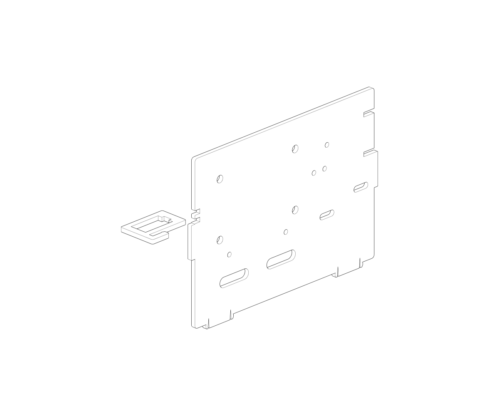

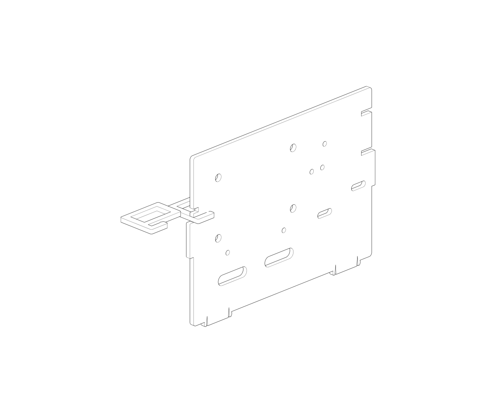

Install the board for fixing the servo at the pet feeding position. 

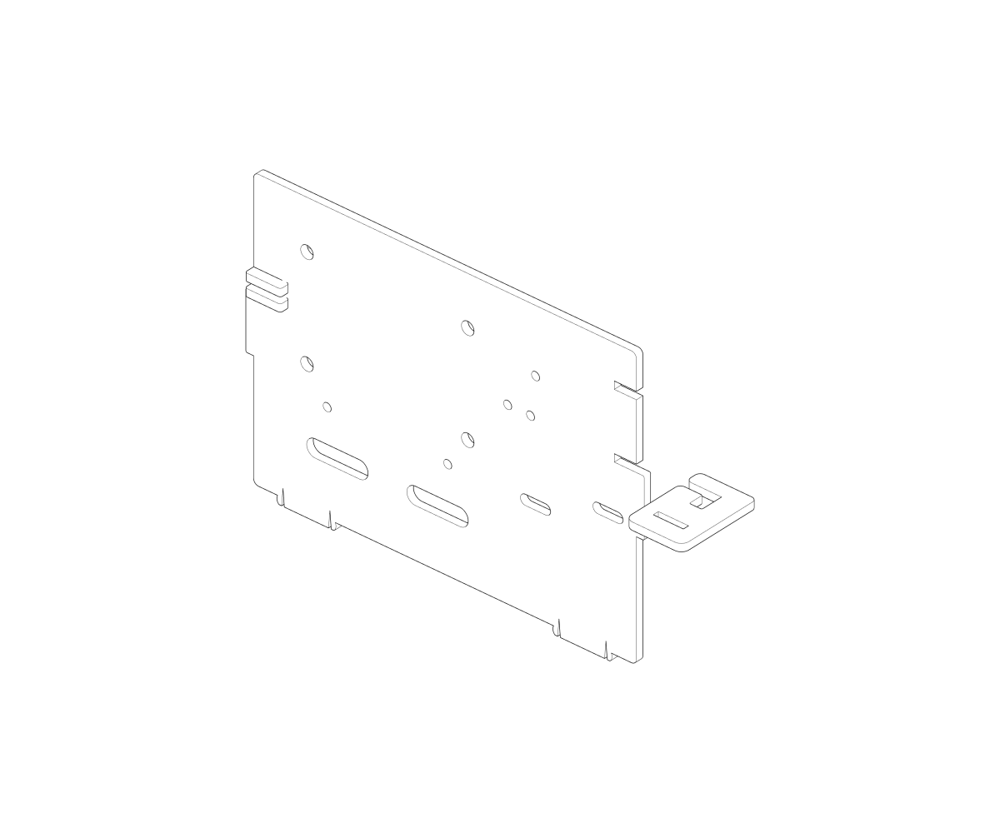

Assemble the doors with the transparent tapes. 

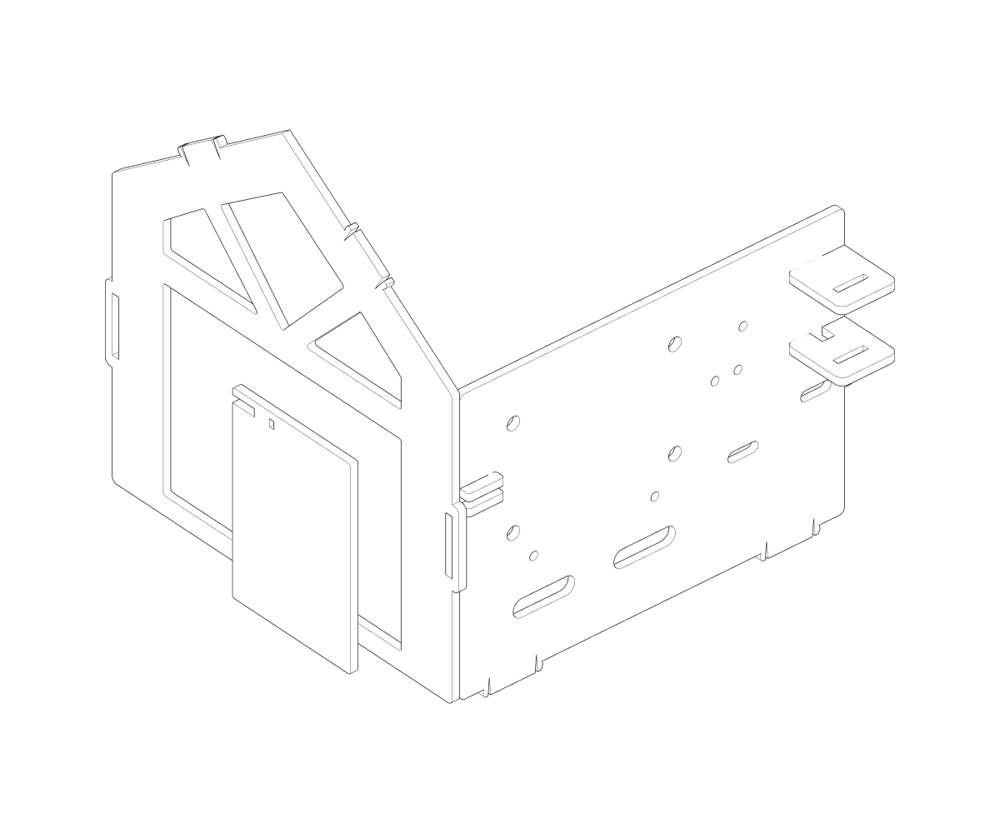

Assemble the board for opening/closing the door. 

Here we pre-reserved with 2 connection rods, we may connect the door with servos via them, thus, the function to open/close the door could be achieved. 

Install another door with the transparent tapes. 

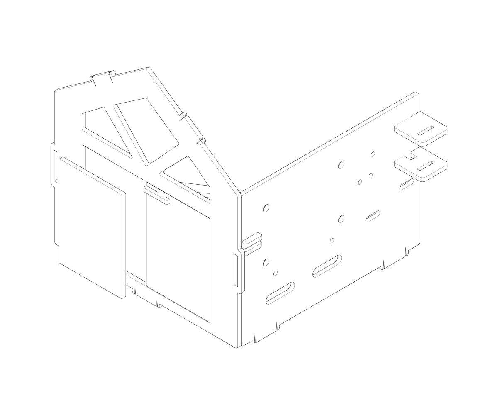

Assemble the wall. 

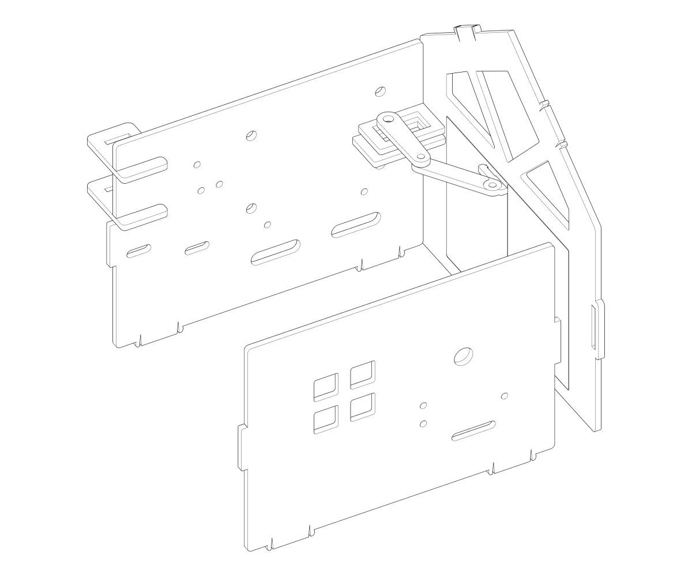

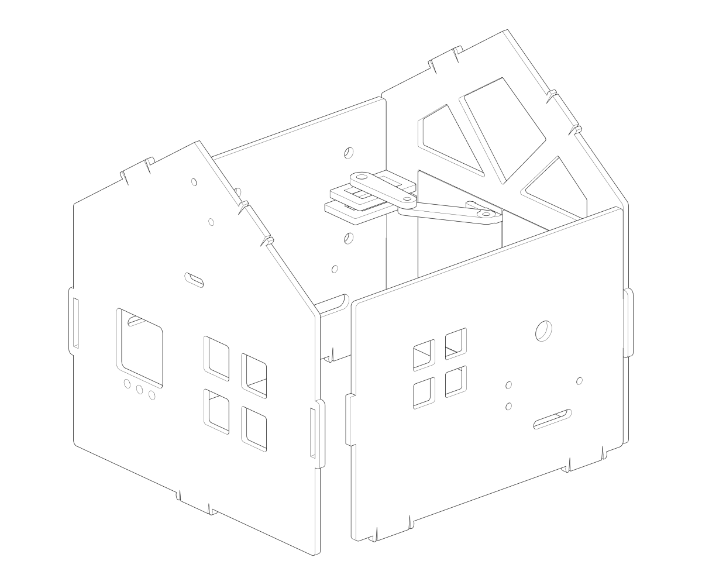

Assemble the floors. 

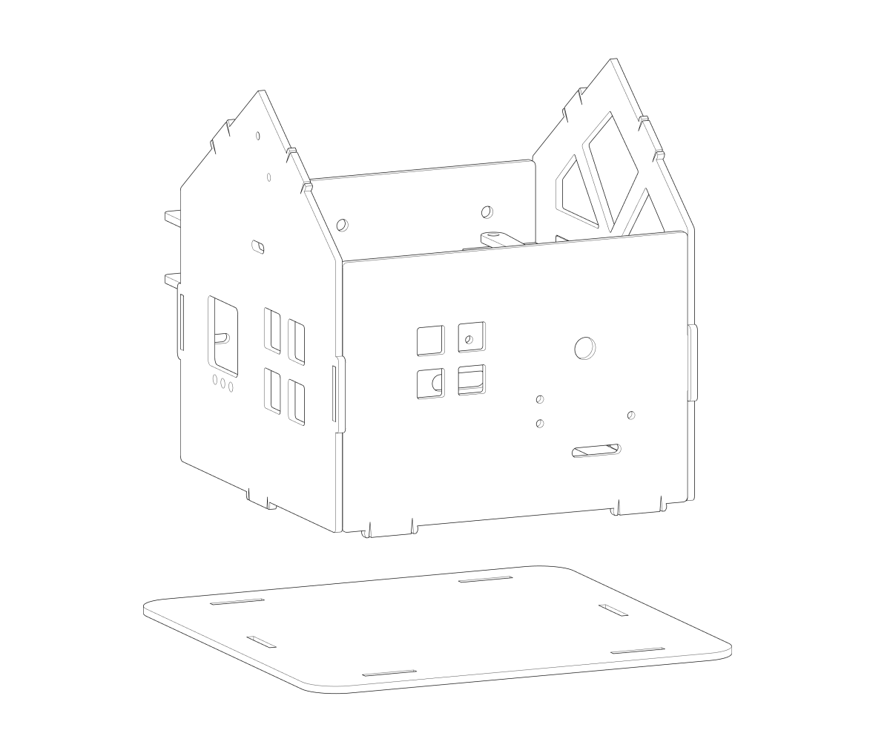

Assemble the roofs. 

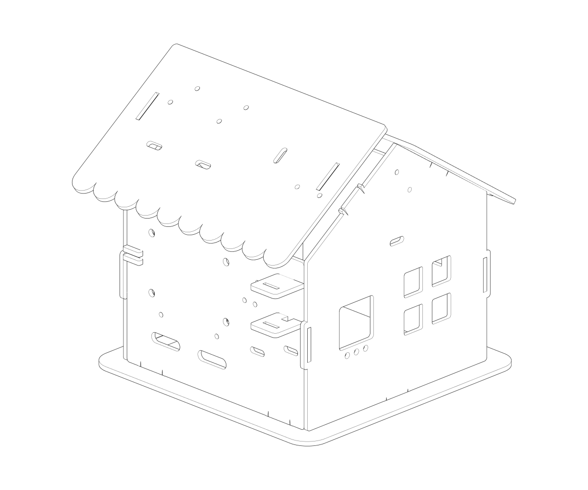

Assemble the pet feeder, if you have installed servo in that fixed position, you may insall the pet feeder with the correspondig servos.

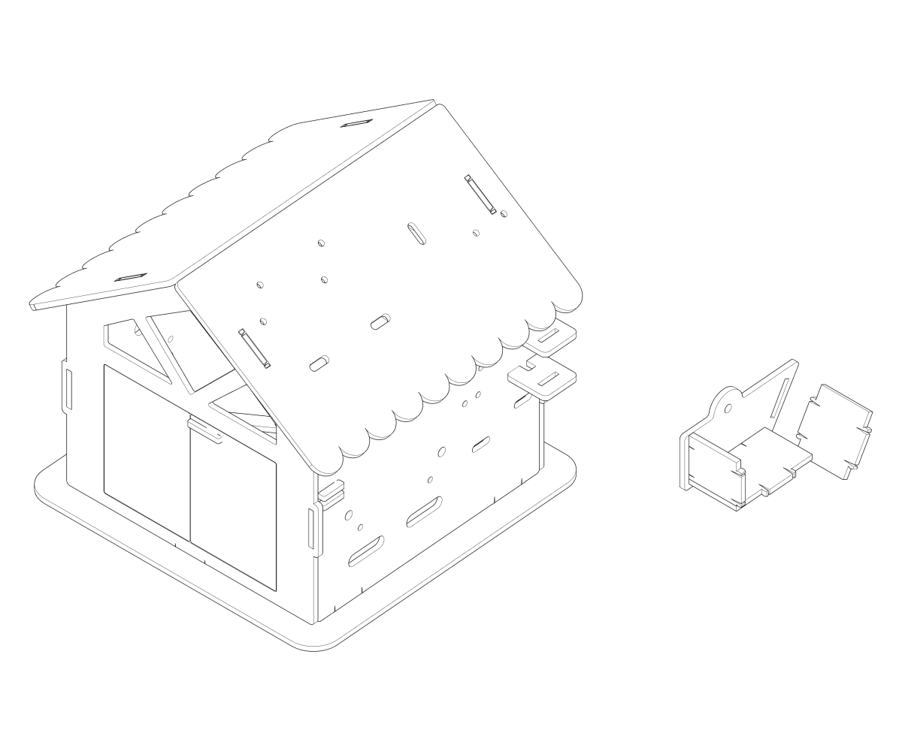

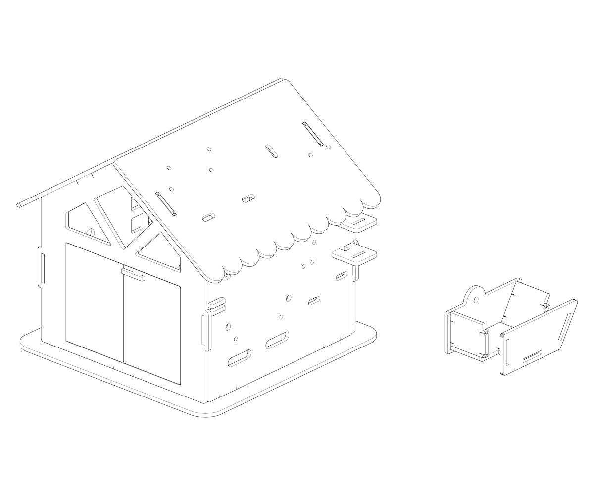
