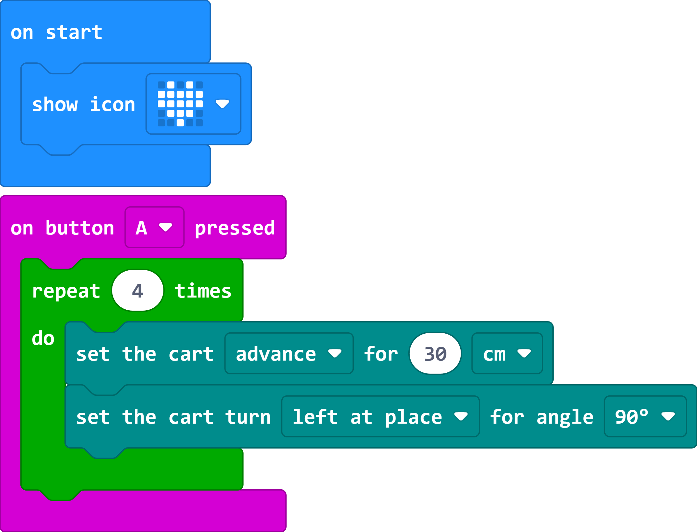

# Case 03 Go Square

## Introduction

This course aims to let students learn and explore knowledge points such as car motor control and turning methods by making smart racing cars and applying this knowledge to let the car drive along a square track.

## Teaching Objectives

Learn to control the forward, backward and stop of the car.

Grasp the principles of different turning methods, including right-angle turns and circular arc turns, and be able to apply them to realize that the car travels along a square trajectory.

## Teaching Preparation

Cutebot Pro × 1

micro:bit × 1

## Teaching process

### Course Introduction

Hello everyone! Today we are going to continue our smart car making project, but this time we are going to set a new challenge for the car to drive along a square track. How do you think the car can accurately walk out of a perfect square?

We can achieve this by controlling the car's motors and how it turns. In the next lessons, we will learn how to control the car to move forward, reverse and stop, and learn two different ways of turning. This knowledge will help us make the car follow a square trajectory.

### Inquiry activities

The difference between a right-angle turn and an arc turn.

### Sample Code

Link：[https://makecode.microbit.org/_A8KcTgaowc6P](https://makecode.microbit.org/_A8KcTgaowc6P)

You can also download the program directly from the following web page.

    <iframe
        src="https://makecode.microbit.org/_A8KcTgaowc6P"
        frameborder="0"
        sandbox="allow-popups allow-forms allow-scripts allow-same-origin"
        style={{
            position: 'absolute',
            width: '100%',
            height: '100%',
        }}
    />

### Teamwork and Presentation

Students are divided into groups to complete the production and programming of the car together.

Students are encouraged to collaborate, communicate and share experiences with each other.

Each team has the opportunity to present the smart car they built to the other teams.

### Summary and Reflection

Review course content to remind students of what knowledge and skills they have acquired.

Guide students to discuss the problems and difficulties they encountered in the production process, and how to solve these problems.

Guide students to think about what kind of trajectory the car can go besides going square? If a pen is fixed on the small car, is it possible to draw by controlling the traveling track of the small car?
