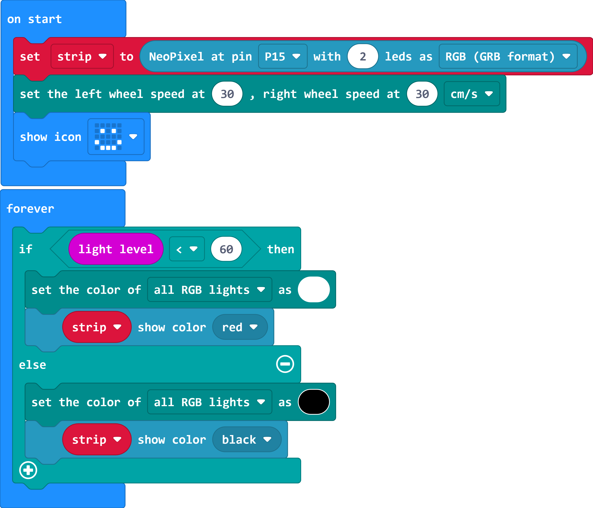

# Case 06 自动车灯

## 简介

在本节课中，我们将学习如何使用cutebot pro和micro:bit来制作一个自动车灯。当周围环境光线变暗时，车大灯会自动打开，当周围环境光线足够明亮时，车大灯会自动关闭。本课程将涉及micro:bit的光线检测、RGB车灯控制以及RGB三原色等知识点。

## 教学目标

了解micro:bit是如何检测周围环境光线强度的。

了解光生伏特效应。

学习如何使用micro:bit和cutebot pro进行光线检测以及控制LED车灯。

学习RGB三原色的概念和如何控制RGB车灯。

## 教学准备

Cutebot Pro × 1

micro:bit × 1

## 教学过程

### 课程引入

大家好！今天我们将继续我们的智能赛车制作项目，这一次我们要制作一个智能装置，让我们的Cutebot Pro行驶到较为黑暗的环境时，可以自动打开车灯。

### 探究活动

光生伏特效应是什么？

如何用于光线检测？

什么是RGB三原色？

如何控制RGB车灯？

### 示例代码

提示：开启车灯的光线强度阈值需要根据测试环境的光线强度进行调整。

请参考程序连接：[https://makecode.microbit.org/_M8k75C0Fp7fu](https://makecode.microbit.org/_M8k75C0Fp7fu)

你也可以通过以下网页直接下载程序。

    <iframe
        src="https://makecode.microbit.org/_M8k75C0Fp7fu"
        frameborder="0"
        sandbox="allow-popups allow-forms allow-scripts allow-same-origin"
        style={{
            position: 'absolute',
            width: '100%',
            height: '100%',
        }}
    />

### 团队合作与展示

学生分成小组，共同完成小车的制作和程序编写。

鼓励学生之间相互合作、交流和分享经验。

每个小组完成后向全班展示自己的成果，并接受其他小组的提问和建议。

### 总结与反思

回顾课程内容，提醒学生掌握了哪些知识和技能。

引导学生讨论他们在制作过程中遇到的问题和困难，以及如何解决这些问题。

引导学生思考自动车灯的优化和改进方向，如调整开启和关闭车灯的阈值等。

### 延伸活动

鼓励学生在家中尝试将所学知识应用到其他场景，例如智能家居系统。

推荐学生阅读有关光生伏特效应、编码电机和RGB三原色等方面的进阶资料，以提高自己的专业技能。
