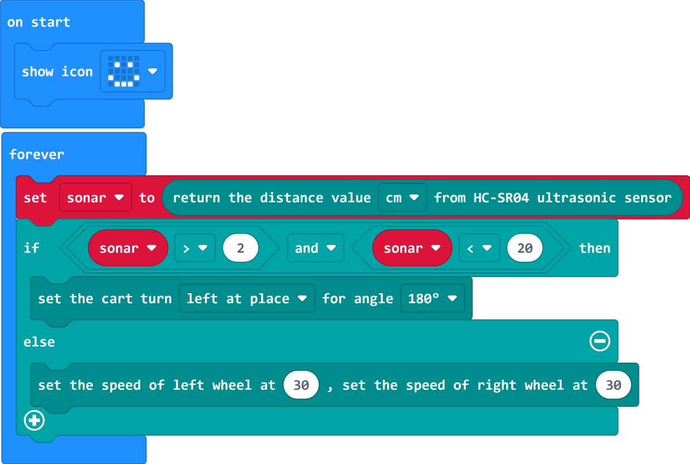

# Case 03 智能避障

## 简介

本课程旨在向学生介绍图形化编程和超声波传感器的应用。学生将学习如何编写程序让小车具备避障功能。通过这个案例，学生将加深对程序设计的判断、分支、与或非等知识点的理解，以及了解超声波传感器的工作原理。

## 教学目标

理解图形化编程的判断、分支、与或非等相关知识点。

学习超声波传感器的工作原理和应用。

掌握如何使用超声波传感器检测障碍物，并编写相应的程序进行避障。

## 教学准备

Cutebot Pro × 1

micro:bit × 1

## 教学过程

### 课程引入

在本节课，我们将使用Cutebot Pro智能赛车来制作一辆可以自动避开障碍物的小车。通过这个项目，我们将学习如何利用图形化编程和传感器技术来控制赛车的行为。

我们将学习如何使用超声波传感器来检测障碍物，并编写相应的代码来控制赛车的行动。

准备好迎接这个有趣的挑战了吗？让我们开始吧！

### 探究活动

如何使用超声波传感器检测障碍物？

如何编写一个程序，在遇到障碍物时让小车自动转弯避免碰撞？

### 示例代码

请参考程序连接：[https://makecode.microbit.org/_KgLeP413s4yf](https://makecode.microbit.org/_KgLeP413s4yf)

你也可以通过以下网页直接下载程序。

    <iframe
        src="https://makecode.microbit.org/_KgLeP413s4yf"
        frameborder="0"
        sandbox="allow-popups allow-forms allow-scripts allow-same-origin"
        style={{
            position: 'absolute',
            width: '100%',
            height: '100%',
        }}
    />

### 团队合作与展示

学生分成小组，共同完成小车的制作和程序编写。

鼓励学生之间相互合作、交流和分享经验。

每个小组有机会向其他小组展示他们制作的智能赛车。

### 总结与反思

回顾课程内容，提醒学生掌握了哪些知识和技能。

引导学生讨论他们在制作过程中遇到的问题和困难，以及如何解决这些问题。

引导学生思考小车超声波传感器在生活中还有哪些应用。
