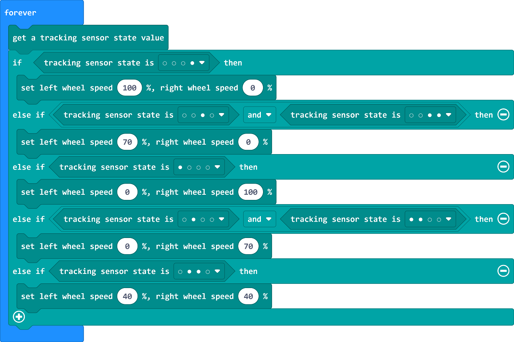

# Case 10 自动巡线

## 简介

本课程旨在通过制作智能巡线小车，让学生了解巡线传感器的工作原理。

## 教学目标

了解程序设计的基本概念，如判断、分支、与或非等。

理解巡线传感器的工作原理和应用。

能够使用Cutebot Pro智能赛车制作一个可以巡线行驶的小车。

## 教学准备

Cutebot Pro × 1

micro:bit × 1

## 教学过程

### 课程引入

大家好！今天我们将要介绍一个非常有趣的项目——制作智能巡线赛车。这辆小车可以沿着黑色线条行驶。

### 探究活动

巡线传感器的工作原理，它是如何检测黑色线条的？

在设计巡线小车的时候我们可能会用到哪些编程积木块？

巡线小车在生活中可能有哪些应用场景？

根据巡线传感器的工作原理，我们还能将其应用在哪些领域？

### 示例代码

请参考程序连接：[https://makecode.microbit.org/_aLj4hMCawg4M](https://makecode.microbit.org/_aLj4hMCawg4M)

你也可以通过以下网页直接下载程序。

    <iframe
        src="https://makecode.microbit.org/_aLj4hMCawg4M"
        frameborder="0"
        sandbox="allow-popups allow-forms allow-scripts allow-same-origin"
        style={{
            position: 'absolute',
            width: '100%',
            height: '100%',
        }}
    />

## 总结与反思

回顾课程内容，提醒学生掌握了哪些知识和技能。

引导学生讨论他们在制作过程中遇到的问题和困难，以及如何解决这些问题。

鼓励学生思考智能赛车制作案例的应用领域和未来发展。

## 延伸活动

让学生尝试改进智能赛车的巡线行驶功能，使其能够应对更复杂的线路。

鼓励学生设计其他传感器与巡线小车的综合使用案例，如超声波传感器等。

引导学生思考和讨论智能赛车在日常生活中的实际应用和未来发展前景。
