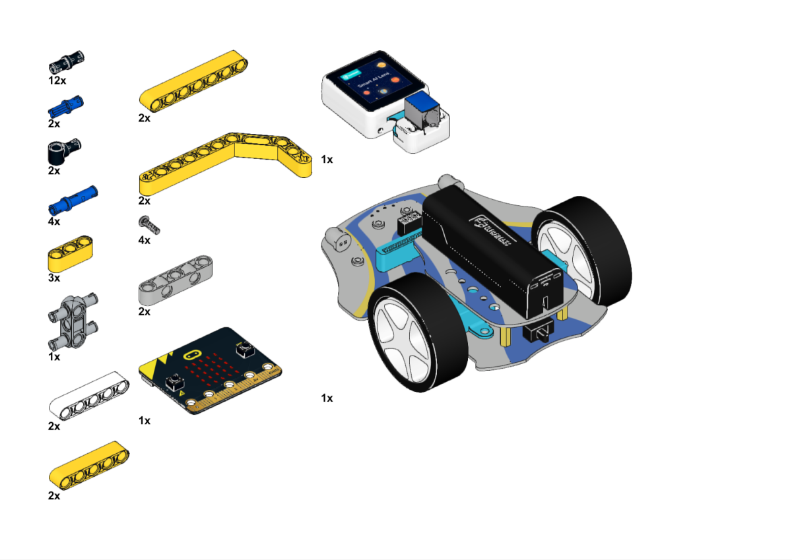
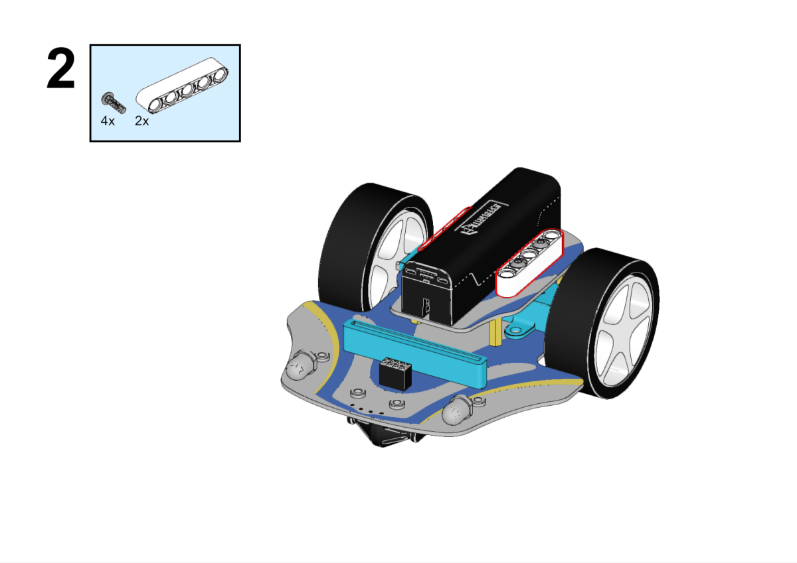
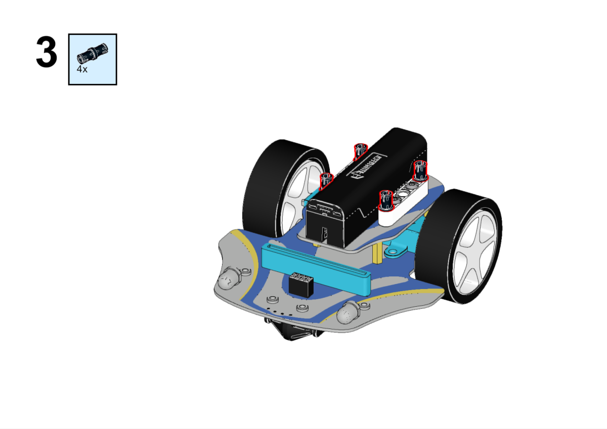
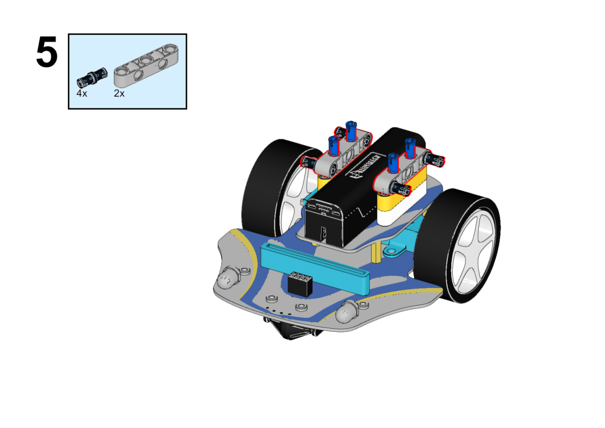
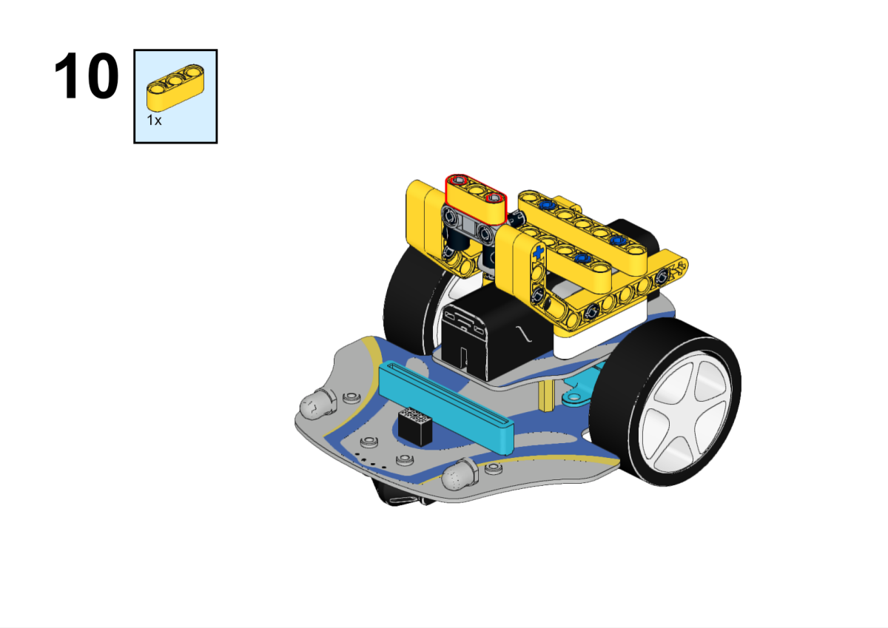
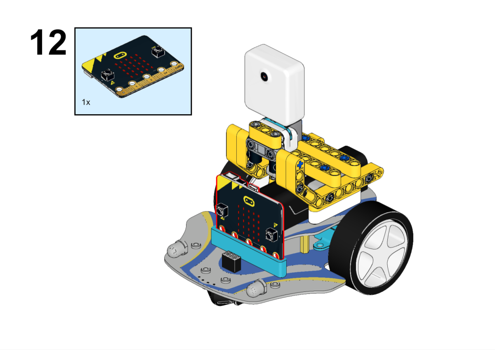
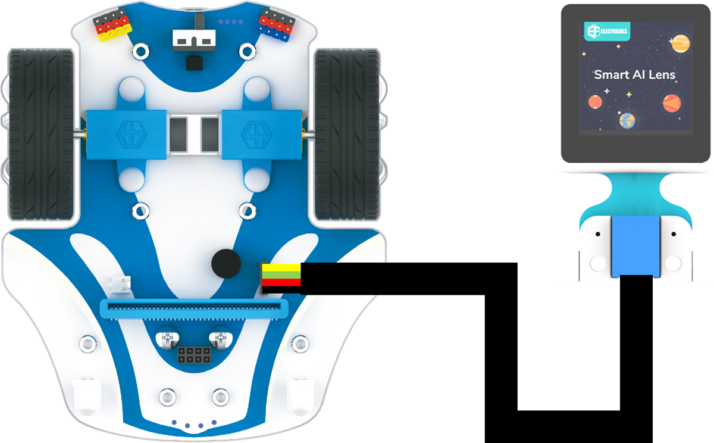
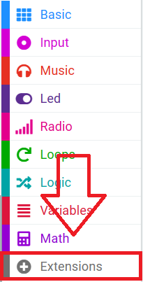
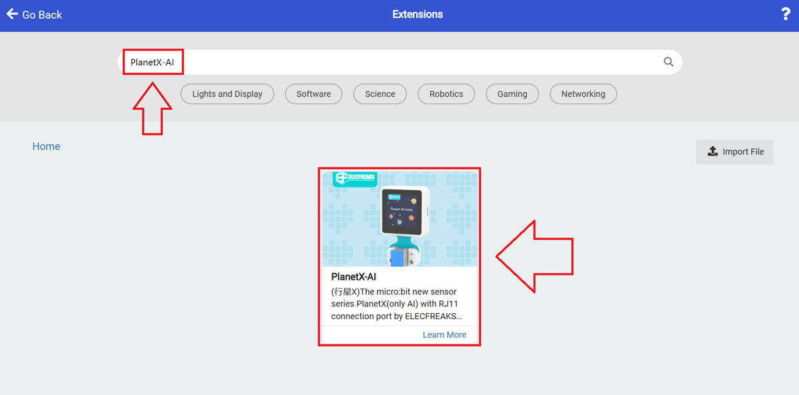

# Case 01 AI Road Signs Recognition Cart

## Purpose

Build a Cutebot PRO cart that uses an AI Lens to recognise road signs.

## Materials Requested

[Cutebot Pro](https://www.elecfreaks.com/elecfreaks-smart-cutebot-pro-programming-robot-car-for-micro-bit.html)

[AI Lens](https://www.elecfreaks.com/elecfreaks-smart-ai-lens-kit.html)

[Science and Technology Pack](https://shop.elecfreaks.com/products/elecfreaks-tpbot-science-and-technology-pack?_pos=3&_sid=11fe49ca3&_ss=r)

## Assembly Steps

## Hardware Connections

Connect the AI Lens to the IIC port on Cutebot Pro.

## Software

[Microsoft makecode](https://makecode.microbit.org/#)

## Code

Click "Extensions" in the makecode drawer to see more choices.

In order to programme the Cutebot Pro, we need to add an extension library. Find `Extensions` at the bottom of the code drawer and click on it. This will bring up a dialogue box to search for `CutebotPro` and click to download it.

For programming the AI Lens, we need to add the extension. Click  `Extensions`  at the bottom of the drawer and search with `PlanetX-AI` to download it.

## Code Example

`While on start `, initialise the AI lens and `set it to card recognition mode`;

`When button A is pressed,` set the cart `to move forward at the speed of 30%`;

In `forever` block, `set to get one image`, `set the cart to turn 90° to the right` when the AI Lens `recognises the image as turning to the right` and `the image size is over 100`.

### Program

Link: [https://makecode.microbit.org/_aRxCqsMuY8iq](https://makecode.microbit.org/_aRxCqsMuY8iq)

You may download it directly below:

    <iframe
        src="https://makecode.microbit.org/_aRxCqsMuY8iq"
        frameborder="0"
        sandbox="allow-popups allow-forms allow-scripts allow-same-origin"
        style={{
            position: 'absolute',
            width: '100%',
            height: '100%',
        }}
    />

## Conclusion

When button A is pressed, the cart moves forward and when it meets a road sign turning right, it automatically turns right by 90° and stops moving.

## Expanded Knowledge

*** AI路牌识别的应用及发展 ***

AI路牌识别是一种基于人工智能技术的图像识别应用，用于检测、识别和理解道路上的交通路牌。以下是AI路牌识别的应用和发展方面的一些关键点：

交通管理：AI路牌识别可以帮助交通管理部门监测道路上的交通标志和路牌情况。它可以自动检测和识别交通标志，提供实时的交通信息和指示，帮助驾驶员和行人遵守交通规则和导航。

自动驾驶：在自动驾驶车辆的发展中，AI路牌识别是关键技术之一。它可以帮助自动驾驶车辆辨识和理解道路上的交通标志和指示，以便做出相应的决策和行驶计划。

导航和路径规划：AI路牌识别可以用于实时导航系统，帮助司机和行人确定正确的行驶方向和路径规划。它可以识别路牌上的道路名称、交叉口指示和限速信息，为用户提供准确的导航指引。

城市规划和交通优化：AI路牌识别可以为城市规划和交通优化提供宝贵的数据。通过分析和识别路牌信息，可以了解道路网络的结构、交通流量和交通状况，从而优化交通规划、改善道路设施和提升城市交通效率。

安全监控：AI路牌识别可以用于交通安全监控系统。它可以实时监测道路上的交通标志和路牌，检测异常情况，例如损坏的路牌或缺失的标志。这有助于及时修复和维护交通设施，确保道路的安全性和可靠性。

AI路牌识别的发展已经取得了显著进展，主要得益于深度学习和计算机视觉技术的不断发展。随着算法的不断优化和硬件的提升，AI路牌识别的准确性和实时性得到了显著提升。未来，预计AI路牌识别将进一步发展，更加智能化和全面化，为交通管理、自动驾驶和城市规划等领域带来更多的便利和效益。

*** Application and Development of AI Road Sign Recognition ***

AI Road Sign Recognition is an image recognition application based on Artificial Intelligence technology for detecting, recognising and understanding traffic road signs on roads. Here are some of the key points in terms of application and development of AI Road Sign Recognition:

Traffic Management : AI Road Sign Recognition helps traffic management to monitor the condition of traffic signs and road signs on roads. It can automatically detect and recognise traffic signs, provide real-time traffic information and directions, and help drivers and pedestrians follow traffic rules and navigation.

AUTOMATIC DRIVING: AI road sign recognition is one of the key technologies in the development of autonomous driving vehicles. It helps self-driving vehicles recognise and understand traffic signs and instructions on the road in order to make decisions and travel plans accordingly.

NAVIGATION AND PATH PLANNING: AI road sign recognition can be used in real-time navigation systems to help drivers and pedestrians determine the correct direction of travel and path planning. It recognises road names, intersection instructions and speed limit information on road signs to provide users with accurate navigation guidance.

Urban planning and traffic optimisation: AI road sign recognition can provide valuable data for urban planning and traffic optimisation. By analysing and recognising road sign information, the structure of the road network, traffic flow and traffic conditions can be understood to optimise traffic planning, improve road facilities and enhance urban traffic efficiency.

Safety monitoring: AI road sign recognition can be used for traffic safety monitoring system. It can monitor traffic signs and road signs on roads in real time and detect abnormalities, such as damaged road signs or missing signs. This helps to repair and maintain traffic facilities in time to ensure the safety and reliability of roads.

Significant progress has been made in the development of AI road sign recognition, mainly due to the continuous development of deep learning and computer vision technologies. With the continuous optimisation of algorithms and the enhancement of hardware, the accuracy and real-time performance of AI road sign recognition have been significantly improved. In the future, it is expected that AI road sign recognition will further develop to become more intelligent and comprehensive, bringing more convenience and benefits to fields such as traffic management, autonomous driving and urban planning.
