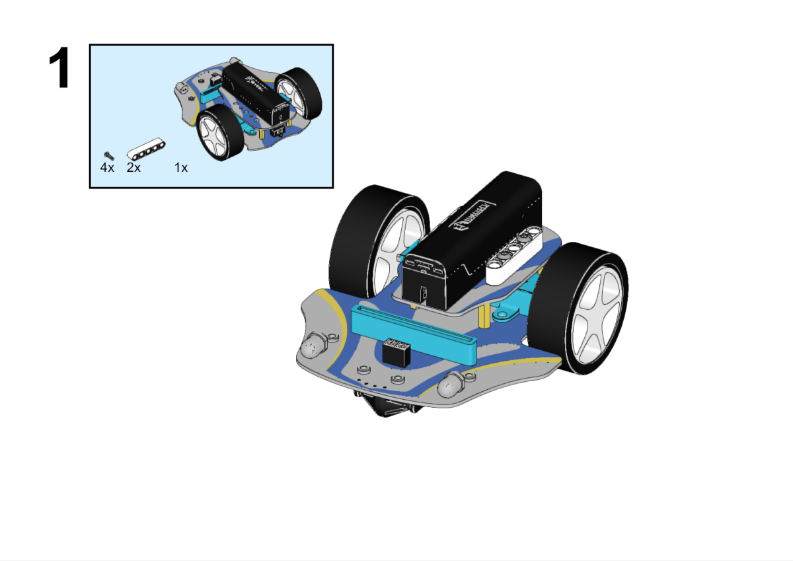
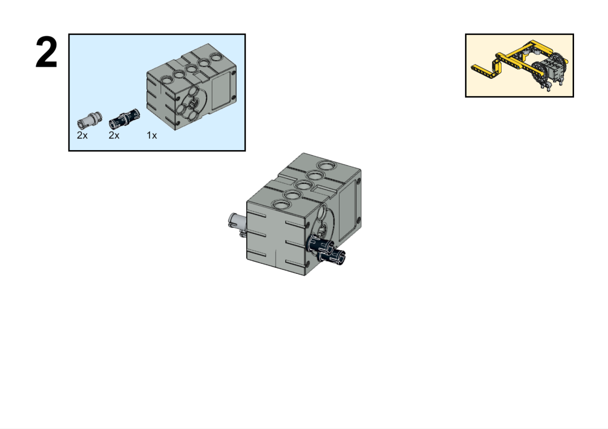
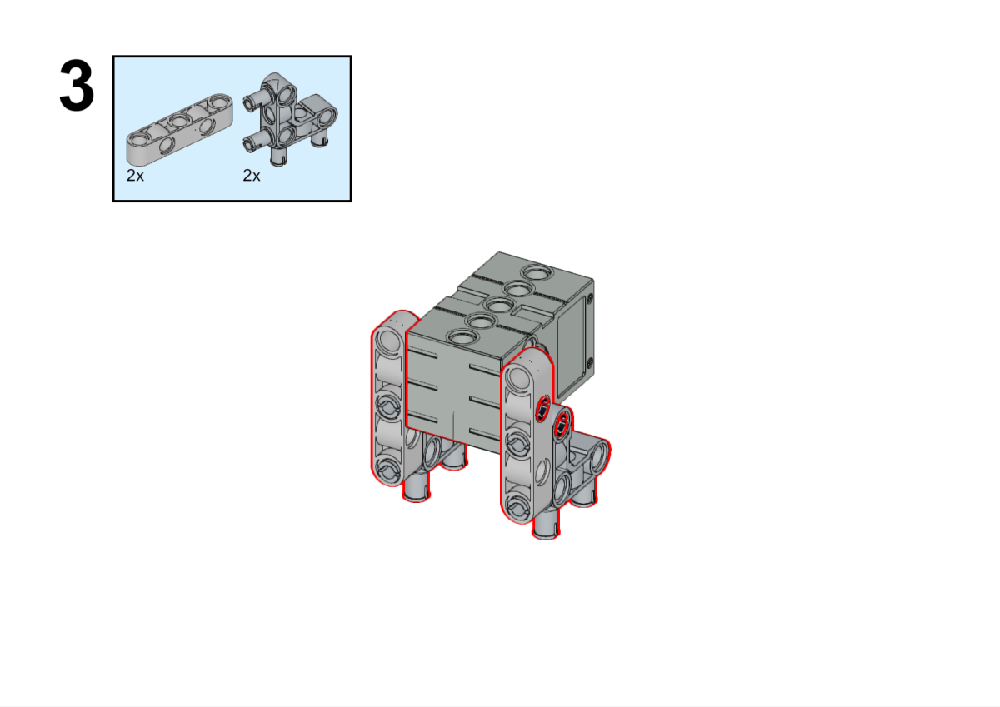
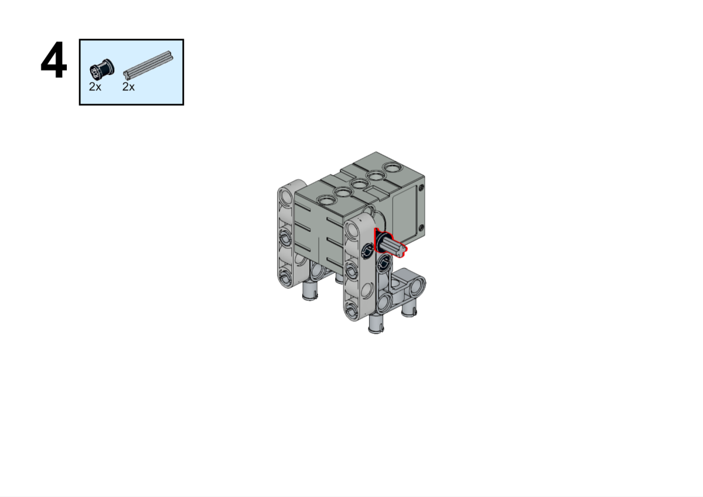
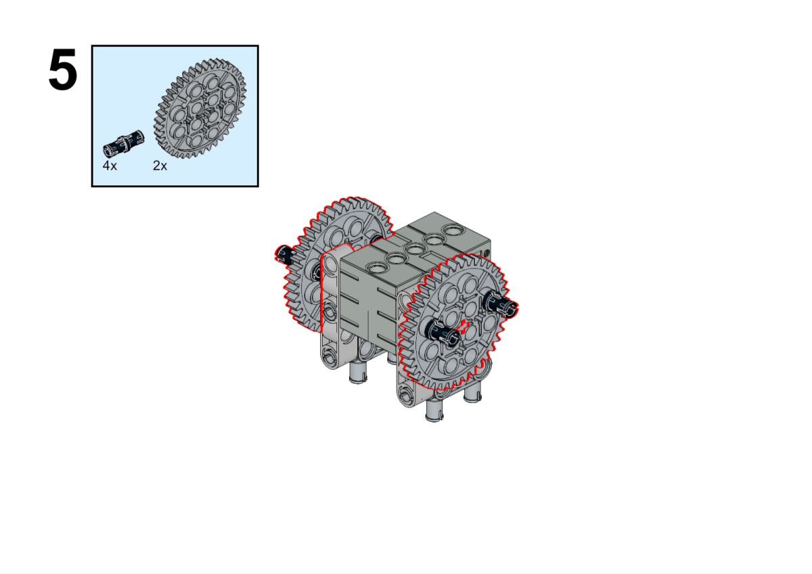
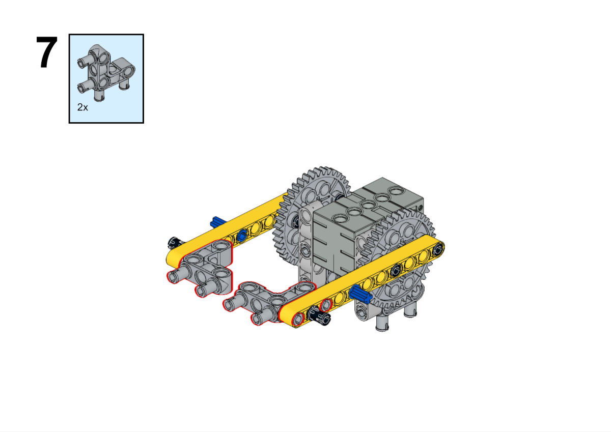
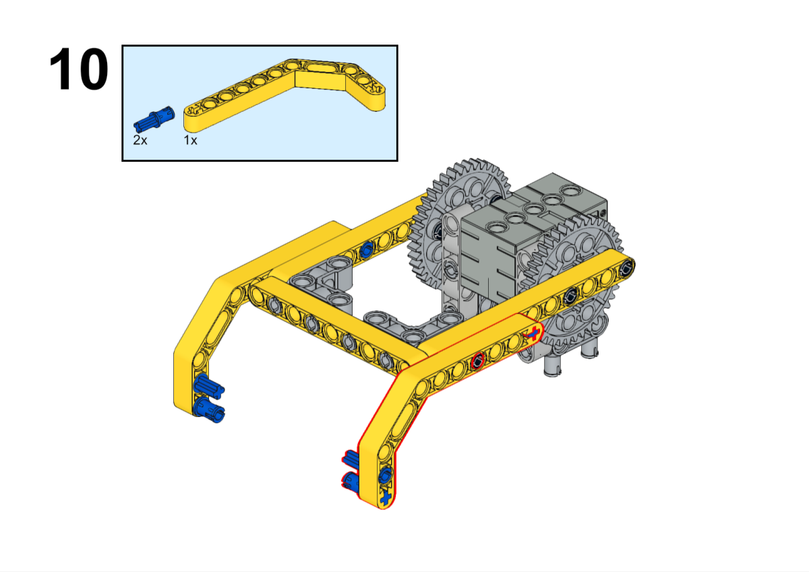
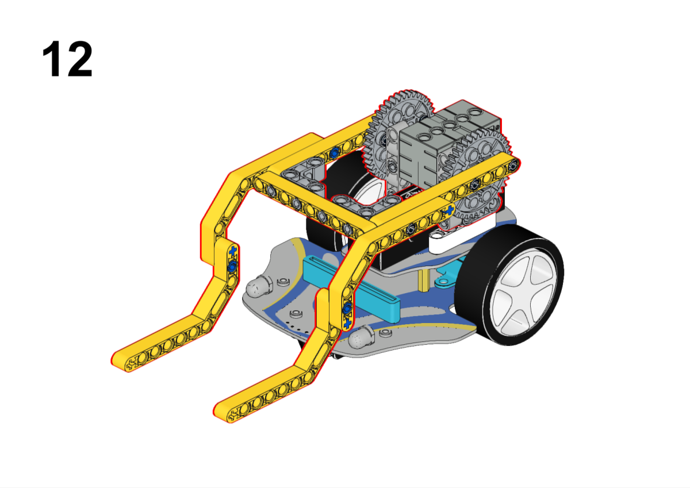
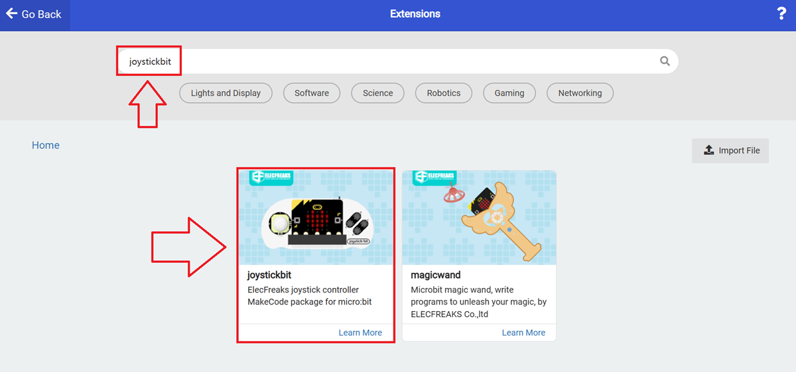

# Case 06 Remote Control Forklift Trucks

## Purpose

 To build a remote control Forklift truck with blocks.

## Materia Request

[Cutebot Pro](https://www.elecfreaks.com/elecfreaks-smart-cutebot-pro-programming-robot-car-for-micro-bit.html)

[Science and Technology Pack](https://shop.elecfreaks.com/products/elecfreaks-tpbot-science-and-technology-pack?_pos=3&_sid=11fe49ca3&_ss=r)

[ELECFREAKS micro:bit Joystick:bit V2 Kit](https://www.elecfreaks.com/joystick-bit-2-kit-for-micro-bit.html)

## Assembly Steps

## Hardware Connection

Connect the servo to the S1 port of the Smart Cutebot Pro.

## Software

[Microsoft makecode](https://makecode.microbit.org/#)

## Programming

Click `Advanced` in MakeCode's code drawer to see more code options.

In order to programme Smart Cutebot Pro, we need to add an extension library. Find `Extensions` at the bottom of the code drawer and click on it. This will bring up a dialogue box to search for `CutebotPro` and click to download this code library.

In order to programme the joystick:bit V2, we need to add an extension library. Find `Extensions` at the bottom of the code drawer and click on it. This will bring up a dialogue box to search for `joystickbit` and click it to have it downloaded.

## Code Example

### Joystick

### Reference

Link: [https://makecode.microbit.org/_DHyiYdULjKg0](https://makecode.microbit.org/_DHyiYdULjKg0)

You can also download the links directly:

    <iframe
        src="https://makecode.microbit.org/_DHyiYdULjKg0"
        frameborder="0"
        sandbox="allow-popups allow-forms allow-scripts allow-same-origin"
        style={{
            position: 'absolute',
            width: '100%',
            height: '100%',
        }}
    />

### Cutebot Pro

### Reference

Link: [https://makecode.microbit.org/_WgKiF1Ckkbch](https://makecode.microbit.org/_WgKiF1Ckkbch)

You can also download the links directly:

    <iframe
        src="https://makecode.microbit.org/_WgKiF1Ckkbch"
        frameborder="0"
        sandbox="allow-popups allow-forms allow-scripts allow-same-origin"
        style={{
            position: 'absolute',
            width: '100%',
            height: '100%',
        }}
    />

## Result

The trolley travelling route is controlled by the joystick, and press the button C to control the trolley to lift the items.

##  Expanded knowledge

*** Structural characteristics of forklift trucks ***

A forklift truck (or forklift) is a mechanical device used for handling and stacking goods. It has the following structural features:

Chassis: The chassis of a forklift truck is the foundation of the whole machine, usually made of steel with sufficient strength and stability. The chassis is fitted with the cab, engine, hydraulic system and other important mechanical and electronic components.

Cab: The cab of a forklift truck is located at the front or centre of the chassis, providing the operator with a comfortable and safe working environment. The cab contains a seat, steering wheel, instrument panel and control levers through which the operator can manipulate the movements and functions of the forklift.

Fork Arms: The fork arms of a forklift truck are its primary working parts, used for lifting and stacking loads. The arm is usually made of steel, inverted "L" shape, and can be moved up and down. Forks are mounted on the top of the arm to insert the load and lift and carry it.

Lifting System: The lifting system of a forklift truck is driven by a hydraulic system that raises and lowers the fork arms and forks. Hydraulic cylinders are supplied with pressure by hydraulic pumps, which push hydraulic fluid into the cylinders to move the fork arms up and down.

Power system: Forklift trucks usually use either an internal combustion engine or an electric motor as the power source. Internal combustion engine forklifts are powered by fuel (e.g. petrol, diesel or LPG), while electric forklifts are powered by batteries or electricity. The power system provides the forklift's power and operating capacity.

Tyres: Forklifts are usually equipped with special solid rubber tyres or pneumatic tyres to provide good traction and manoeuvrability. The choice of tyres depends on the environment in which they are used and the nature of the load.

Control system: The control system of a forklift truck consists of devices such as joysticks, pedals and control panels that are used to operate the forklift truck's movements and functions. The operator can control the direction, lift the forks, tilt the fork arms and other operations through these control devices.

Overall, forklifts have key structural features such as a robust chassis, cab, fork arms, lifting system, power system, tyres and control system. These features enable forklifts to efficiently and safely handle and stack heavy loads, making them indispensable equipment in the logistics and warehousing industries.
