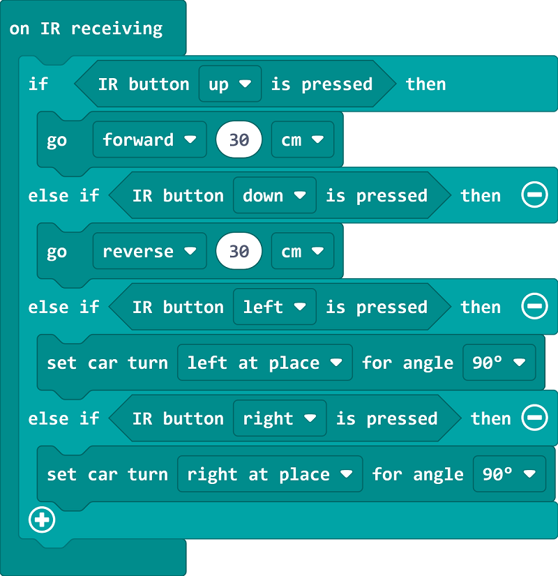

# Case 13 红外遥控小车

## 简介

本课程旨在通过让学生制作红外遥控小车案例，让学生了解红外遥控的方式。

## 教学目标

使用红外遥控器控制小车行驶。

## 教学准备

Cutebot Pro × 1

micro:bit × 1

红外遥控器 × 1

## 教学过程

### 课程引入

大家好！今天我们将继续我们的智能赛车制作项目，并给小车添加一个新的功能。你们有没有想过如何利用红外遥控来控制小车的行驶呢？

### 探究活动

如何利用红外遥控来控制小车的行驶呢？

### 示例代码

请参考程序连接：[https://makecode.microbit.org/_hek2e375jWeM](https://makecode.microbit.org/_hek2e375jWeM)

你也可以通过以下网页直接下载程序。

    <iframe
        src="https://makecode.microbit.org/_hek2e375jWeM"
        frameborder="0"
        sandbox="allow-popups allow-forms allow-scripts allow-same-origin"
        style={{
            position: 'absolute',
            width: '100%',
            height: '100%',
        }}
    />

### 案例展示

## 总结与反思

回顾课程内容，提醒学生掌握了哪些知识和技能。

引导学生讨论他们在制作过程中遇到的问题和困难，以及如何解决这些问题。

鼓励学生思考遥控智能赛车的应用场景
