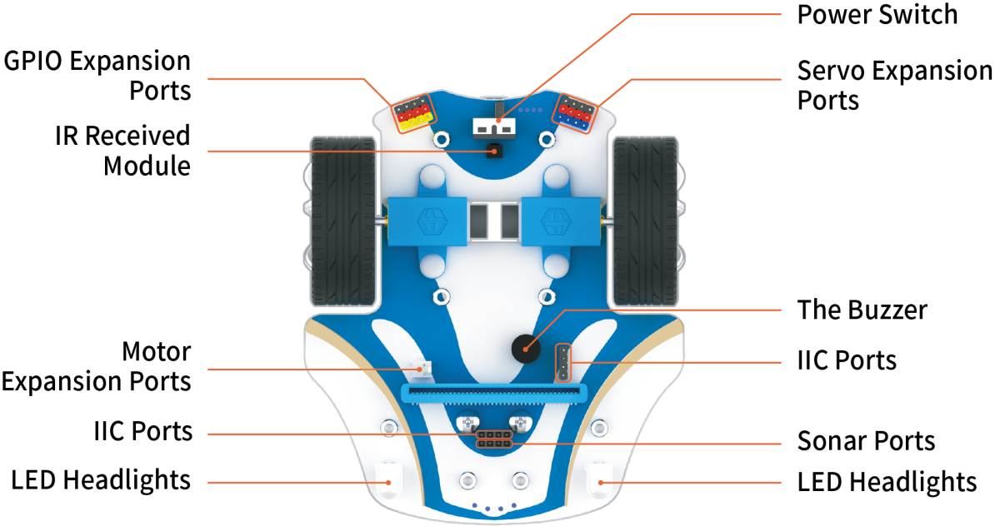
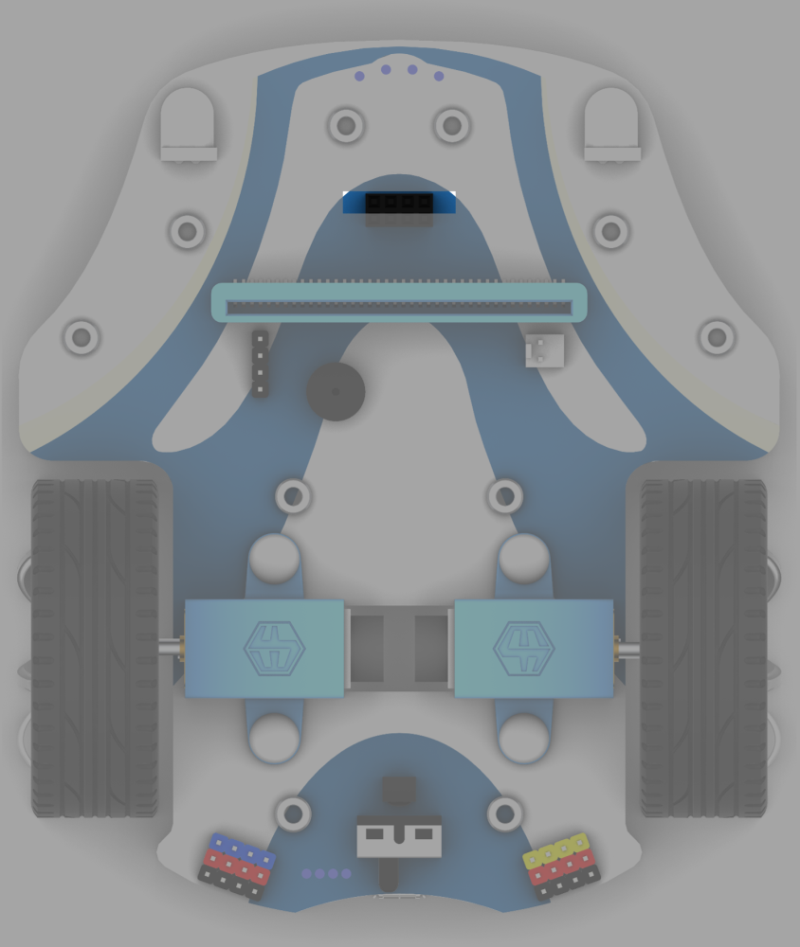
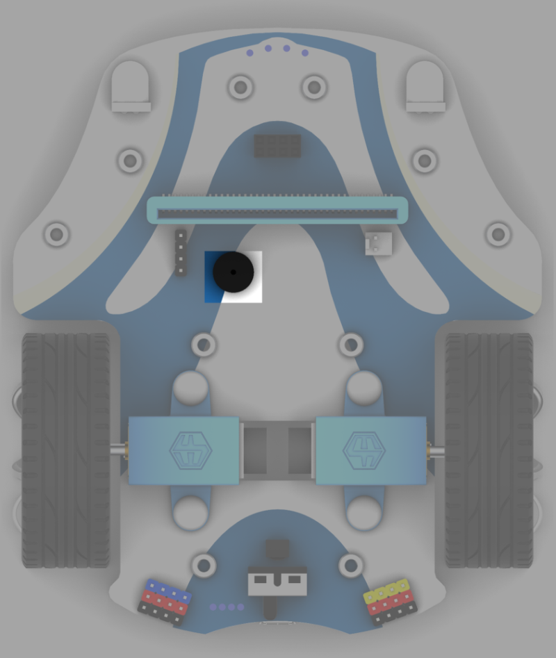
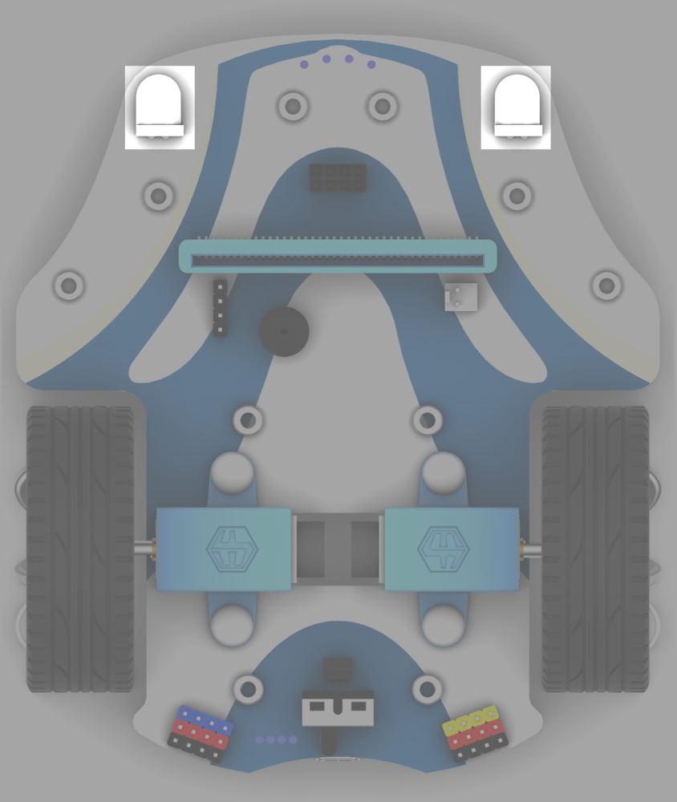
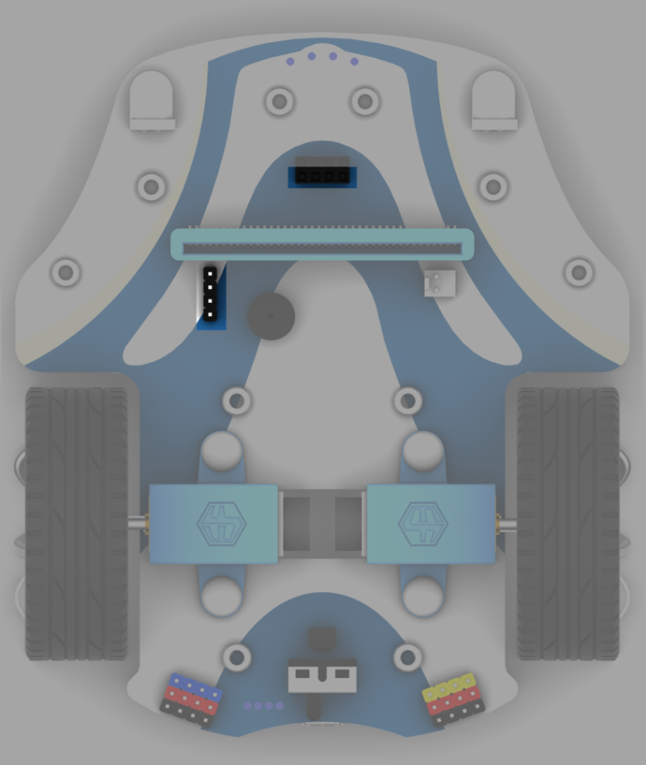
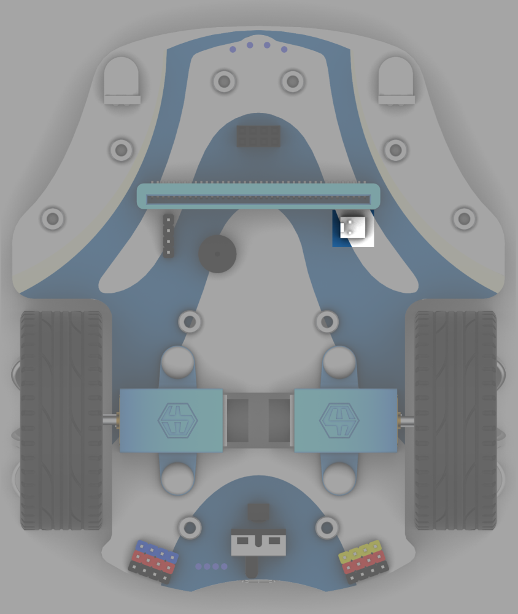
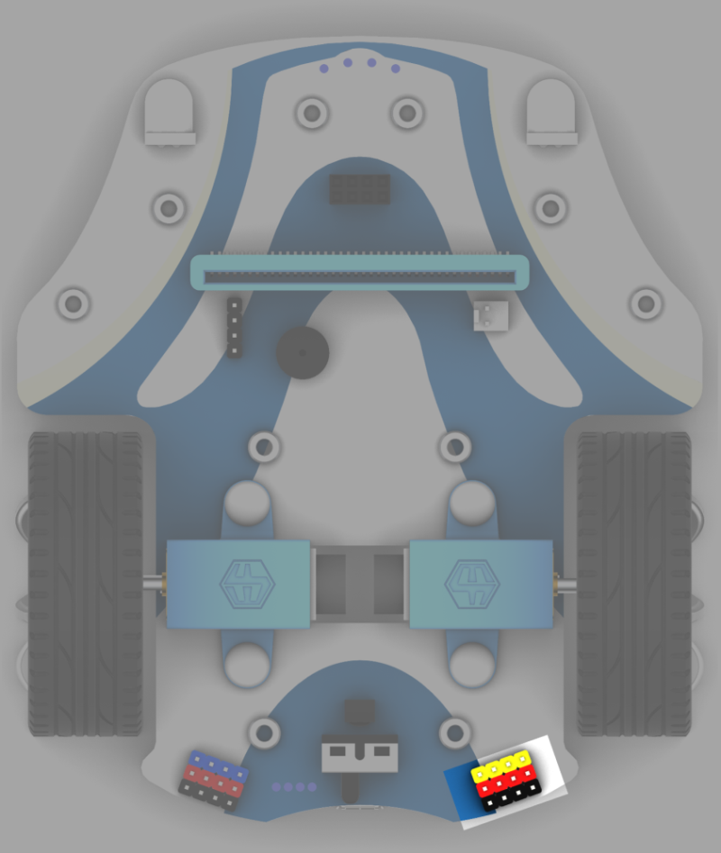
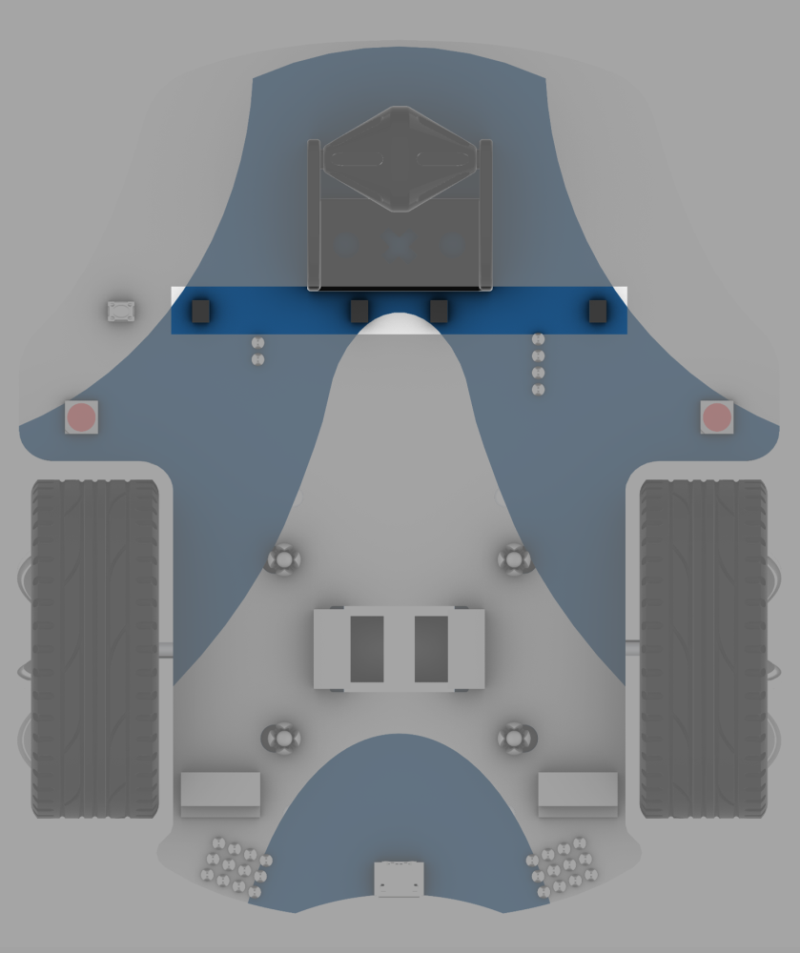
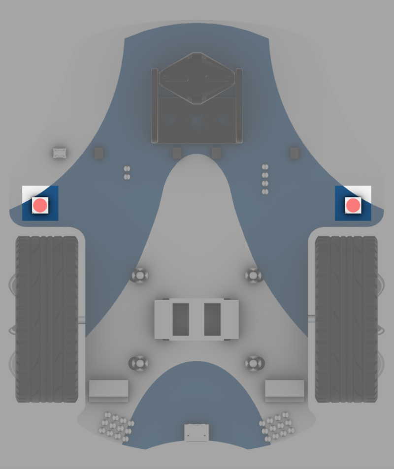

# Introduction to the function modules

## Encoder motors

## Interface for ultrasonic sensor

## Buzzer

## Infrared receiving module

## RGB headlights

## IIC expansion port

## Servo expansion port

## Motor expansion port

## GPIO expansion port

## Four-way infrared line following sensor

## Learn button of four-way infrared line following sensor

## Rainbow LEDs

