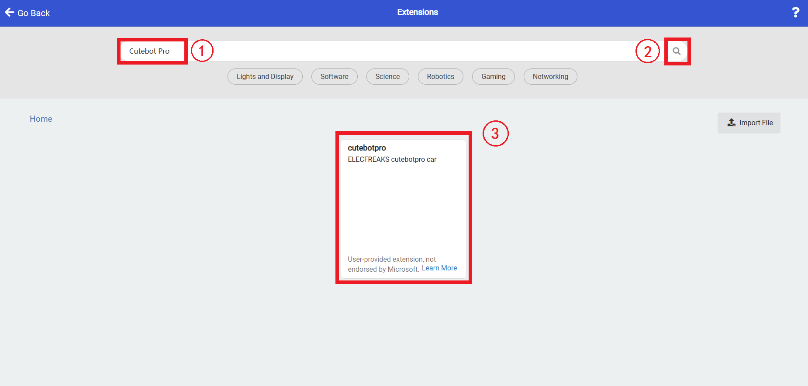

# Add extensions

Go to "makecode.microbit.org" and click "New project".

Create your item name in the pop-up box.

Click "Extensions" in the code drawer.

Search with "Cutebot Pro" in the box and download it.

