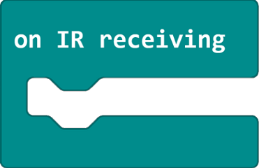

# Functions introduction to the bricks

| Classification | Command | Description |
| ------------ | ------------------------------------------------------- | ------ |
| **Basic** |   | Drive the car at full speed. |
|              |   | Reverse at full speed. |
|              |   | Set the speed of both wheels with the range from -100~100 |
|              |   | Set the left or right wheel or all wheels to stop turning |
|              |   | Obtain the speed of rotation of the left or right wheel (cm/s) |
|              |   | Get the rotation angle of the left or right wheel |
|              |   | Clear the acquired rotation angle of the left or right wheel |
| **Headlights** |   | Set the colour of the left and right RGB lights as the preset colour |
|              |   | Set the colour of the left and right RGB lights display |
|              |   | Turn off all the headlights |
| **Four-Way** |   | Get the current status value of the four line following sensors |
|              |   | Get the current status of the four line following sensors |
|              |   | Get four line following sensor offsets |
|              |   | Get the status of a channel of a four-way line following sensor |
|              |   | Get the grayscale value of a channel of a four-way line following sensor |
| **HC-SR04** |   | Get the return value of the ultrasonic sensor |
| **PIDContrl** |   | Set wheel speed (speed range 20 to 50 cm/s) |
|              |   | Set the trolley forward or backward a specified distance (in cm, inches, wheel rotation angle) |
|              |   | Set the steering method and steering angle of the trolley |
|              |   | Set the square side lengths ((in cm, inches)) |
|              |   | Set the trolley to travel several squares forward |
| **IRservo** |   | Execution of the internal program when an infrared signal is received |
|              |   | Identify whether a button on an infrared remote control has been pressed |
| **Extendinterface** |   | Set the speed of the extended motor (-100 to 100) |
|              |   | Setting the extended motor to stop rotating |
|              |   | Set the maximum rotation angle using the servo as well as the access port and rotation angle |
|              |   | Set the access port and speed of the continuous rotation servo |
| **other** |   | Get the current firmware version number of the cart |
