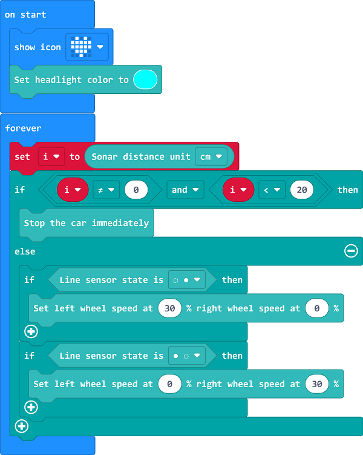

---

sidebar_position: 22
sidebar_label: 别碰我

---

# Case 21: 别碰我

## 简介

制作一辆天蓬车，当它被拿起时则会发出警报。

## 购买链接

[TPBot](https://www.elecfreaks.com/tpbot.html)
micro:bit v2

## 软件

[MicroSoft makecode](https://makecode.microbit.org/#)

## Programming

 Click "Advanced" in the MakeCode drawer to see more choices.

We need to add a package for programming. Click "Extensions" in the bottom of the drawer and search with "tpbot" to download it.

### Sample

### Link
Link：[https://makecode.microbit.org/_VcfdkRUW6TUs](https://makecode.microbit.org/_VcfdkRUW6TUs)

You may also download it directly below:

    <iframe
        src="https://makecode.microbit.org/_VcfdkRUW6TUs"
        frameborder="0"
        sandbox="allow-popups allow-forms allow-scripts allow-same-origin"
        style={{
            position: 'absolute',
            width: '100%',
            height: '100%',
        }}
    />

### Conclusion

通过加速度计判断天蓬车的状态，当天蓬车被拿起来时，灯光闪烁并蜂鸣器发出声音；放下后停止，显示爱心。
