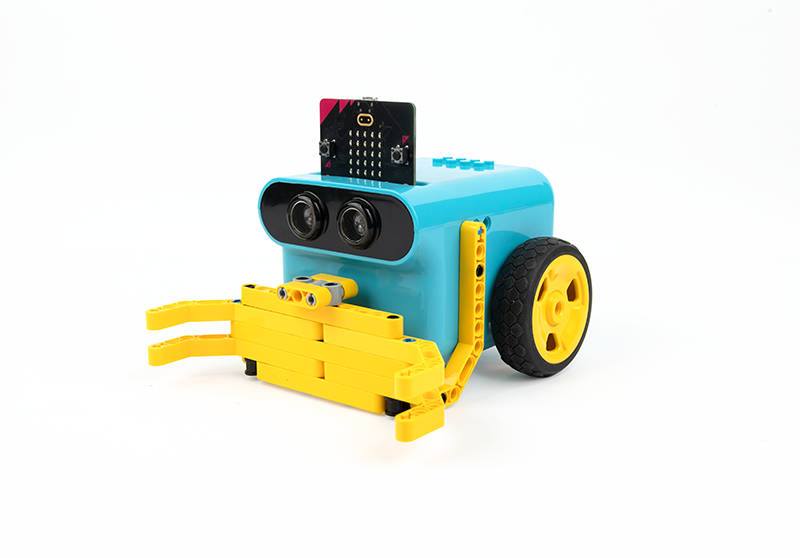
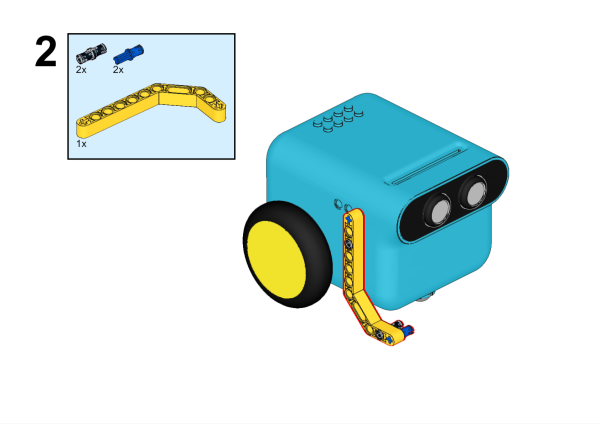
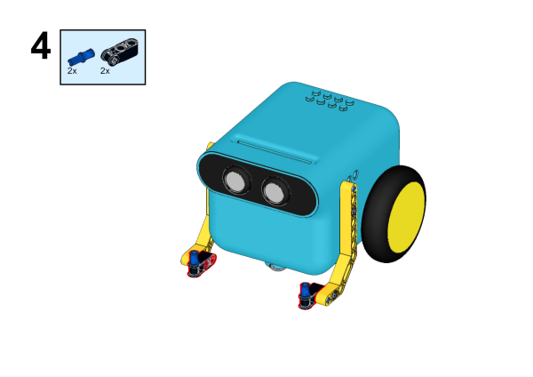
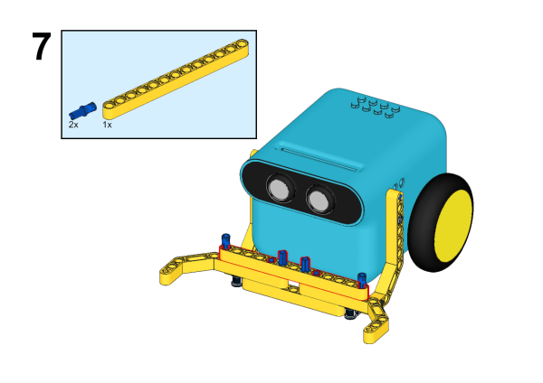
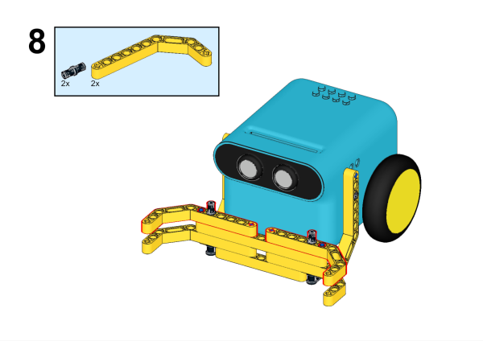
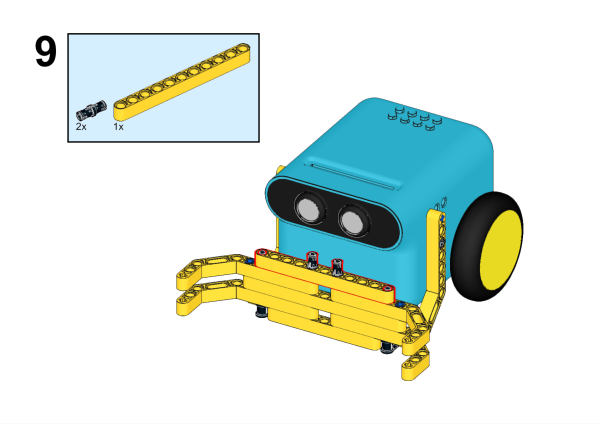

# TPbot Bulldozer

## Purpose

Build a TPBot bulldozer. 

## Materials Requested

[TPBot Smart Car](https://www.elecfreaks.com/tpbot.html)
[360 degrees servo](https://www.elecfreaks.com/geekservo-2kg-360-degrees-compatible-with-lego.html)
Bricks Pack

## Assembly steps

## Software 

[Microsoft makecode](https://makecode.microbit.org/#)

## Program 

Click "Advanced" in the makecode drawer to see more choices. 

For programming the TPBot, we need to add the extensions. Click "Extensions" at the bottom of the drawer and search with `tpbot` in the box, then download it. 

## Samples Program

While `on start`, set to show an icon and make the car drive forward at the speed of 50%. 

### Program

Reference program: [https://makecode.microbit.org/_egqdaXL02ey6](https://makecode.microbit.org/_egqdaXL02ey6)

You may download it directly here: 

    <iframe
        src="https://makecode.microbit.org/_egqdaXL02ey6"
        frameborder="0"
        sandbox="allow-popups allow-forms allow-scripts allow-same-origin"
        style={{
            position: 'absolute',
            width: '100%',
            height: '100%',
        }}
    />

## Conclusion

The TPBot drives forward. 
