# TPbot Catapult

## Purpose

To build a TPBot Catapult.

## Materials Requested

[TPBot Smart Car](https://www.elecfreaks.com/tpbot.html)

[360 degrees servo](https://www.elecfreaks.com/geekservo-2kg-360-degrees-compatible-with-lego.html)

Bricks Pack

## Assembly Steps

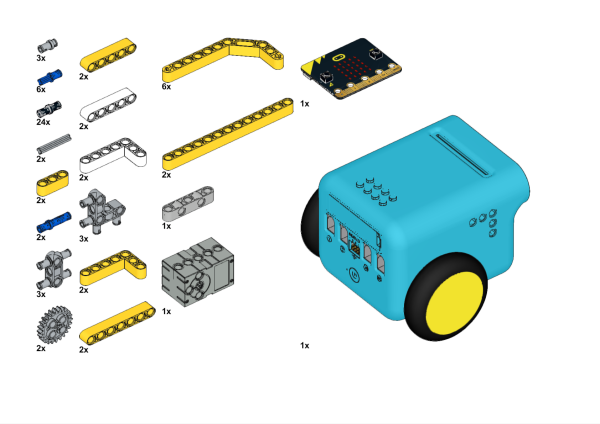

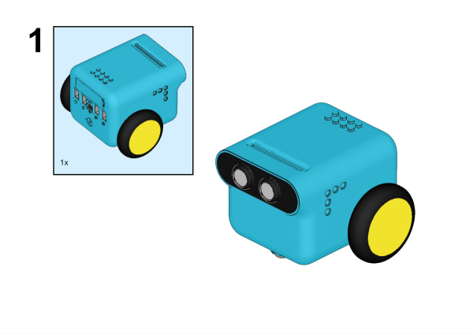

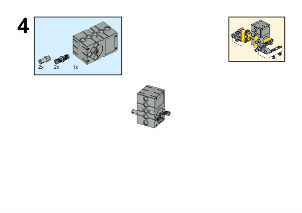

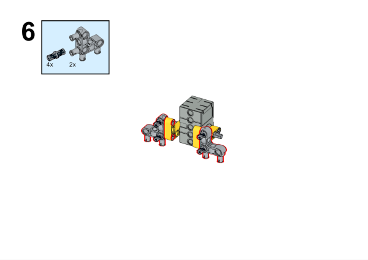

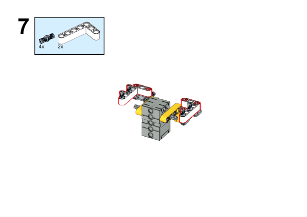

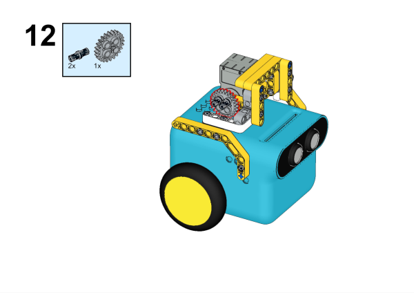

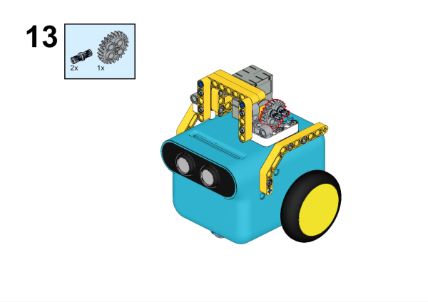

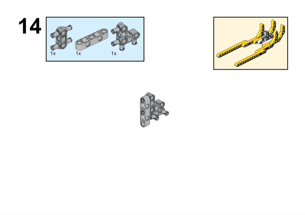

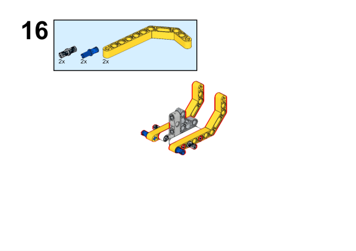

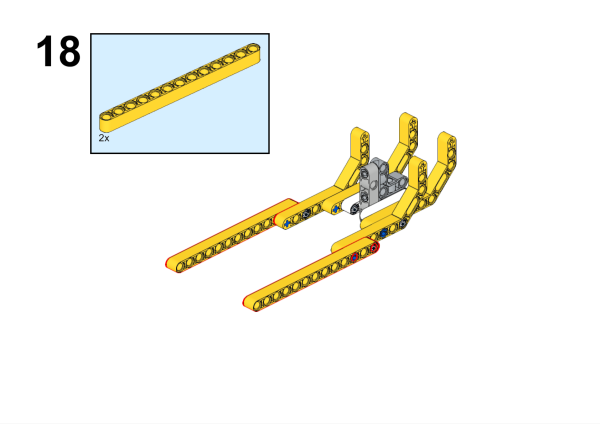

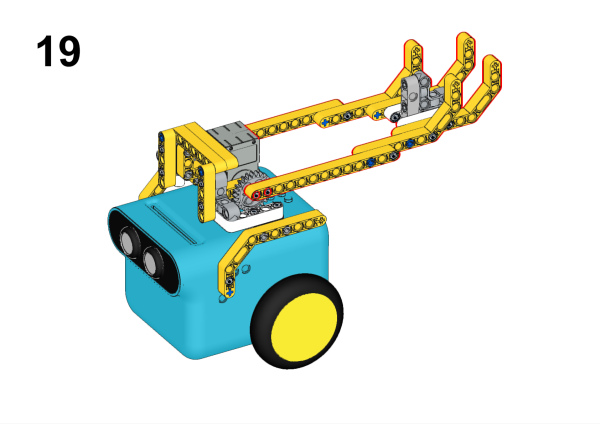

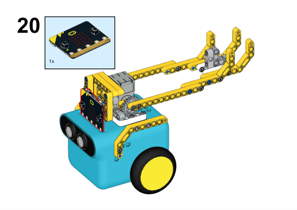

## Hardware Connections

Connect the 360° servo to servo 1 port on the TPBot.

## Hardware Connections

Connect the 360° servo to servo 1 port on the TPBot.

## Software

[Microsoft makecode](https://makecode.microbit.org/#)

## Program

Click "Advanced" in the makecode drawer to see more choices.

For programming the TPBot, we need to add the extensions. Click "Extensions" at the bottom of the drawer and search with `tpbot` in the box, then download it.

## Samples for program
While `on start`, set to show an icon, while button A being pressed, make the servo connecting to S1 drive to 180 degrees; while button B being pressed, set the servo connecting with S1 to ratote to 270 degrees.

### Program

Reference link: [https://makecode.microbit.org/_abKfLKhV4V99](https://makecode.microbit.org/_abKfLKhV4V99)

You may download it directly here:

    <iframe
        src="https://makecode.microbit.org/_abKfLKhV4V99"
        frameborder="0"
        sandbox="allow-popups allow-forms allow-scripts allow-same-origin"
        style={{
            position: 'absolute',
            width: '100%',
            height: '100%',
        }}
    />

## Conclusion:

While pressing button A, the catapult shots out the ball; while pressing button B, the catapult lies down.
