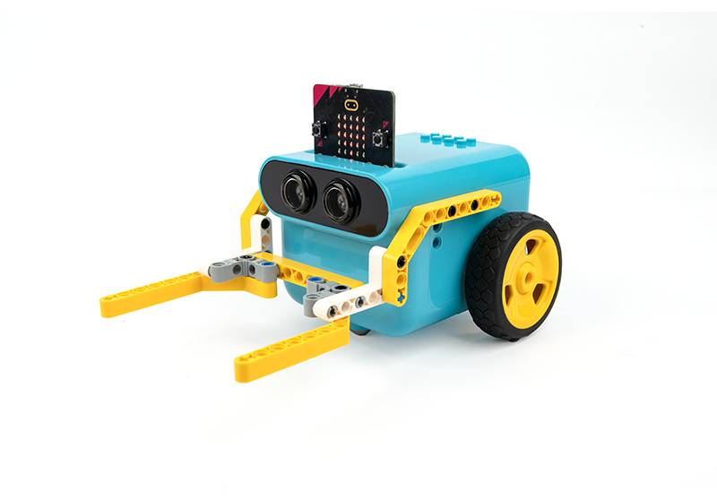
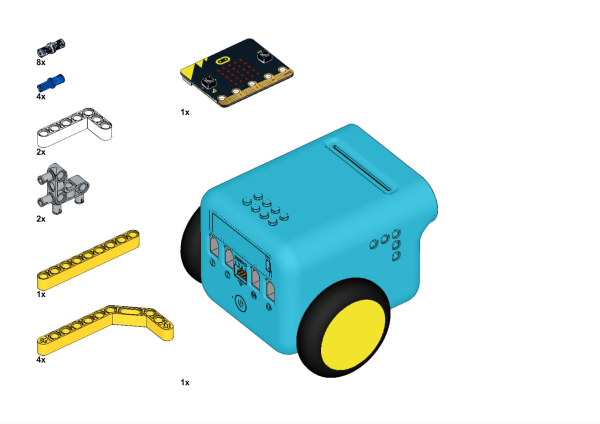
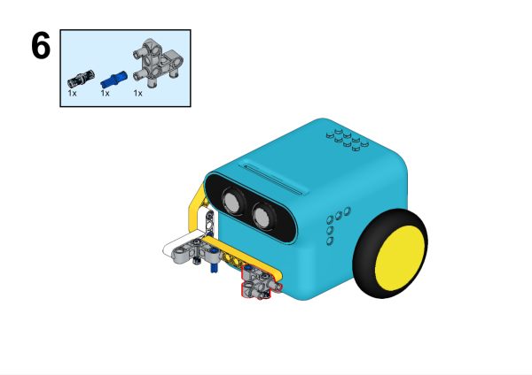
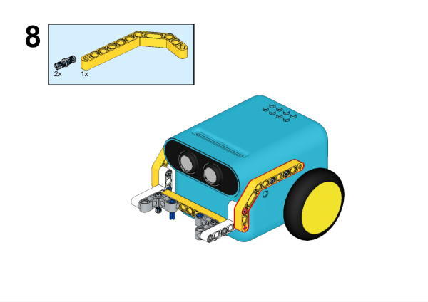
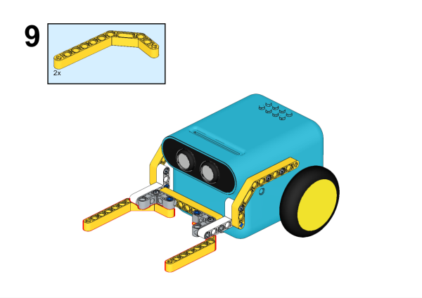
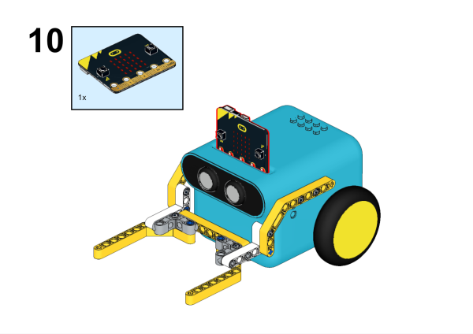

# TPbot Combat 3

## Purpose

To build a combat TPBot.

## Materials Requested

[TPBot Smart Car](https://www.elecfreaks.com/tpbot.html)

[360 degrees servo](https://www.elecfreaks.com/geekservo-2kg-360-degrees-compatible-with-lego.html)

Bricks Pack

## Assembly Steps

Hardware Connections

Connect the 360° servo to servo 1 port on the TPBot.

## Software

[Microsoft makecode](https://makecode.microbit.org/#)

## Program

Click "Advanced" in the makecode drawer to see more choices.

For programming the TPBot, we need to add the extensions. Click "Extensions" at the bottom of the drawer and search with `tpbot` in the box, then download it.

## Samples program

While `on start`, set to show an icon and drive the car to move forward at the speed of 50%.

### Program

Reference link: [https://makecode.microbit.org/_egqdaXL02ey6](https://makecode.microbit.org/_egqdaXL02ey6)

You may download it directly here:

    <iframe
        src="https://makecode.microbit.org/_egqdaXL02ey6"
        frameborder="0"
        sandbox="allow-popups allow-forms allow-scripts allow-same-origin"
        style={{
            position: 'absolute',
            width: '100%',
            height: '100%',
        }}
    />

## Conclusion

The cart drives forward and the fork in the headpart push the other carts away.
