# TPbot Mechanical Claw

## Purpose

To build a TPBot with the Mechanical claw.

## Materials Requested

[TPBot Smart Car](https://www.elecfreaks.com/tpbot.html)

[360 degrees servo](https://www.elecfreaks.com/geekservo-2kg-360-degrees-compatible-with-lego.html)

Bricks Pack

## Assembly Steps

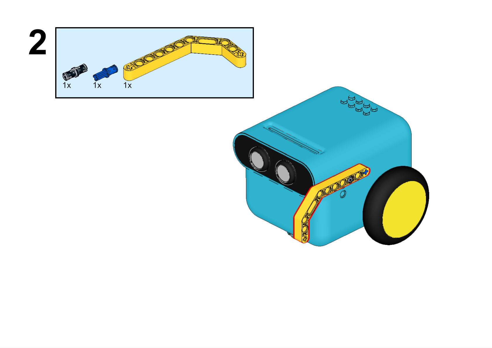

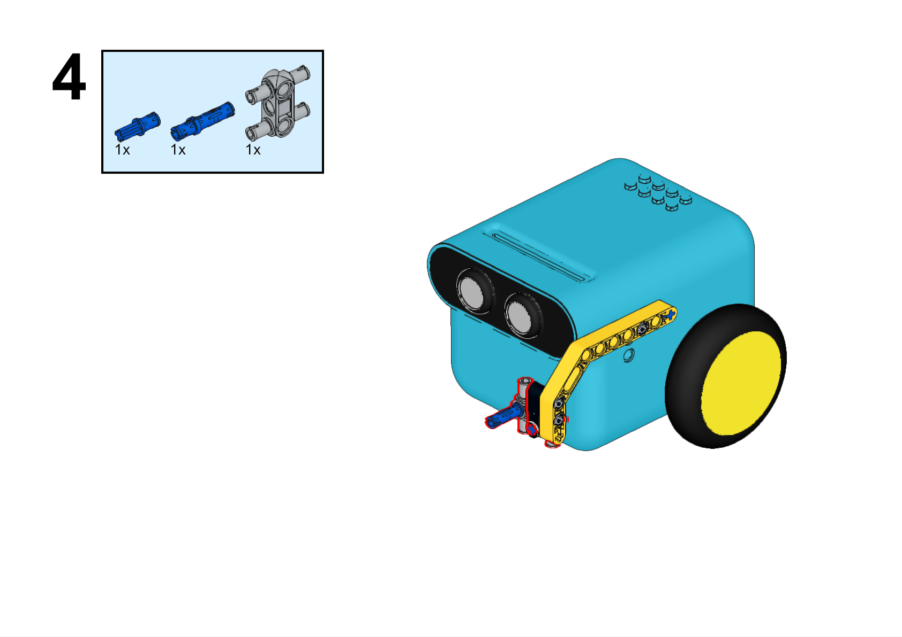

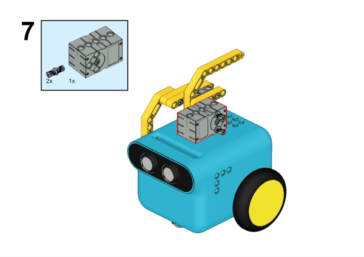

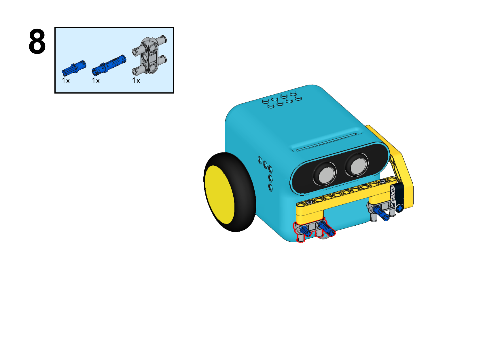

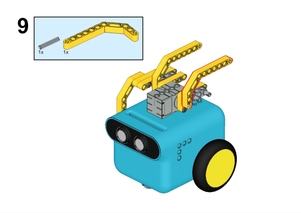

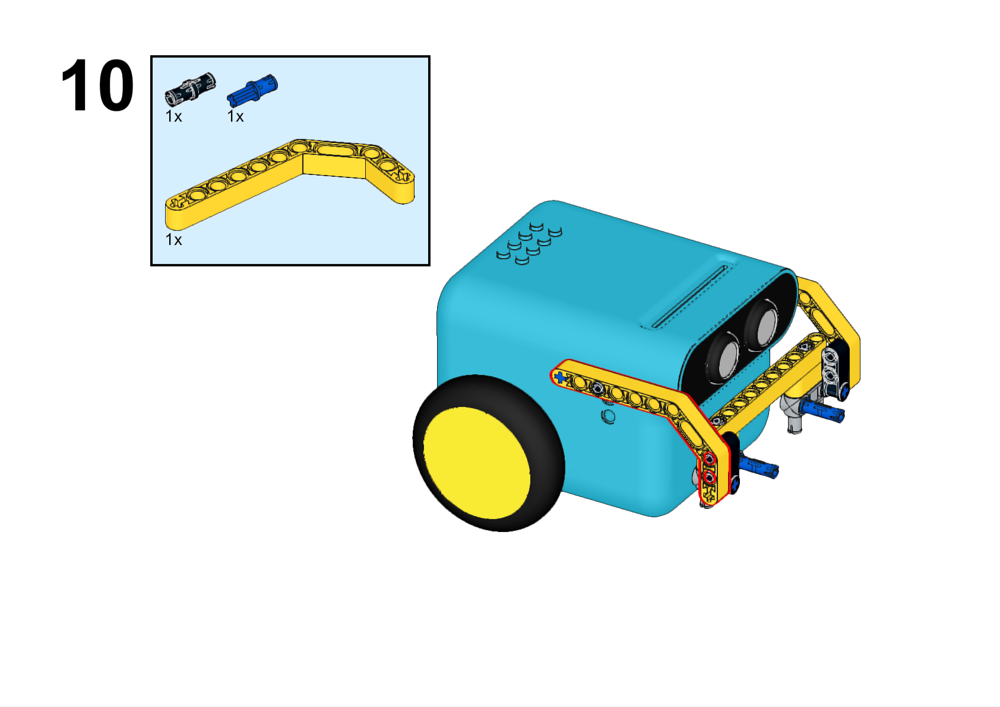

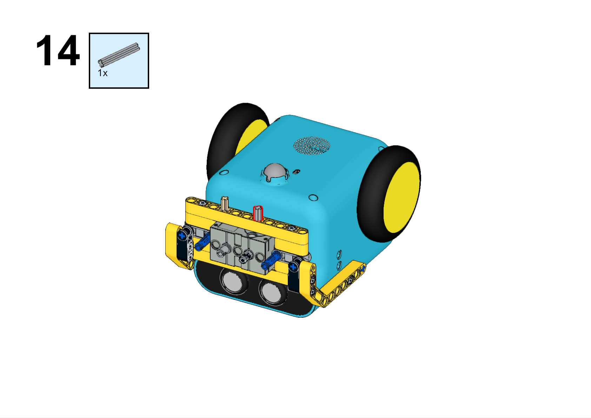

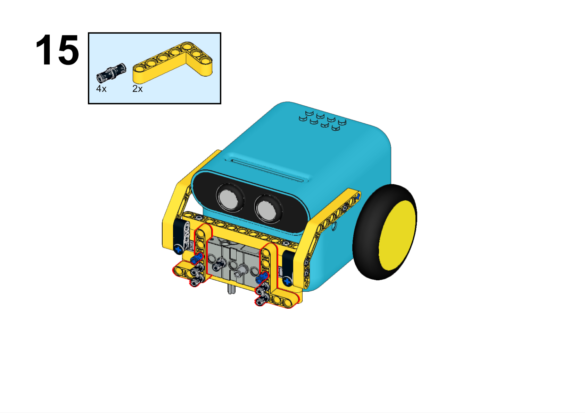

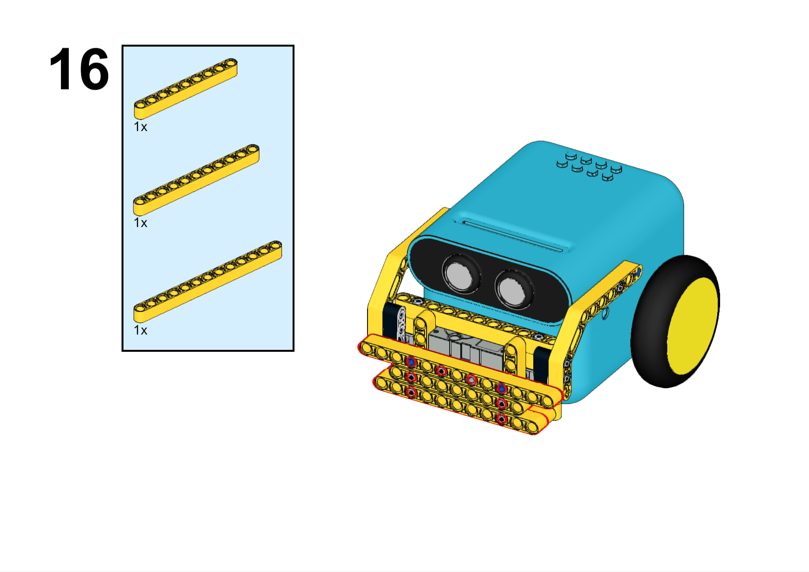

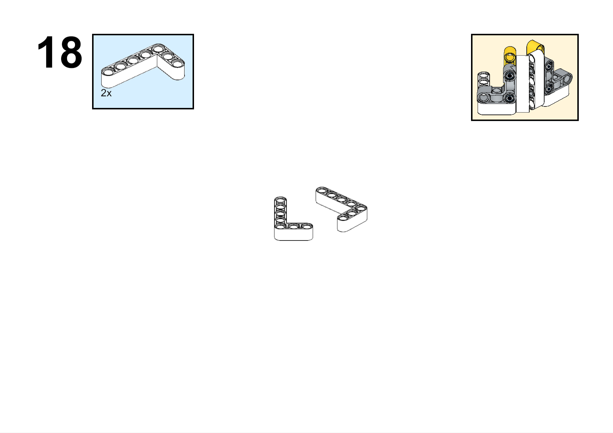

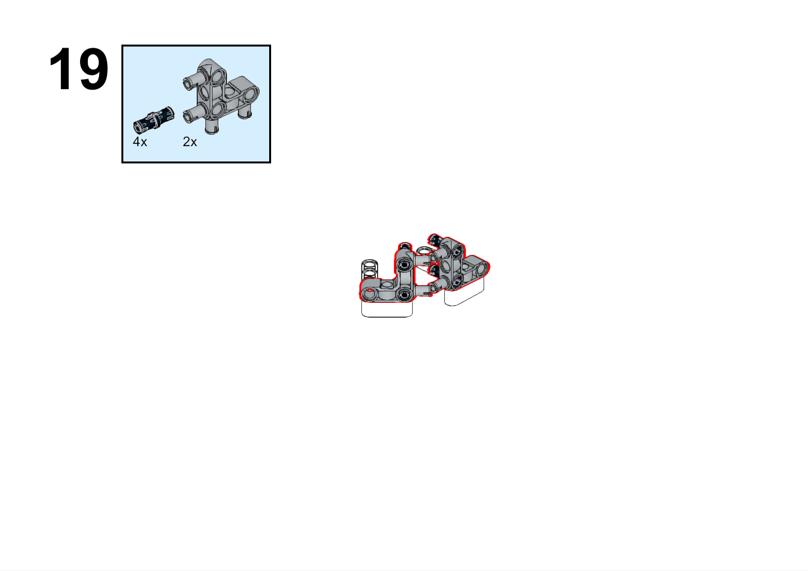

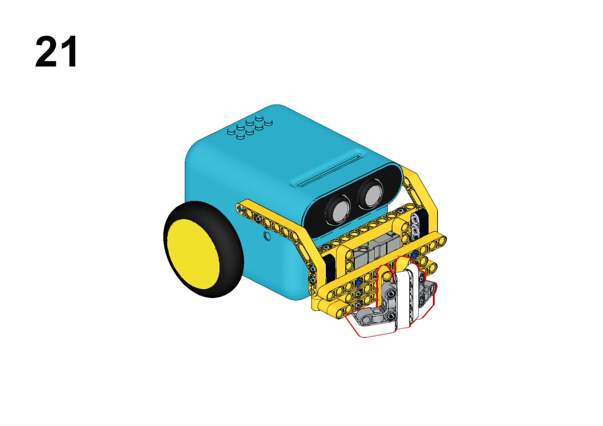

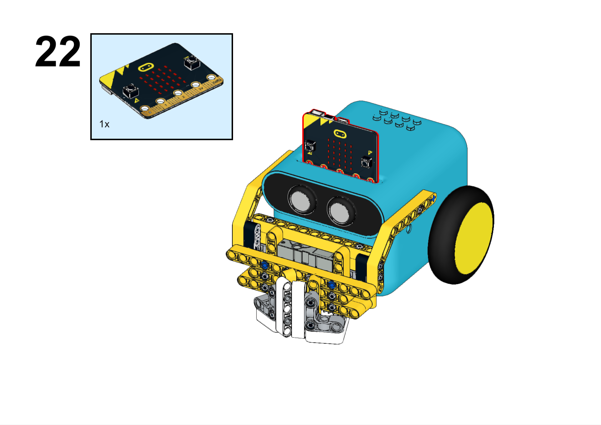

## Hardware Connections

Connect the 360° servo to servo 1 port on the TPBot.

## Software

[Microsoft makecode](https://makecode.microbit.org/#)

## Program

Click "Advanced" in the makecode drawer to see more choices.

For programming the TPBot, we need to add the extensions. Click "Extensions" at the bottom of the drawer and search with `tpbot` in the box, then download it.

## Samples program

While `on start`, set to show an icon, while pressing button A, set the servo connecting to S1 to drive to 225 degrees; while pressing button B, set the servo to drive to 255 degrees.

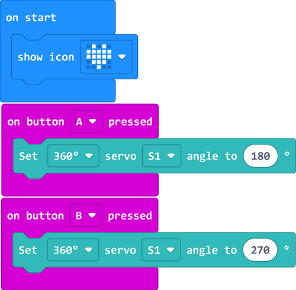

### Program

Reference link: [https://makecode.microbit.org/_c0e6ii2PXW9L](https://makecode.microbit.org/_c0e6ii2PXW9L)

You may download it directly here:

    <iframe
        src="https://makecode.microbit.org/_c0e6ii2PXW9L"
        frameborder="0"
        sandbox="allow-popups allow-forms allow-scripts allow-same-origin"
        style={{
            position: 'absolute',
            width: '100%',
            height: '100%',
        }}
    />

## Conclusion

While pressing button A, the claw grasps the object; while pressing button B, the claw releases it.
