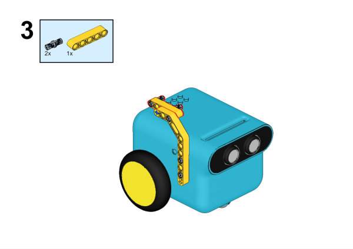
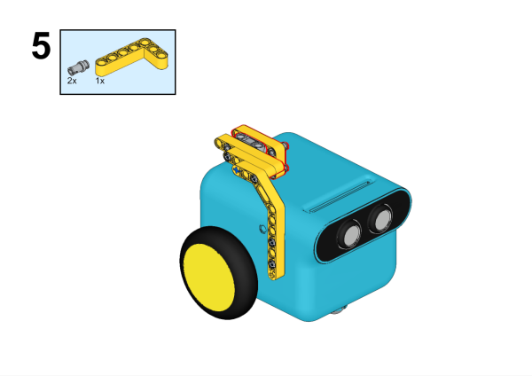
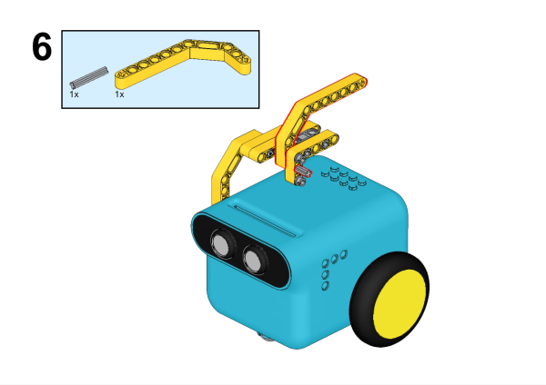
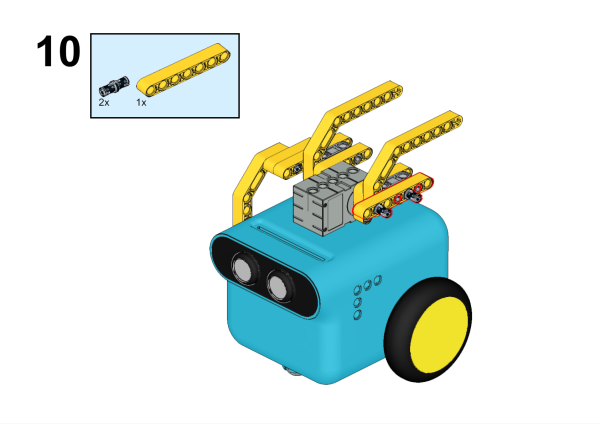
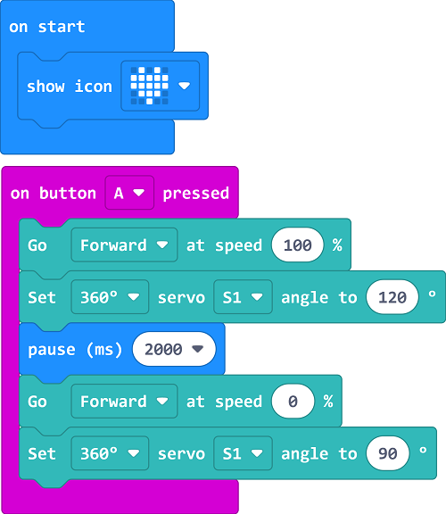

# TPbot Tail Wing

## Purpose

To build a TPBot with a tail wing.

## Materials Requested

[TPBot Smart Car](https://www.elecfreaks.com/tpbot.html)

[360 degrees servo](https://www.elecfreaks.com/geekservo-2kg-360-degrees-compatible-with-lego.html)

Bricks Pack

## Assembly Steps

## Hardware Connections

Connect the 360° servo to servo 1 port on the TPBot.

## Software

[Microsoft makecode](https://makecode.microbit.org/#)

## Program

Click "Advanced" in the makecode drawer to see more choices.

For programming the TPBot, we need to add the extensions. Click "Extensions" at the bottom of the drawer and search with `tpbot` in the box, then download it.

## Samples program

While `on start`, set to show an icon and while pressing button A,  make the TPBot drive at full speed and the servo connecting to S1 drive to 120 degrees, then pause for 2000ms and stop the car, set the servo connecting with S1 to ratote to 90 degrees.

### Program

Reference program: [https://makecode.microbit.org/_2x8LaCRwXaz6](https://makecode.microbit.org/_2x8LaCRwXaz6)

You may download it directly here:

    <iframe
        src="https://makecode.microbit.org/_2x8LaCRwXaz6"
        frameborder="0"
        sandbox="allow-popups allow-forms allow-scripts allow-same-origin"
        style={{
            position: 'absolute',
            width: '100%',
            height: '100%',
        }}
    />

## Conclusion

While pressing button A, the cart moves forward and the tail wing raises up, after two seconds, the cart stops moving the the wing lies down.
