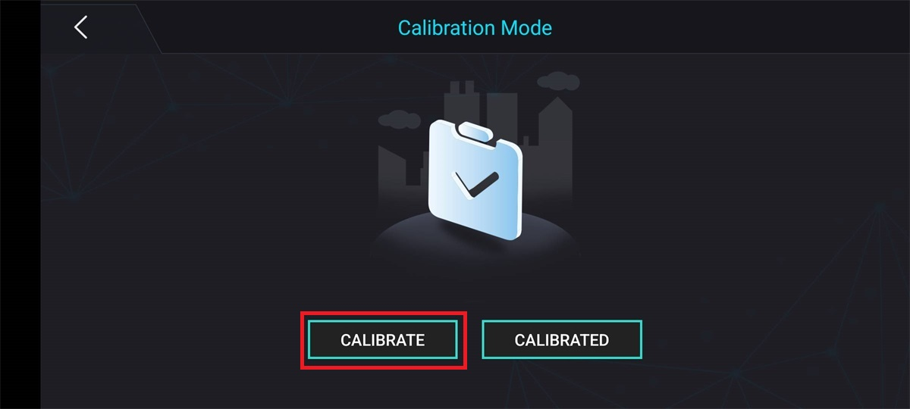
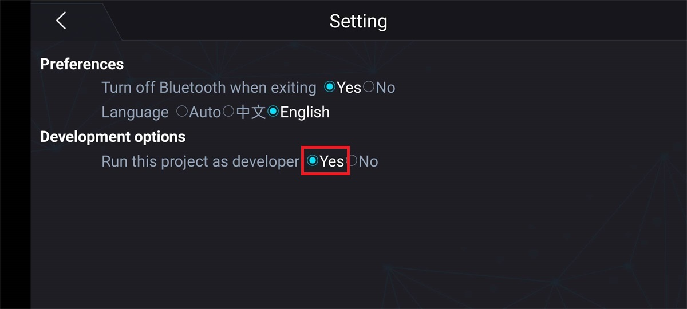

# Machine dog cannot walk straight

1. The robotic dog is corrected through a gyroscope. When starting up, the robotic dog needs to be placed on the ground or on a table. After pressing the switch, the gyroscope will have a 3-5s initialization process. During this time, do not move the robotic dog and wait for the switch light to remain on before operating.

If the problem with gyroscope initialization is ruled out and the walking deviation of the robotic dog is still significant, it is necessary to recalibrate the robotic dog.

## Recalibrate the robotic dog

When you notice that your robotic dog's posture is abnormal, such as when standing, if one leg deviates significantly, causing all four legs to be unable to land on the ground at the same time or the body to be noticeably tilted, it is very likely that the initial position deviates from the preset value due to loose screws or sliding teeth of the servo. At this time, you can perform initial position calibration to recalibrate the initial position preset value of the robotic dog.

1. Open the XGO app, connect to the robot through Bluetooth, click the settings button, and run as a developer, as shown in the following figure.

2. Return to the main page and click on the calibration icon.

3. Enter the calibration page and click to start calibration.

At this point, the servo of the robotic dog will no longer output torque, allowing you to rotate all joints. Place the robotic dog in the following posture, paying attention to ensuring that the shoulders of each leg are perpendicular to the body, the thighs are perpendicular to the ground, and the calves are perpendicular to the thighs. Open the gripper to the maximum range, fold the robotic arm on the back, and whether the placement is vertical will directly affect the posture of the robotic dog during operation.

5. After placing the standard, click the "Complete Calibration" button in the calibration interface. After 10 seconds, the robotic dog will return to its initial standing position.

