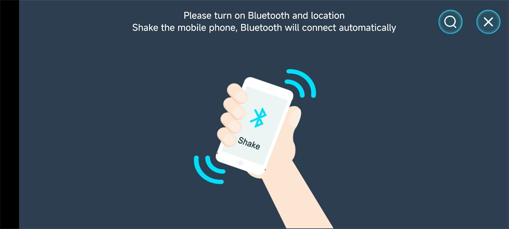
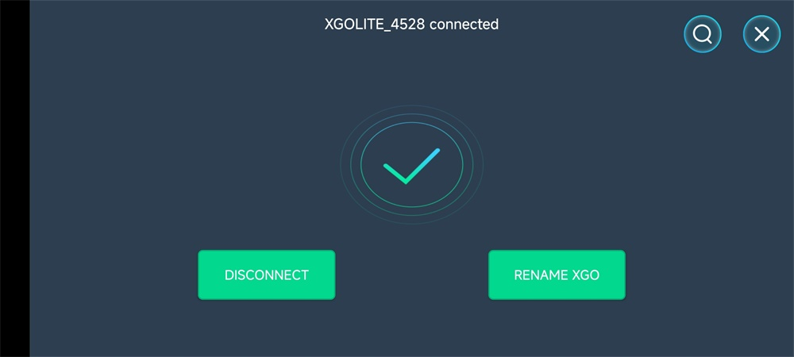
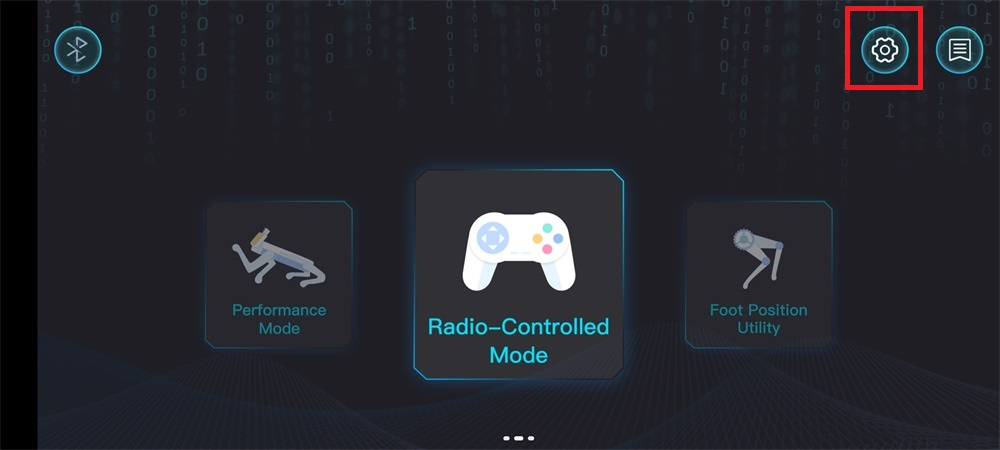
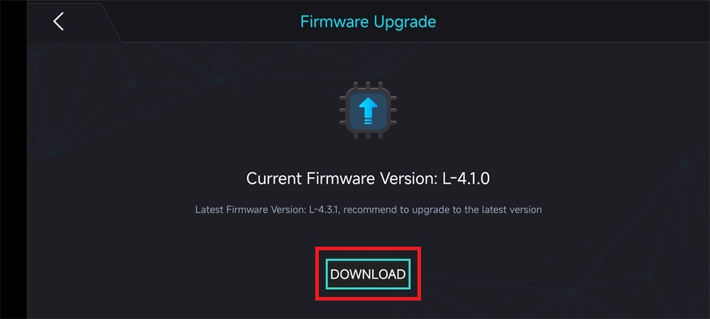
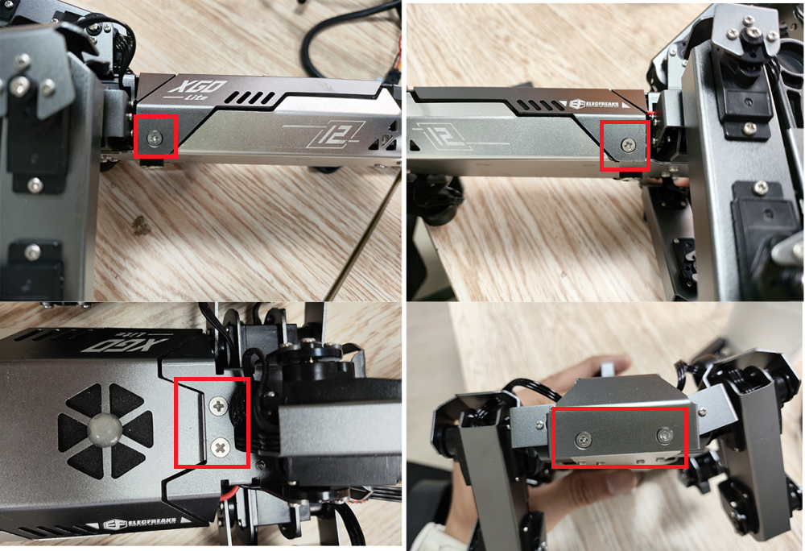
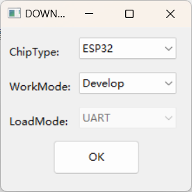
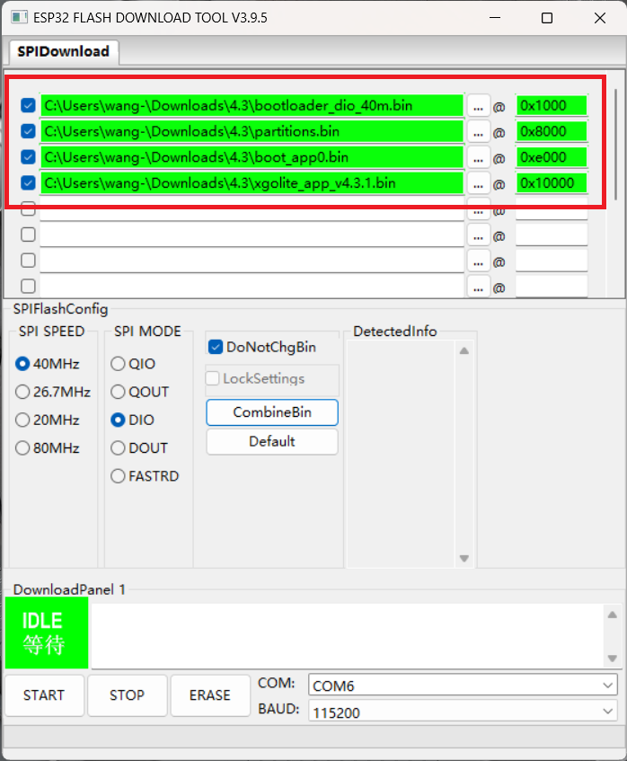
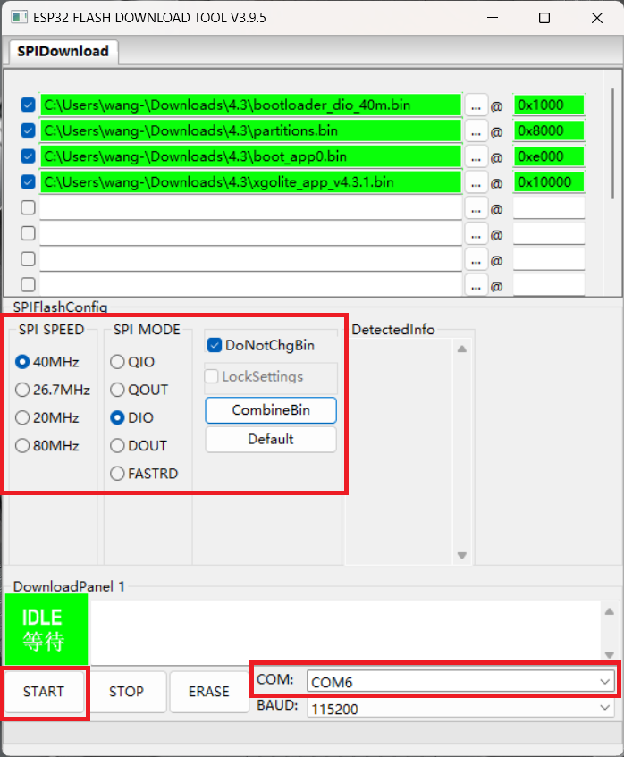

# Upgrade driver board firmware

We will release optimized firmware for the driver board (lower computer) from time to time. There are two ways to upgrade the firmware, and you can complete the upgrade according to your own choice.

Method one is to use the Android XGO application to update firmware. The advantage is that it is simple and convenient, without the need to disassemble and assemble the XGO body. The disadvantage is that it may require several updates to succeed. Because this method is transmitted through Bluetooth, there is a certain probability of failure. It is recommended that you update it multiple times until it is successful.

The second method is to use Type-C cable for direct connection, and upgrade the firmware through the computer firmware burning program. The advantage is that there is no possibility of failure, but the disadvantage is that the XGO body needs to be disassembled and assembled.

Below are two different methods.

## Method 1: Use XGO application to upgrade driver board firmware

***Note: Only Android XGO applications have firmware upgrade capabilities, while Apple XGO applications do not have firmware upgrade capabilities. For downloading and using the XGO application, please refer to the "Smartphone Detection" section on the unboxing inspection page***

1. Turn on XGO, open the XGO application, and connect via Bluetooth.

2. After returning to the main page, click the "Setting" button.

3. In "Development options", select "Yes" and return to the main page.

4. Click the "DOWNLOAD" button to enter the firmware upgrade page.

5. Click "Upgrade" and wait for the upgrade action to be completed.

***Note: This method does not guarantee a one-time success. If the upgrade is not successful, please try upgrading again until it is successful***

## Method 2: Update the driver board firmware through Type-C cable direct connection

1. Remove the six screws from the XGO body.

2. Open the upper cover of the body and connect the Type-C cable to the XGO body's Tpye-C interface and computer port.

3. Download the latest [driver board firmware files](https://www.elecfreaks.com/download/xgo/firmware_4.3.zip) and [firmware burning tools](https://www.elecfreaks.com/download/xgo/flash_download_tool_3.9.5_0.zip) to your computer.

4. Open flash_download_tool, select the following parameters, and click "OK".

5. Refer to the table below, click on the icon of the three points to add a bin file, follow the table below to add it, then modify the download address in the box after the @, and check the box in front again to make all four lines turn green.

6. After selecting the corresponding SPI SPEED, SPI MODE parameters, and the COM port of the computer, click "START" and wait for the burning to complete.

7. Remove the Type-C cable, reassemble the XGO body cover, and tighten the fixing screws.
