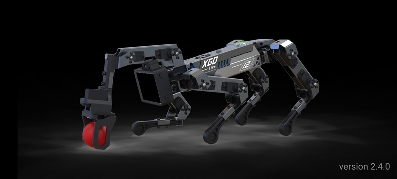
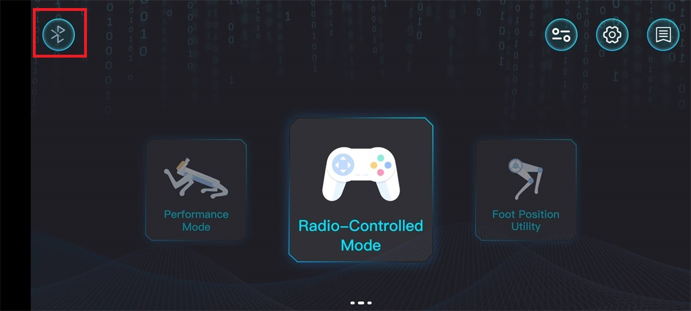
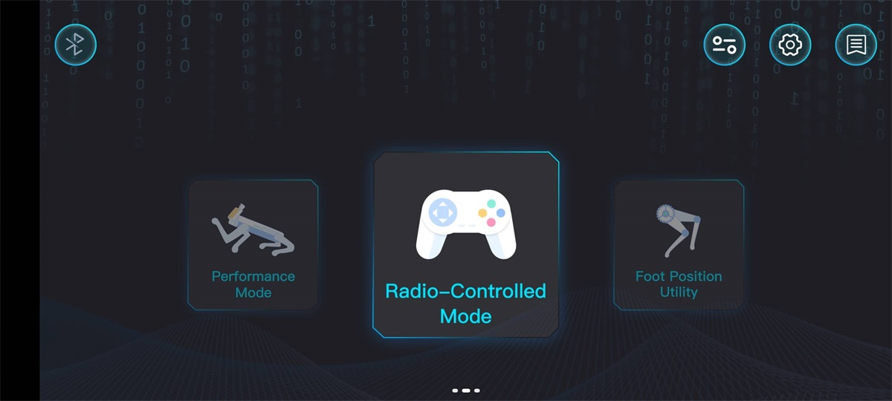
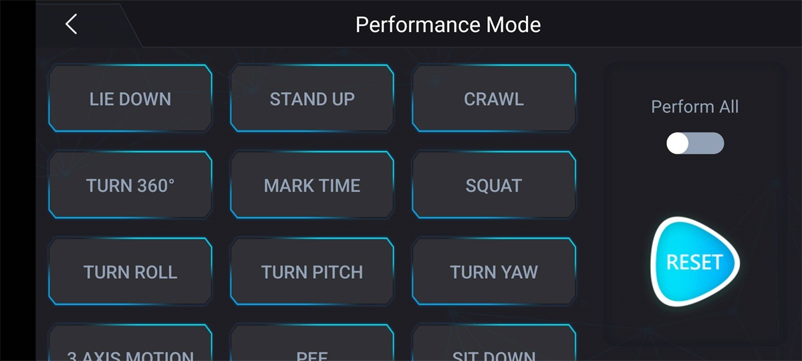
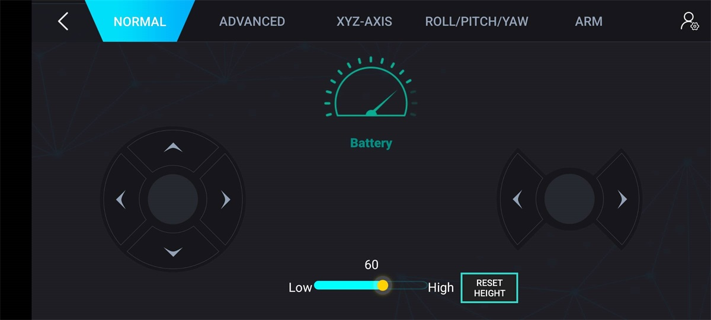
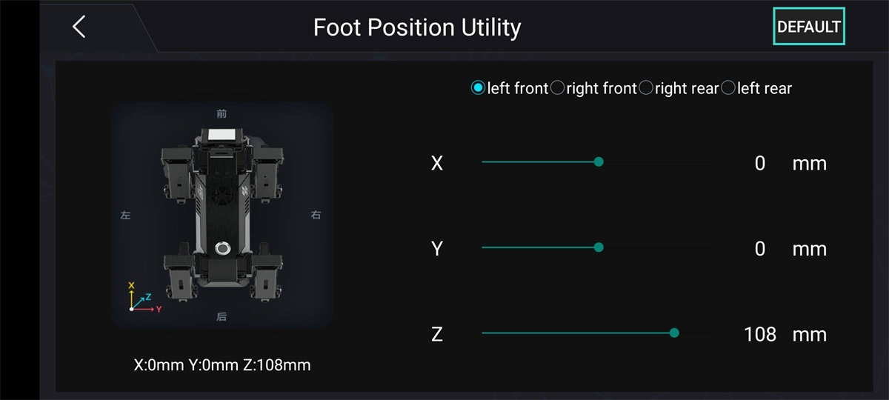

# XGO APP control XGO-lite V2 Experience

## Introduction

We hope that before you start learning XGO-lite V2 programming, you can firstly operate the XGO-lite V2 mobile through the mobile XGO App to experience the movement of XGO-lite V2 and get a general understanding of what XGO-lite V2 can do and what it needs Aspects of attention.

This tutorial will take you from the beginning of downloading the XGO App, to the end of proficiently controlling the XGO-lite V2 through the XGO App to achieve the desired effect.

## Materials used

1 × micro:bit XGO Robot Kit V2

1 × smart phone

## Hardware Connection

### Download XGO APP

If the operating system of your smartphone is Android, you can search for "XGO" through **Baidu Mobile Assistant** and install it. After the installation is complete, open the XGO APP startup interface as shown in the figure:

**Notice**:

1. As of the completion date of this tutorial, the version number of the XGO APP used is: 2.4.0, please ensure that the downloaded XGO APP version is not lower than 2.4.0.

2. After installing the XGO APP, please open the permissions of the XGO APP in the settings, including: location information, nearby devices, otherwise XGO-lite V2 may not be searchable.
3. The XGO APP is still being improved gradually. If you encounter any problems during use, please give us feedback, at the after-sales email address: support@elecfreakc.com.

### Connect XGO-lite V2

Turn on the Bluetooth function of the smartphone, turn on the XGO-lite V2, open the XGO APP, there is a  icon in the upper left corner of the home page, click the Bluetooth icon, and follow the prompts to connect the smartphone to XGO-lite V2.

After the connection is successful, as shown in the figure below:

##  Control Mode

On the main interface of the XGO App, we can see that there are three ways to remotely control the XGO-lite V2, namely **performance mode**, **machine control**, **single-leg control**.

**Performance mode** is an integrated predetermined command, which allows XGO-lite V2 to make predetermined actions, with low degree of freedom and high operability;

**Complete machine mode** can freely control the speed and direction of XGO-lite V2, with high degree of freedom and sensitive operation;

**Single leg control** The granularity of control is smaller. It controls a single leg (left front leg, right front leg, right rear leg, left rear leg), and adjusts the up, middle and down servos of a single leg. Generally used for minor adjustments to specific actions;

## Demo

