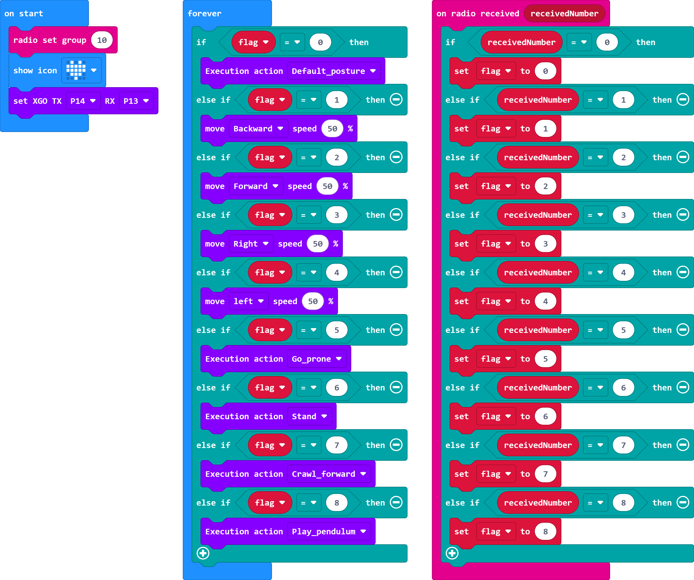
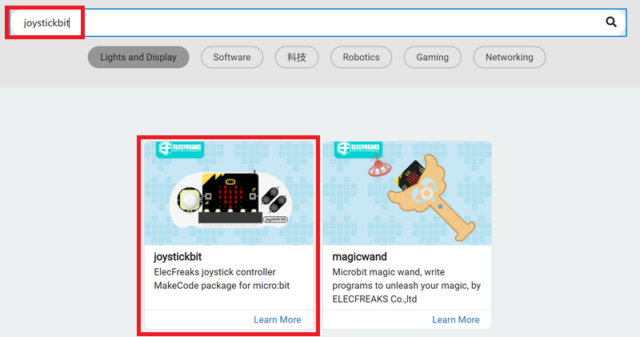
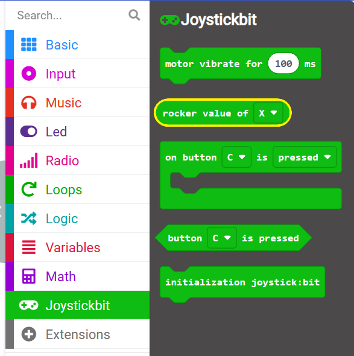

# Joysticks remote controller XGO-lite V2

## Introduction

In this tutorial, we will introduce how to use the Joystick:bit V2 remote control to realize remote control of XGO Robot Kit V2. By combining these two innovative devices, you will be able to experience more interesting ways of interaction, bringing richer functions and actions to the robot dog.

Whether you are a beginner or a professional, through this tutorial, you will be able to easily master the method of remote control XGO Robot Kit V2, and bring more creativity and inspiration to your research, teaching or entertainment projects. Let's get started together!

## Material preparation

1 × micro:bit XGO Robot Kit V2

1 × Joysticks V2

## Start Programming

Joystick:bit V2 and micro:bit XGO Robot Kit V2 both use the micro:bit as the main controller. Based on the Bluetooth function of the micro:bit V2, the two main controllers can communicate with each other. Therefore, this tutorial will program two devices through the graphical programming platform: MakeCode. Please open the official website link of the makecode platform: [MakeCode](https://makecode.microbit.org/#). And follow the steps below to prepare the programming environment.

### XGO-lite V2 Programming Environment Preparation

1.  Click **New Project**, name the project and **Create**

2. Click **Extension** and search for **XGO** in the search bar, select the XGO library, and you can load the XGO library into the makecode platform programming environment

   

   

### XGO-lite V2 Programming Example

XGO-lite V2 programming sample program, link https://makecode.microbit.org/_Cc2g7qHrk45T

### Joystick:bit V2 Programming environment preparation

The steps to create a programming project file for Joystick:bit V2 are the same as those for XGO-lite V2, here the details are not displayed. The difference is that in the step of adding the extension library, what needs to be added is the **joystickbit** library file. As shown below:

### Joystick:bit V2 Programming Example

Joystick:bit V2 Programming sample program, link: https://makecode.microbit.org/_bU0LPbJd3Yer

## Case Presentation
