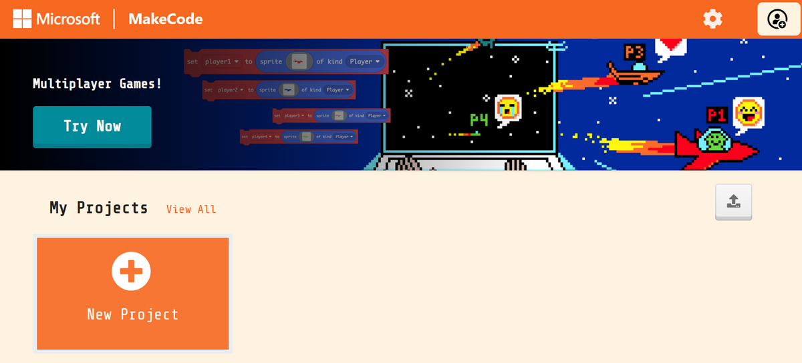
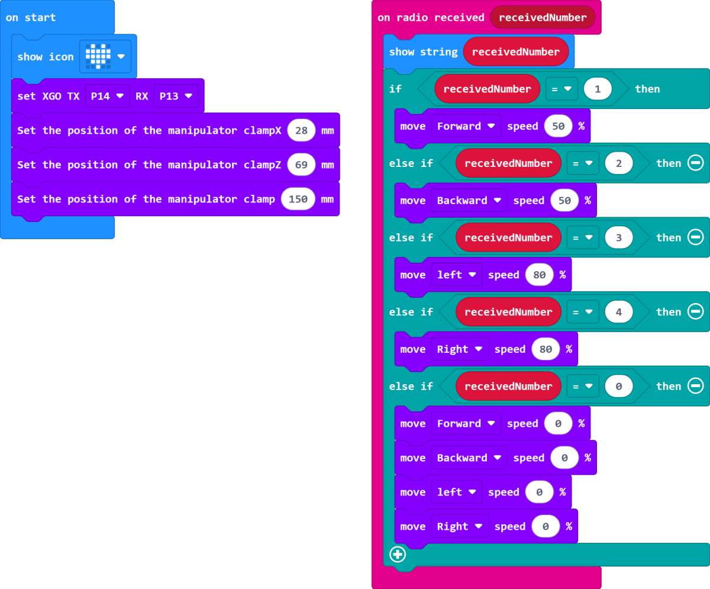
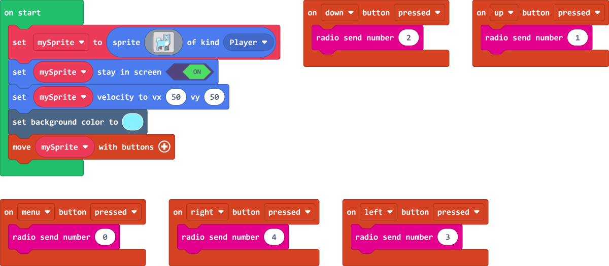
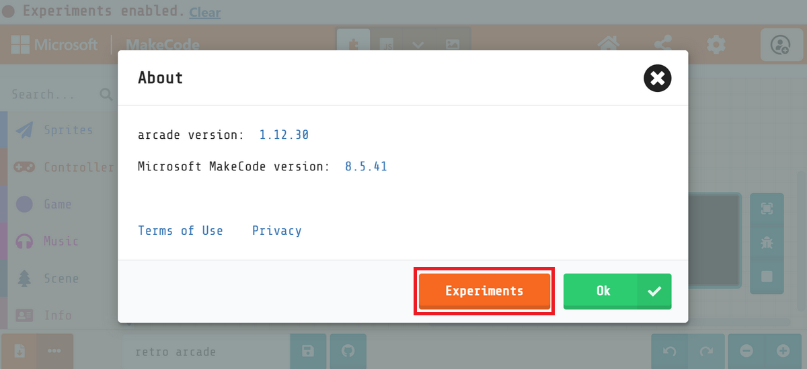
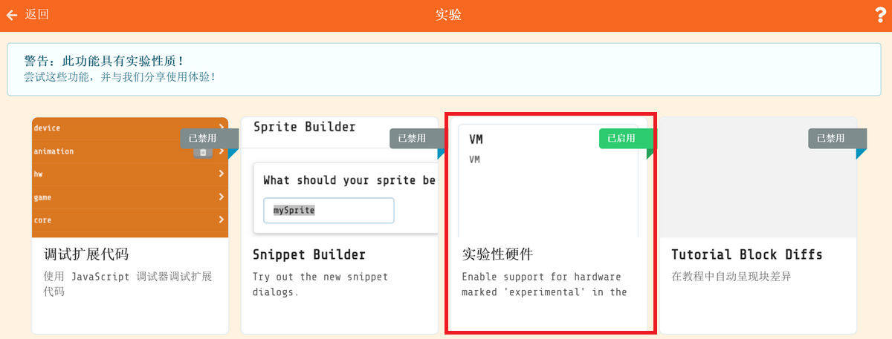

# Micro:bit Retro Arcade Remote Control XGO-lite V2

## Introduction

The combination of micro:bit Retro Arcade and XGO Robot Kit V2 will bring you an unprecedented programming and remote control experience. In this innovative practice, we will use the micro:bit Retro Arcade's color-screen handle expansion board to control the XGO Robot Kit V2, a desktop-level quadruped robot dog with fifteen degrees of freedom, by remote control. You can develop more creativity, enhance logical thinking and hands-on ability in a fun programming learning environment.

Through the button control of the micro:bit Retro Arcade, we can realize the omnidirectional movement of XGO Robot Kit V2, six-dimensional attitude control, attitude stabilization, multiple motion gaits and gripping tasks, etc.

Writing games, designing plots, customizing characters, and flexible interaction with remote-controlled quadruped robot dogs will allow you to explore the mysteries of programming in a relaxed and pleasant atmosphere. At the same time, graphical programming can also be used to create more creative applications for XGO Robot Kit V2.

## Material Preparation

1 × micro:bit XGO Robot Kit V2

1 × micro:bit Retro Arcade

## Start Programming

The micro:bit Retro Arcade and micro:bit XGO Robot Kit V2 both use the micro:bit as the main controller. Based on the Bluetooth function of the micro:bit V2, the two main controllers can communicate with each other. Therefore, this tutorial will program the two devices through the graphical programming platforms: [MakeCode](https://makecode.microbit.org) and [MakeCode Arcade](https://arcade.makecode.com).

### XGO-lite V2 Programming Environment Preparation

1.  Open the [MakeCode](https://makecode.microbit.org) official website, click **New Project**, name the project and **Create**

2.  Click **Extension** and search for **XGO** in the search bar, select the XGO library, and you can load the XGO library into the makecode platform programming environment

   

### XGO-lite V2 Programming Example

Link: https://makecode.microbit.org/_ddT6ypdu34Ap

### Retro Arcade Programming environment preparation

Click **New Project**

Enter a project name to create a new project.

To add the wireless communication extension library, click Extend.

Enter "radio" in the search bar and click Search to add the extension library.

### Retro Arcade Program Example

Link: https://makecode.com/_T7FgaeRe294M

As far as the official Arcade platform is concerned, micro:bit V2 (nRF52833) is still in the testing stage, so we need to go to the platform’s settings page to open the hardware options that are still in the experimental version.

Make sure that Experimental Hardware is enabled (you only need to set it once)

Then return to the programming home page, click the download button in the lower left corner, and select N3 in the pop-up selection hardware window to the bottom

You will get a file in .hex format, drag it into the MICROBIT drive letter to run it on micro:bit V2 + Microbit Retro Arcade.

## Case presentation
