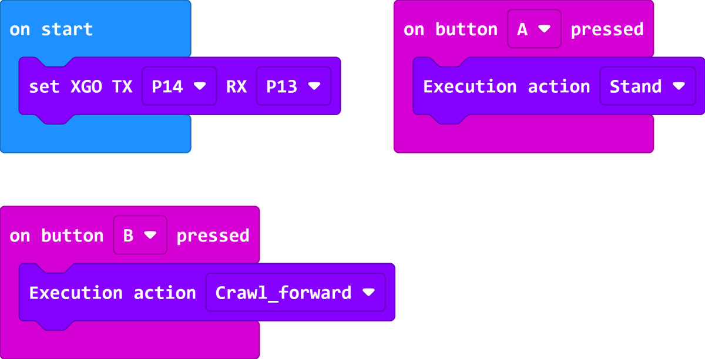

# MakeCode Graphical Programming

Micro:bit XGO Robot Kit V2 is a four-legged robot dog kit with micro:bit as the core controller, specially designed for programming beginners and robot enthusiasts. It combines the ease of use and powerful functions of the micro:bit, allowing users to program easily on the makecode platform. At the same time, we have developed XGO library files for XGO Robot Kit V2, which greatly improves the development experience and allows users to carry out innovative design and programming practices more conveniently.

## XGO Library File Loading

Open the official website of the MakeCode platform, click "**New Project**", name the project and click "**Create**".

Select **Extension** and click, enter **XGO** in the search bar and press Enter to search, select **XGO** library, so that you can load the XGO library to the makecode platform.

## Start Programming

The communication between micro:bit and XGO-lite V2 is transmitted through the serial port, so at the beginning, you need to set the TX (send) and RX (receive) serial port numbers. XGO-lite V2 defaults to TX-14 and RX-13. The command is as follows:

Programming example:

Link: https://makecode.microbit.org/_JPM3Hs9wWiwu
