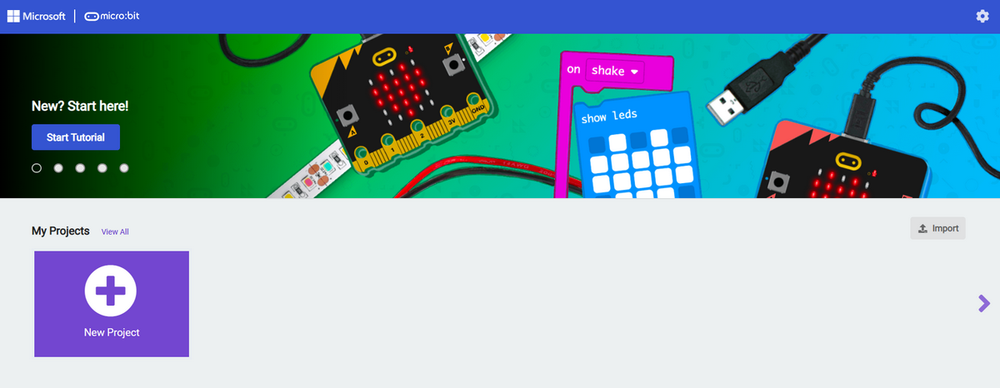
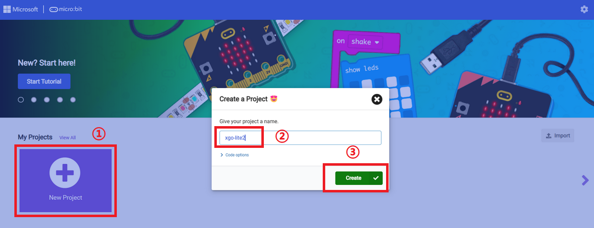
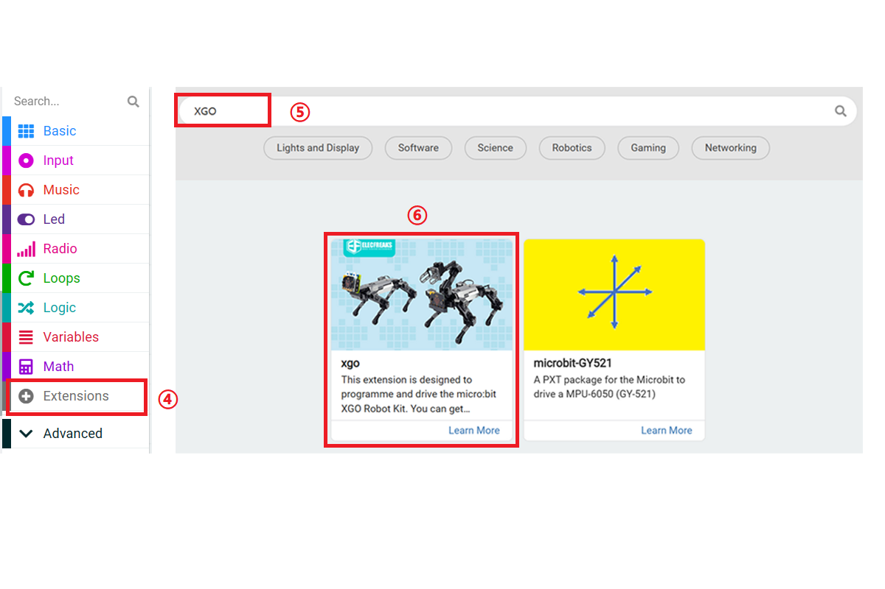
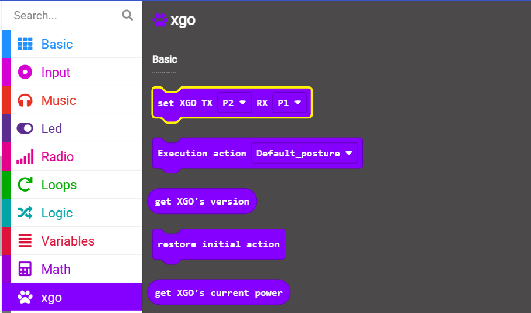
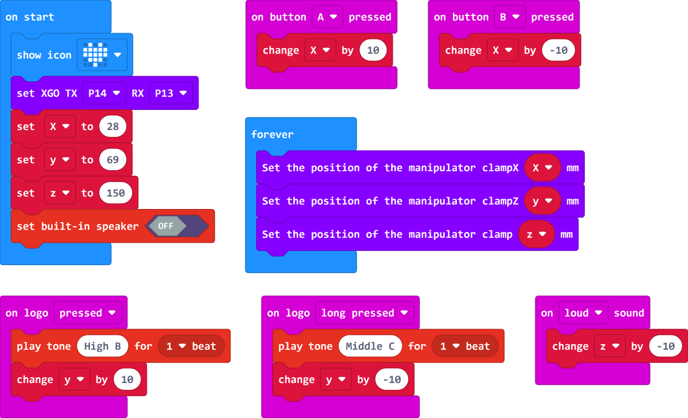

# Robotic Arm and Buzzer Programming

## Introduction

XGO-lite V2 has a built-in 3-DOF robotic arm and speaker. This tutorial will explain the XGO-lite V2 robot arm and speaker programming. By programming the movement of the robotic arm and the audio output from the speaker, we can achieve a variety of interesting and practical application scenarios. Robotic arm and speaker programming is a very challenging and innovative field that requires knowledge of robotic arm control, motion planning, audio processing, and more. In the following explanations, we will introduce the basic concepts and common applications of robotic arm and speaker programming. We hope that these contents can bring you inspiration and inspiration, and stimulate your enthusiasm for robot programming.

## Material Preparation

1 × micro:bit XGO Robot Kit V2

## Start Programming

This tutorial will program two devices through the graphical programming platform: MakeCode. Please open the official website link of the makecode platform: [MakeCode](https://makecode.microbit.org/#). And follow the steps below to prepare the programming environment.

### Programming environment preparation

1.  Click **New Project**, name the project and **Create**

2. Click **Extension** and search for **XGO** in the search bar, select the XGO library, and you can load the XGO library into the makecode platform programming environment

   

## Programming Example

Link: https://makecode.microbit.org/_5gjUhuK0m4TV

## Demo
