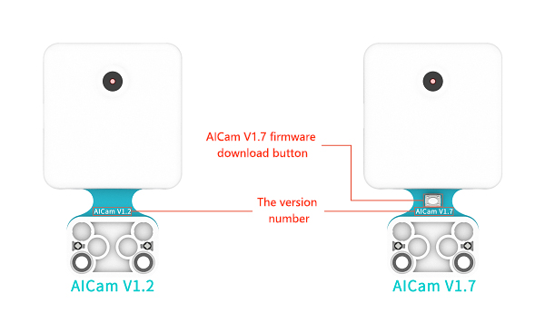
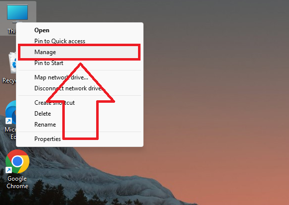
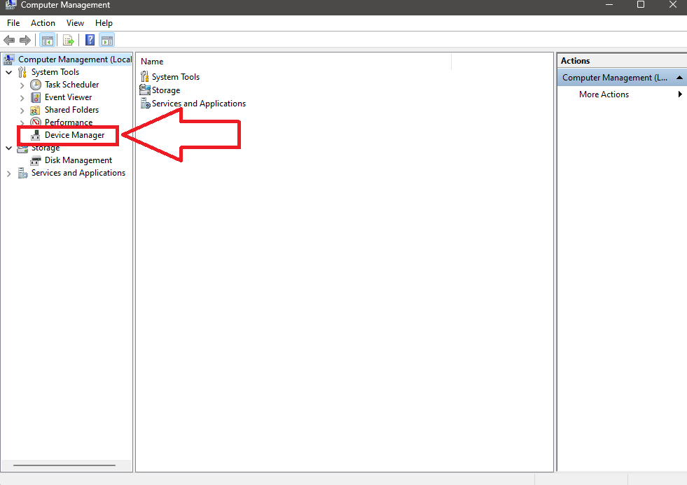
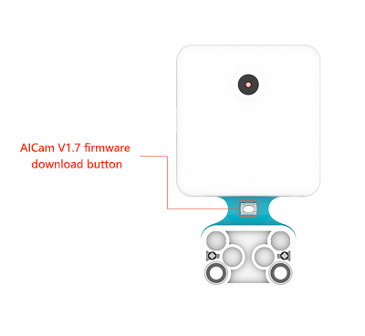
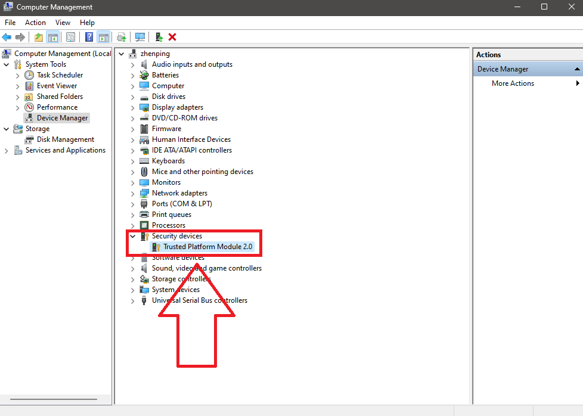
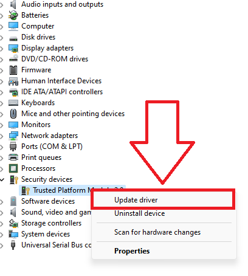
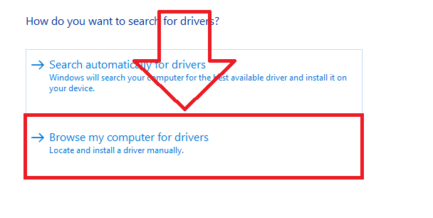

# Products Introduction

## Introduction

The AI Lens is an easy-to-use AI camera that supports face recognition, colour recognition, card recognition, line tracking, ball recognition, machine learning and more. It encapsulates complex AI concepts into hardware modules that are perceivable, understandable and fun for students.

AI training can be completed with just one button, getting rid of tedious training and complex visual algorithms, allowing you to focus more on the conception and implementation of the project.

## Characteristic

Designed with RJ11 connection and easy to plug.

## Specification

Items | Parameter
:-: | :-:
SKU|EF05045
Weight(GW)| Approximately 170g
Size|145mm × 92mm × 40mm（L× W× H）
Connection|RJ11
Connection Type|IIC
Working Voltage|3.3V
Working Current|300mA
Core IC|V831

The origin of the AI Lens (0,0) is in the lower left corner of the screen, and the X and Y axes range from: X (0 ~ 224), Y (0 ~ 224).

## Packing List

Items | QTY
:-: | :-:
AI Lens|1
Red ball|1
Blue ball|1
RJ11 cable|1
RJ11 to Dupont cable|1
Cards|41

## Outlook and dimensions

## When using RJ11 to Dupont connector cable

If you use a micro:bit expansion board without RJ11 expansion port, due to the weak power supply ability of the USB port of the micro:bit, you need to choose an expansion board that uses an external power supply USB port or lithium battery for power supply, such as the Sensor:bit, IOT:bit, Wukong Expansion Board and so on.

When using micro:bit expansion boards without RJ11 expansion interface, you can use the RJ11 to DuPont cable to connect the RJ11 interface to the AI Lens, the black wire of the DuPont interface end connects to GND, the red wire connects to VCC, the green wire connects to the P19 (SCL) port, and the yellow wire connects to the P20 (SDA) port; if the AI Lens fails to start up in the process of using it, try to supply power to the AI Lens with separate power supply.

Take IoT:bit for an example

Note:

1. When using a micro:bit expansion board other than the Nezha expansion board to connect to the AI lens, the requested extension should be searched with "PlanetX-AI"

2. When using the one-click learning function, if the power is restarted, the item needs to be re-learned.

3. After downloading the program, if you find that the AI Lens is on the startup page and cannot run properly, you need to completely power off and then reboot to ensure that the AI Lens is initialised successfully.

## The firmware update of AI Lens

AI Lens will be updated with some new features and performance optimisation from time to time, you need to manually update the firmware of AI Lens after releasing the new version of firmware.

*Note: There are two hardware versions of AiCam-AiCam V1.2 and AiCam V1.7, and the firmware of the two versions are not common*.

### How to check the firmware version

There are AiCam V1.2 and V1.7 for the AI lens, and there is a firmware download button on the back of the AiCam V1.7  we are able to differentiate these two versions by the download button or the version number.

### How to check the current firmware version

The bottom right corner of the AI lens boot page will prompt the current version number, (if not prompted, it is the oldest version please update it)

! 

AiCam V1.2 version firmware v1.0.12 [Click to download](https://github.com/elecfreaks/learn-cn/raw/master/microbitplanetX/ai/v1.0.12.kfpkg).

AiCam V1.7 version firmware v2.0.1 [click to download](https://github.com/elecfreaks/learn-cn/raw/master/microbitplanetX/ai/PhoenixSuit-master.zip).

AiCam V1.7 version software package v2.0.1 [click to download](https://github.com/elecfreaks/learn-cn/releases/download/V2.0.1/AI-Cam-V1.7-V2.0.1.zip).

## AiCam V1.2 firmware update method

1. Firstly install the camera serial driver:

Windows system download [CH341SerSetup.exe](https://github.com/elecfreaks/learn-cn/raw/master/microbitplanetX/ai/CH341SerSetup.exe) and unzip it.

MacOS system download [CH34x_Install_V1.5.pkg](https://github.com/elecfreaks/learn-cn/raw/master/microbitplanetX/ai/CH34x_Install_V1.5.pkg).

2. Install the firmware download software kflash.

Windows system download [kflash_gui_v1.6.5_2_windows.7z](https://github.com/elecfreaks/learn-cn/raw/master/microbitplanetX/ai/kflash_gui_v1.6.5_2_windows.7z).

MacOS system download [kflash_gui_v1.6.5_2_macOS.dmg](https://github.com/elecfreaks/learn-cn/raw/master/microbitplanetX/ai/kflash_gui_v1.6.5_2_macOS.dmg).

For windows system, open the folder kflash_gui after unzipping and find the kflash_gui.exe programme.

Once the download is complete for macOS, open the icon below.

3. Double click to open the kflash_gui.exe programme, click on Open File, select and open the latest version of firmware v1.0.12 in the folder [click to download](https://github.com/elecfreaks/learn-cn/raw/master/microbitplanetX/ai/v1.0.12.kfpkg).

Then use USB to connect the AI Lens.

Finally, select the port (the port number may vary from computer to computer) and click download, then wait for the download to complete.

## AiCam V1.7 firmware update method

Connect the AI lens with USB.

When the AI Lens starts up, if the computer pops up a USB stick, you only need to update the software package to update. Otherwise, you need to update the driver first, then update the firmware, and finally update the software package.

### Driver update method

Download AiCam V1.7 version firmware v2.0.1 [click to download](https://github.com/elecfreaks/learn-cn/raw/master/microbitplanetX/ai/PhoenixSuit-master.zip) and unzip it.
Open right-click this computer and select Manage.

Open the device manager

Unplug the USB cable, press the firmware download button when the power is completely cut off, and then use the USB to connect the AI lens to enter the firmware download mode.

After entering the firmware download mode, an unknown device will appear in the device manager.

Right-click the unknown device and click Update Driver.

Select "browse" my computer for searching drivers.

Select the path as the `Drivers` folder in the `PhoenixSuit-master` folder, and then click the next page.

### Update method for the firmware update

Select `PhoenixSuit.exe` under the `PhoenixSuit-master` directory to open the firmware update software.

Click `One-click flash`, click `Browse`, and select [AI-Cam-V1.7-V2.0.1](https://github.com/elecfreaks/learn-cn/releases/download according to the firmware version you need to upgrade /V2.0.1/AI-Cam-V1.7-V2.0.1.zip), or [AiCam V1.7 version firmware v2.0.4](https://www.elecfreaks. `ef831-2.0.4-ov9732-2022-11-30.img` in com/download/AI-Cam-V2.0.1-V2.0.4.zip). Click to upgrade now.

*** Here we take the V2.0.1 firmware upgrade as an example ***

Unplug the USB cable, press the firmware download button when the power is completely cut off, and then use the USB to connect the AI lens to enter the firmware download mode.

When the connection is successful, the firmware update software will prompt whether to format, please select `Yes`.

Please wait patiently for the formatting to complete. When prompted that the firmware burning is complete, click OK and reconnect the AI lens.

### Update package steps

Download and unzip [AiCam V1.7 software package v2.0.1](https://github.com/elecfreaks/learn-cn/releases/download/V2.0.1/AI-Cam-V1.7-V2.0.1.zip), open the disk, and copy the two files `maix_dist` and `res` in the `AI-Cam-V1.7-V2.0.1` folder to the disk , **wait for the copy to complete, and then manually uninstall the disk**. Then reconnect the AI Lens.

### FAQ

1. If under the macOS system, during the process of installing the firmware download software, the installation fails because the developer cannot be verified.

Please visit [https://support.apple.com/zh-cn/HT202491](https://support.apple.com/zh-cn/HT202491) for solutions.

2. When using the AI lens, an error message appears when clicking download, it may be that the software library of PlanetX has been damaged.

There are two possible situations:

(1) The software library is relatively old, please create a new project, re-add the software library and test again.

(2) To add conflicts between the PlanetX software library and the PlanetX-AI software library at the same time, please click the red box "JaveScript" in the figure to switch the programming interface, click the resource manager, and delete the PlanetX software library or PlanetX-AI software library as needed;

After deletion, there should be no more error prompts in the explorer;

If you find that the building blocks are lost after deletion, please try to re-add the corresponding software library. If re-adding the software library does not solve the problem, please reset the makecode programming platform as shown in the figure below. Note: After resetting the platform, all projects saved on makecode will be cleared. Please save the project files to the computer if needed.

