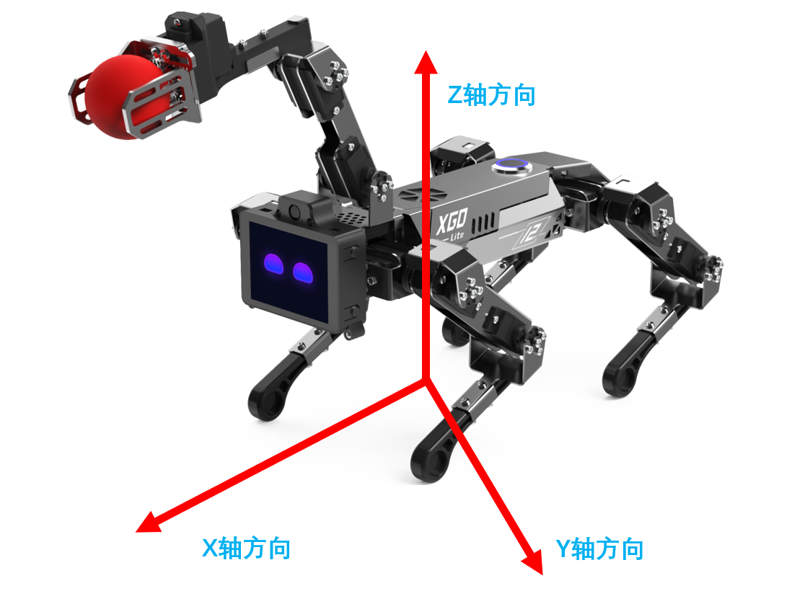
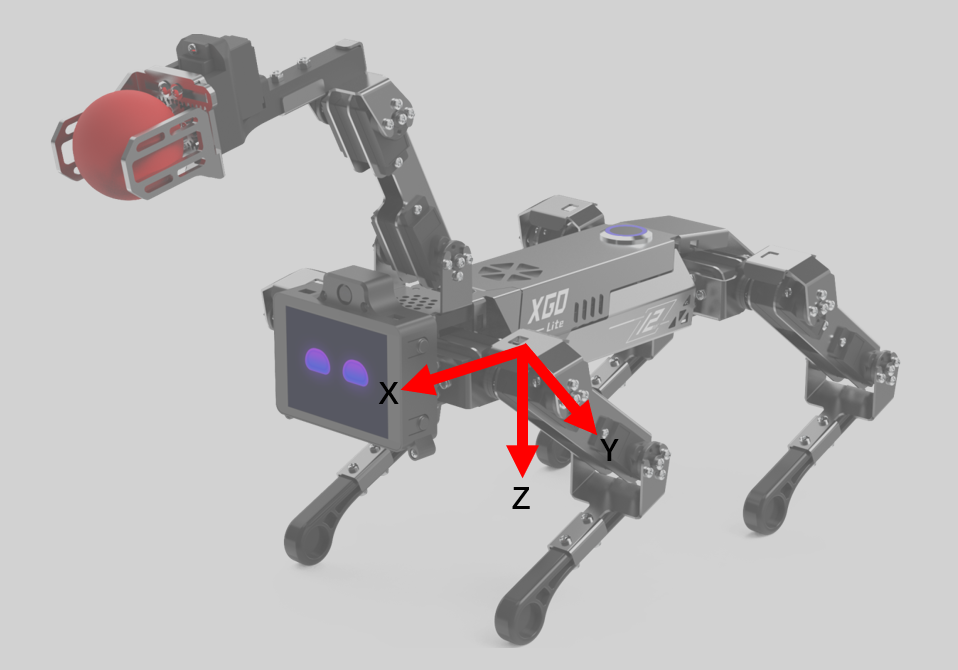

# Development and use based on serial port protocol

 ## Serial communication protocol

 ### Document Purpose and Object

This document is applicable to the communication protocol for command/data interaction between any upper computer and the XGO series machine dog driver board. Used by advanced developers for secondary development of XGO.

### Hardware Connection

Use a hex wrench to unscrew the two screws on the back, left and right, and two screws on the back. Remove the back panel of the machine dog and unplug the switch wire. The motherboard has two serial communication interfaces, which are connected to the upper computer wire sequence according to the motherboard screen printing wire sequence (TX to RX, RX to TX), and can then be debugged. The external power supply voltages of the two terminals are 5V and 3.3V respectively, and cannot be used simultaneously.

### Software interface

Using standard TTL serial communication

| BAUD       | 115200 |
| ---------- | ------ |
| Data bits  | 8      |
| stop bit   | 1      |
| Parity bit | no     |

### Data Frame

The data frame adopts a fixed format: frame header+frame length+data+checksum+frame tail.

| Header       | Fixed to 0x55 0x00                                           |
| ------------ | ------------------------------------------------------------ |
| frame length | Bytes of the entire data frame                               |
| data         | Depending on the type of instruction, it has different meanings, as shown in Part 2 |
| checksum     | Add all bytes of length and data, take the lowest byte, and then invert it |
| End of Frame | Fixed to 0x00 0xAA                                           |

### Instruct

It is recommended that the interval between each instruction on the upper computer should be at least 1ms to prevent packet loss caused by the machine dog not being able to process the instruction too quickly.

You can refer to [xgolib. py (24 KB)]（ https://www.elecfreaks.com/download/xgolib.py ）The code for send and read in.

### Write instruction, no response (0x00)

| Frame header | Frame length | Command type | First address | Data | Checksum | End of frame |
| ------------ | ------------ | ------------ | ------------- | ---- | -------- | ------------ |
| 0x55 0x00    |              | 0x00         |               | data |          | 0x00 0xAA    |

The write command will modify the data starting from the first address, and will not generate a response.

```
>For example, to modify the forward speed of the robot dog, the forward speed address is 0x30, and the maximum speed is forwarded, that is, the speed content is 0xFF. The specific instructions are as follows:
>0x55 0x00 0x09 0x00 0x30 0xFF 0xC7 0x00 0xAA
>The checksum calculation process is as follows:
>0x09+0x00+0x30+0xFF=0x138，Take the lowest byte 0x38, and get 0xC7 by inversion
```

### Read command, response (0x02)

| Frame header | Frame length | Command type | First address | Read length | Checksum | End of frame |
| ------------ | ------------ | ------------ | ------------- | ----------- | -------- | ------------ |
| 0x55 0x00    |              | 0x02         |               | uint_8      |          | 0x00 0xAA    |

The write command will read the data starting from the first address continuously, and no response will be generated.

The format of the returned data packet is:

| Frame header | Frame length | Command type | First address | Date | Checksum | End of frame |
| ------------ | ------------ | ------------ | ------------- | ---- | -------- | ------------ |
| 0x55 0x00    |              | 0x12         |               | data |          | 0x00 0xAA    |

```
>For example, to read the angles of 12 servos, 0x50 is the address of the first servo position, 0x0C means to read 12 consecutively, the specific instructions are as follows：
>0x55 0x00 0x09 0x02 0x50 0x0C 0x98 0x00 0xAA
>The checksum calculation process is as follows:
>0x09+0x02+0x50+0x0C=0x67，Inverted to get 0x98
>read return packet:
>0x55 0x00 0x14 0x12 0x50 0x80 0x80 0x80 0x80 0x80 0x80 0x80 0x80 0x80 0x80 0x80 0x80 0x89 0x00 0xAA
```

### Machine coordinate system

In the initial standing posture, the origin is directly below the fuselage, the forward direction of the robot dog is the positive direction of the X-axis, the left is the positive direction of the Y-axis, and the upward direction is the positive direction of the Z-axis.



### Single leg coordinate system

The single-leg coordinate system is used to describe the position of the foot. The four legs correspond to four independent single-leg coordinate systems. The thigh joint is the origin. The forward direction of the robot dog is the positive direction of the x-axis, the left is the positive direction of the Y-axis, and the bottom is the positive direction of the Z-axis. Towards.



### Servo number

|                      | shoulder（3） | arm（2） | elbow（1） |
| -------------------- | ------------- | -------- | ---------- |
| left front leg (1）  | 13            | 12       | 11         |
| right front leg（2） | 23            | 22       | 21         |
| right hind leg（3）  | 33            | 32       | 31         |
| left hind leg（4）   | 43            | 42       | 41         |

### Robot dog memory table

| Adress | Function                                                     | read and write | initial value | Remark                                                       | model              |
| ------ | ------------------------------------------------------------ | -------------- | ------------- | ------------------------------------------------------------ | ------------------ |
| 0x00   | working status                                               | read           | 0x00          |                                                              | status information |
| 0x01   | battery power                                                | read           | 0xff          | The range is 0-100, linearly corresponding to the lowest value of power - the highest value |                    |
| 0x03   | show mode                                                    | write          | 0x00          | 0x00 normal control mode \|0x01 loop action                  |                    |
| 0x04   | calibration mode                                             | write          | 0x00          | 0x01 Enter the calibration mode 0x00 Exit the calibration mode and complete the calibration |                    |
| 0x05   | update firmware                                              | write          | 0x00          | 0x01 enters the update mode, the lower computer sends a same command as a reply, and after a delay of 1s, the upper computer starts to transmit hex |                    |
| 0x07   | Firmware version                                             | read           |               | returns a 10-byte string                                     |                    |
| 0x09   | gait                                                         | write          | 0x00          | 0x00 TROT \| 0x01 WALK \| 0x02 HIGH WALK                     |                    |
| 0x20   | Uninstall the servo                                          | read and write | 0x00          | 0x00 servo is in normal working state, 0x01 unloads all servos, 0x11-0x14 unloads legs 1-4 in sequence, 0x21-0x24 restores legs 1-4 in sequence | debug mode         |
| 0x21   | Reset servo zero position                                    | write          | 0x00          | 0x00 The steering gear is in normal working state 0x01 The current position of all steering gear records is zero. After this register is set to 0x01, it will automatically jump to 0x00 |                    |
| 0x30   | forward and backward moving speed                            | read and write | 0x80          | The range is 0x00-0xff, linearly corresponds to the reverse maximum value-forward maximum value, and the positive direction is based on the robot coordinate system, the same below (Note ③) | Machine mode       |
| 0x31   | left and right movement speed                                | read and write | 0x80          |                                                              |                    |
| 0x32   | Clockwise rotation speed                                     | read and write | 0x80          | Facing the direction of the z-axis, clockwise corresponds to the direction of the maximum value |                    |
| 0x33   | body translation distance along the x direction              | read and write | 0x80          | The point of contact between the foot and the ground remains unchanged but the body twists, the same below |                    |
| 0x34   | body translation distance along the y direction              | read and write | 0x80          |                                                              |                    |
| 0x35   | body height                                                  | read and write | 0x80          |                                                              |                    |
| 0x36   | Rotation angle of the body around the x-axis                 | read and write | 0x80          | Facing the coordinate axis, the direction clockwise corresponds to the maximum value direction, the same below |                    |
| 0x37   | Rotation angle of the body around the y-axis                 | read and write | 0x80          |                                                              |                    |
| 0x38   | Rotation angle of the body around the z-axis                 | read and write | 0x80          |                                                              |                    |
| 0x39   | Rotate the body around the x-axis with a certain period      | read and write | 0x00          | 0x00 stops, 0x01-0xff linearly corresponds to the minimum-maximum rotation speed, this function and the direct setting of the position register cannot work at the same time |                    |
| 0x3A   | Rotate the body around the y-axis with a certain period      | read and write | 0x00          |                                                              |                    |
| 0x3B   | Rotate the body around the z-axis with a certain period      | read and write | 0x00          |                                                              |                    |
| 0x3C   | No progress                                                  | read and write | 0x00          | 0x00 stops, 0x01-0xff linearly corresponds to the minimum-maximum step height |                    |
| 0x3D   | sports mode                                                  | read and write | 0x00          | 0x00 Normal speed movement 0x01 Slow movement 0x02 High speed movement |                    |
| 0x3E   | action command                                               | write          | 0x00          | For details, see the action instruction table. 255 is to restore the default posture. 1-N is each action (see the right side) |                    |
| 0x80   | Translational movement along the X-axis direction with a certain period | read and write | 0x00          | 0x00 stops, 0x01-0xff corresponds to the minimum-maximum rotation speed, and the movement range is half of the position limit |                    |
| 0x81   | Translational movement along the Y-axis direction with a certain period | read and write | 0x00          |                                                              |                    |
| 0x82   | Translational movement along the Z-axis direction with a certain period | read and write | 0x00          |                                                              |                    |
| 0x40   | The position of the foot end of the left front leg in x direction | read and write | 0x80          | The range is 0x00-0xff, linearly corresponds to the reverse maximum value-forward maximum value, and the positive direction is based on the robot coordinate system, the same below | single leg mode    |
| 0x41   | The position of the foot end of the left front leg in the y direction | read and write | 0x80          |                                                              |                    |
| 0x42   | The position of the foot end of the left front leg in z direction | read and write | 0x80          |                                                              |                    |
| 0x43   | The position of the foot end of the right front leg in x direction | read and write | 0x80          |                                                              |                    |
| 0x44   | The position of the foot end of the front leg in the y direction | read and write | 0x80          |                                                              |                    |
| 0x45   | The position of the foot end of the right front leg in z direction | read and write | 0x80          |                                                              |                    |
| 0x46   | Foot end position of right hind leg in x direction           | read and write | 0x80          |                                                              |                    |
| 0x47   | The position of the foot end of the right hind leg in the y direction | read and write | 0x80          |                                                              |                    |
| 0x48   | The position of the foot end of the right hind leg in z direction | read and write | 0x80          |                                                              |                    |
| 0x49   | Foot position of left hind leg in x direction                | read and write | 0x80          |                                                              |                    |
| 0x4A   | The position of the foot end of the left hind leg in the y direction | read and write | 0x80          |                                                              |                    |
| 0x4B   | The position of the foot end of the left hind leg in the z direction | read and write | 0x80          |                                                              |                    |
| 0x50   | ID is 11 servo position                                      | read and write | 0x80          | The range is 0x00-0xff, linearly corresponding to the reverse maximum value - forward maximum value, the same below | Servo mode         |
| 0x51   | ID is 12 servo position                                      | read and write | 0x80          |                                                              |                    |
| 0x52   | ID is 13 servo position                                      | read and write | 0x80          |                                                              |                    |
| 0x53   | ID is 21 servo position                                      | read and write | 0x80          |                                                              |                    |
| 0x54   | ID is 22 servo position                                      | read and write | 0x80          |                                                              |                    |
| 0x55   | ID is 23 servo position                                      | read and write | 0x80          |                                                              |                    |
| 0x56   | ID is 31 servo position                                      | read and write | 0x80          |                                                              |                    |
| 0x57   | ID is 32 servo position                                      | read and write | 0x80          |                                                              |                    |
| 0x58   | ID is 33 servo position                                      | read and write | 0x80          |                                                              |                    |
| 0x59   | ID is 41 servo position                                      | read and write | 0x80          |                                                              |                    |
| 0x5A   | ID is 42 servo position                                      | read and write | 0x80          |                                                              |                    |
| 0x5B   | ID is 43 servo position                                      | read and write | 0x80          |                                                              |                    |
| 0x5C   | Set servo speed                                              | read and write | 0x80          | The range is 0x00-0xff, linearly corresponding to min-max (valid only in this mode) |                    |
| 0x5D   | ID is 52 servo position                                      | read and write | 0x80          | Robotic Arm Forearm Servo                                    |                    |
| 0x5E   | ID is 53 servo position                                      | read and write | 0x80          | Robotic Arm Big Arm Servo                                    |                    |
| 0x61   | IMU status                                                   | read and write | 0x00          | 0x00 off 0x01 self-stabilizing mode                          |                    |
| 0x62   | ROLL Angle                                                   | read           |               |                                                              |                    |
| 0x63   | pitch angle                                                  | read           |               |                                                              |                    |
| 0x64   | YAW angle                                                    | read           |               |                                                              |                    |
| 0x71   | Gripper state                                                | write          | 0x80          | 0x00-0xFF, 0x00 corresponds to the full opening of the jaws\|0xFF corresponds to the full opening of the jaws |                    |
| 0x72   | Arm Stabilization Mode                                       | write          | 0x00          | 0x00 does not enable self-stabilization, 0x01 enables stabilization mode, and the position of the end of the robotic arm in space remains unchanged when the body is moving |                    |
| 0x73   | Gripper X axis position                                      | write          | 0x80          | 0x00-0xFF, corresponding to [-80mm, 155mm], the origin of the robot arm coordinate system is at the rotation axis of the arm servo |                    |
| 0x74   | Gripper Z axis position                                      | write          | 0x80          | 0x00-0xFF, corresponding to [-95mm, 155mm]                   |                    |

### Action content

The action execution process can be interrupted by other commands, and no information will be sent to the host computer after the action execution is completed. If you want to automatically execute the next command after the action is completed, you can manually give a certain delay after sending the action command.

| Action ID (decimal) | action content          | execution time (seconds) |
| ------------------- | ----------------------- | ------------------------ |
| 1                   | get down                | 3                        |
| 2                   | stand up                | 3                        |
| 3                   | creep forward           | 5                        |
| 4                   | circle around           | 5                        |
| 6                   | squat up                | 4                        |
| 7                   | Turn Roll               | 4                        |
| 8                   | Turn Pitch              | 4                        |
| 9                   | Turn Yaw                | 4                        |
| 10                  | three-axis rotation     | 7                        |
| 11                  | pee                     | 7                        |
| 12                  | site down               | 5                        |
| 13                  | wave                    | 7                        |
| 14                  | stretch                 | 10                       |
| 15                  | wave                    | 6                        |
| 16                  | swing left and right    | 6                        |
| 17                  | Begging for food        | 4                        |
| 18                  | looking for food        | 6                        |
| 19                  | shake hands             | 10                       |
| 20                  | chicken head            | 9                        |
| 21                  | push ups                | 8                        |
| 22                  | look around             | 7                        |
| 23                  | dance                   | 6                        |
| 24                  | Naughty                 | 7                        |
| 128                 | Catch up                | 10                       |
| 129                 | Caught                  | 10                       |
| 130                 | Catch                   | 10                       |
| 255                 | Restore default posture | 1                        |
