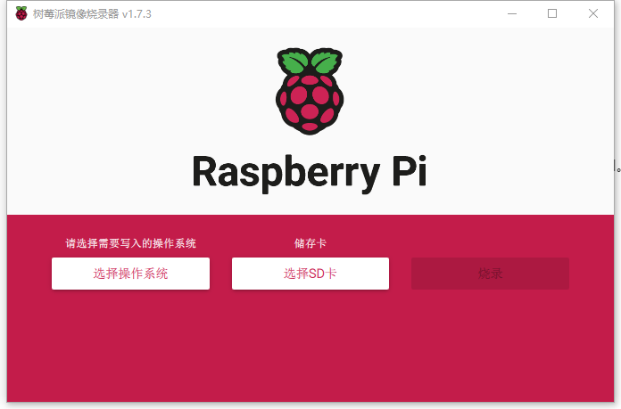

# Software Problem

## Update CM4 Mod Image

**Preparation：**

Hardware: Prepare an SD card reader, which needs to be USB 3.0, pull out the SD card of the XGO and insert it into the card reader, and plug it into the computer USB port.

Software: [Raspberry Pi OS – Raspberry Pi](https://www.raspberrypi.com/software/) Download Raspberry Pi Imager and install it.

1. Start Raspberry Pi Imager

2. [XGO2 image download](https://pan.baidu.com/s/1RblMq1C9kgc9VM74o_lccg?pwd=5416 ) The latest date of the robot dog image, click "Select Operating System" and choose to use the custom image and memory card path.

3. Click Burn, it will end after about 20 minutes. **Note, the system will prompt to format, do not format the SD card. **
