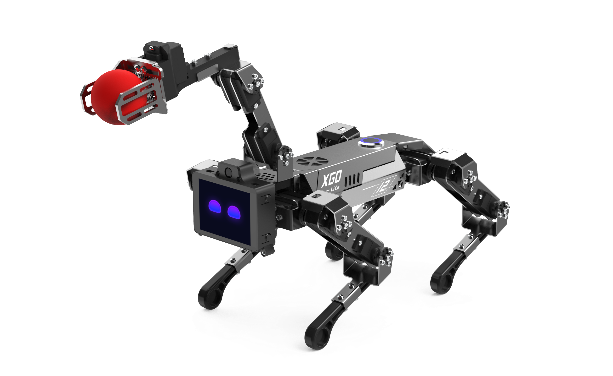

## CM4 XGO Robot Kit V2

CM4 XGO Robot is a desktop-grade Al robot dog with 15 degrees of freedom. It is equipped with a robotic arm and end grippers on its back. It has a built-in Raspberry Pi CM4 module to realize AI edge computing applications. It uses 2.3KG.CM bus serial port servos as joints. It can realize omnidirectional movement, six-dimensional attitude control, attitude stability, multiple motion gaits and clamping tasks. It is equipped with IMU, joint position sensors and current sensors to feed back its own attitude, joint rotation angle and torque, which are used for internal algorithms and secondary develop. Support cross-platform graphics, Python programming and ROS programming.





## Catalog

```mdx-code-block
import DocCardList from '@theme/DocCardList';

<DocCardList />
```
