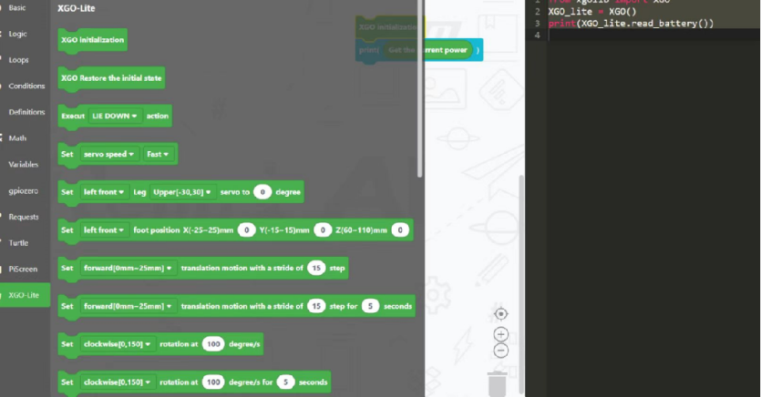

# Program Mode

Programming mode refers to the use of encapsulated building blocks or XGO's Python library to program the machine dog.

1. XGO connects the networking

2. After the XGO is powered on, press A  or  B  to select different modes. Press the  D  key to enter the programming mode, and the screen will automatically display the IP address of the XGO. The schematic diagram of the ABCD button is shown below.

   

3. Download Firefox browser (be sure to use Firefox, other browsers need to set up cross domain settings separately, which is quite troublesome). The website is as follows http://47.252.22.82:8088/ After connecting the computer and the machine dog to the same WIFI (it must be the same network segment), the interface is as follows after successful loading. Click on XGO-CM4 and enter the IP address on XGO.

   

4. After entering the graphical interface, select Mini or Lite based on the XGO model to program the XGO graphically.

   
