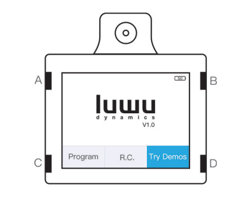
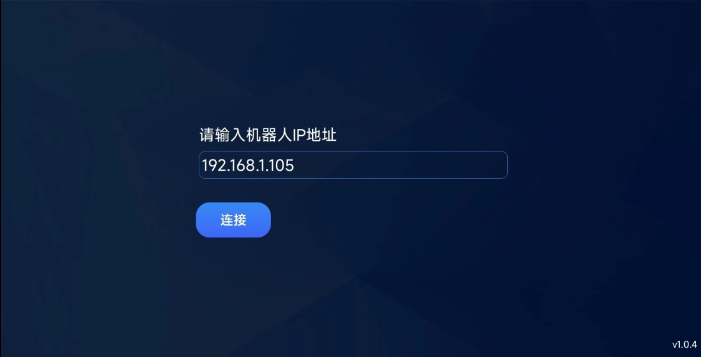
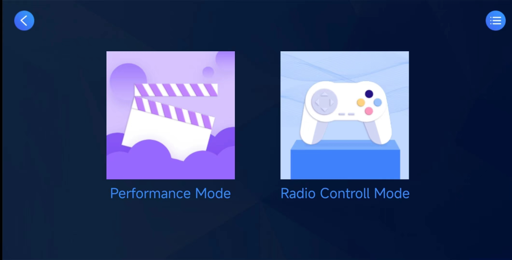
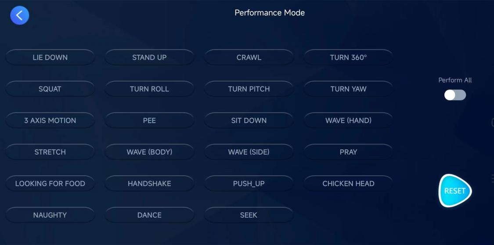
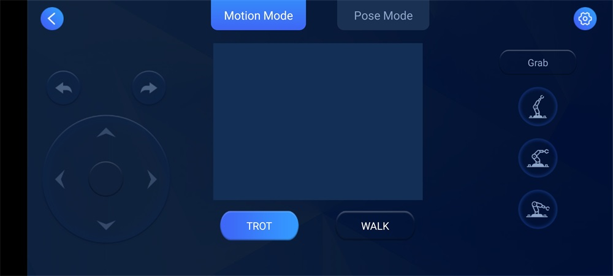
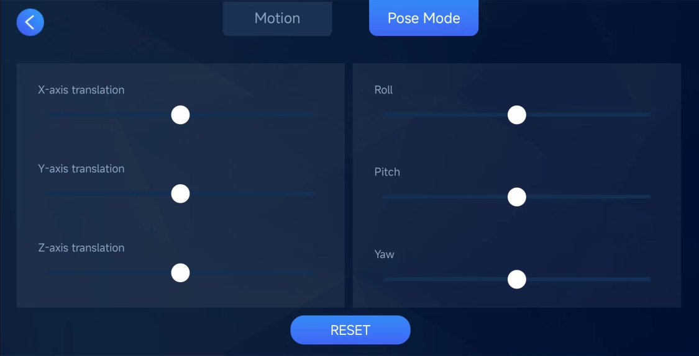
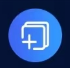

# Remote Mode

 ## Stand-alone remote control

The stand-alone remote control is to use the XGOBOT mobile APP to remotely control the robot dog and send back real-time images. Click [\[XGOBOT APP\]](https://drive.google.com/drive/folders/1dKgBIZHAHC7wmxSXXiN11KBBO8YB_MlC) to download and install it on your mobile phone or search for "XGOBOT" in the Apple App Store to find the corresponding application and download it.

1. Connect the robot dog with the network

2. After the robot dog is powered on, press **A** or **B** to select different modes, press **D** key to enter the remote control **R.C. mode**, the screen will display the IP address of the robot dog, The schematic diagram of the ABCD button is as follows.

3. Start the XGOBOT program on the mobile phone, let the mobile phone and the robot dog be under the same route, enter the IP address of the robot dog page, and then enter the interface to remotely control the robot dog. If it prompts that the connection fails, try to restart the robot dog and APP.

   

   

   

   

   

## Group Control Mode

Start the Group program in the sample program of the robot dog, and the screen of the robot dog will display the word Ready.

Start the XGOBOT APP, let the robot dog and the mobile phone be under the same route, click the  button to enter the group control page, and click start to let the robot dog Synchronously perform show mode.

