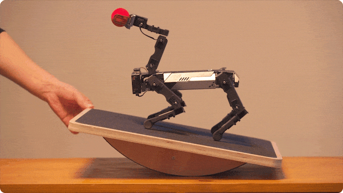
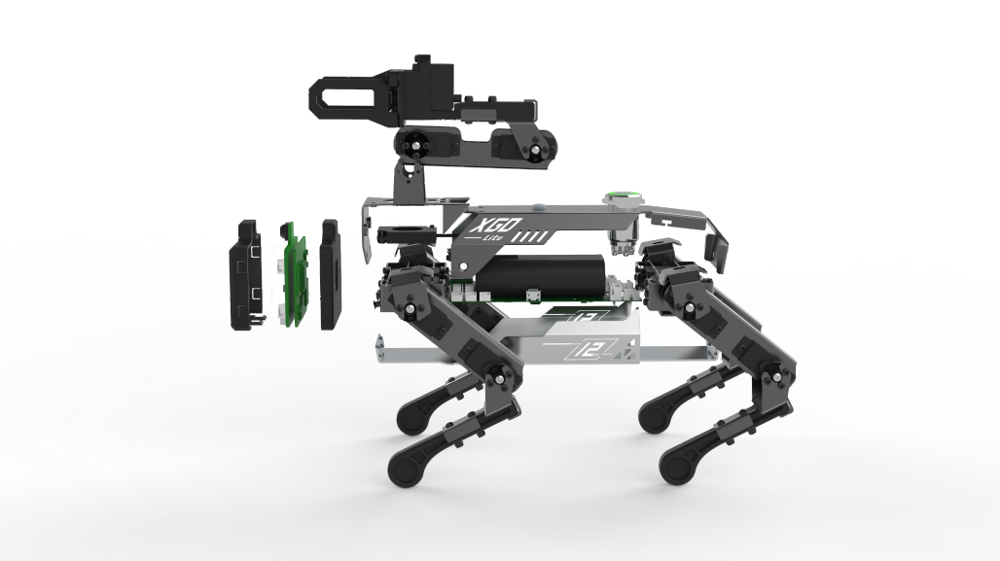
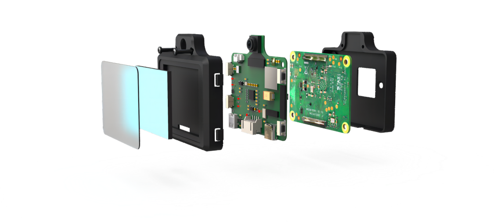

# CM4 XGO Robot Kit V2

## Introduction

XGO-lite V2 is a desktop Al robot dog with 15 degrees of freedom, equipped with a robotic arm and end grippers on the back, built-in Raspberry Pi CM4 module to realize AI edge computing applications, and uses 2.3KG.CM bus serial servo as the joint , which can realize omnidirectional movement, six-dimensional attitude control, attitude stability, multiple motion gaits and clamping tasks, and is equipped with IMU, joint position sensors and current sensors to feed back its own attitude, joint rotation angle and torque, which are used for internal algorithms and two-dimensional secondary development. Support cross-platform graphics, Python programming and ROS programming.

## Functional description

1. It can realize AI edge computing graphical programming, such as face detection, object classification, speech recognition and other common programs.

2. It can realize omnidirectional movement, six-dimensional attitude control, multiple sports gaits and superposition of sports, and a built-in gyroscope to maintain body self-balance.

3. The product supports cross-platform graphics and Python programming cloud platform, and there are related supporting courses.

4. The servo servo has a joint angle readback function, allowing it to remember the joint position of each action and execute the action group you designed, which can be used for teaching programming.

## Product Features

- IMU posture self-stabilization--The posture data obtained through the IMU adopts a closed-loop control method, and the robot dog remains stable no matter how the plane shakes.

- Six-degree-of-freedom attitude control of the whole machine--under the condition of not moving the toes, it can realize the motion control of six degrees of freedom of the body.

- IMU posture suppleness--Through the posture data obtained by the IMU, the closed-loop control realizes that the robot dog can actually adapt to the external force, adjust to the target posture of the hand, and realize the teaching function.

- User communication and secondary programming interface - open the underlying serial port protocol for secondary development and verification.

- Motion gait planning--low, medium, and high three postures of the robot dog match three speeds, using different gait strategies and planning algorithms

- Kinematics and dynamics simulation interface--Under the ros environment, perform kinematics and dynamics simulation on the Rviz and gazebo platforms.

- Omni-directional motion control--With 15 active joints, the robot dog can move forward, translate, and rotate in all directions through kinematic decoupling, and supports motion superposition in multiple directions.

- Artificial intelligence - AI functions such as machine vision, face recognition, speech recognition, model training, etc.

## Mechanical Structure

The main structure of XGO-lite V2 is composed of aluminum alloy structural parts, lower legs, and bus servos. The AI module and driver board on the head are connected by 4pin signal lines, and 2 built-in 18650 lithium batteries

- The robot dog front cover, rear cover, and the bottom cover are used as the robot dog rack for connecting various components. The front and rear legs are respectively fixed to the front and rear sides of the robot dog bottom cover by four screws; the core driver board is fixed to the middle of the robot dog bottom cover by four screws.

- Each leg is equipped with three servos as elbow, shoulder and hip joints. Mechanically, the three joint servos are fixedly connected with aluminum alloy structural parts. Electrically, the elbow servo and the shoulder servo, the shoulder servo and the hip servo, and the hip servo and the core drive board are each connected by a servo wire, so that the core drive board can drive and control all joint steering gear.

- The AI module is fixed on the front cover of the robot dog, and is connected to the core driver board through the serial port connection line of the AI module.

- The switch is fixed on the back cover of the robot dog through nuts, and is connected with the core driver board. The switch is a self-locking type, that is, it does not rebound after being pressed and the robot dog is in a continuous power-on state; when it is pressed again, the robot dog is powered off and turns off after 3~4 seconds.

- The 18650 2S battery is glued to the driver board by Velcro, and the charging hole is fixed on the bottom board.

## XGO-CM4 Module

The AI module adopts the Raspberry Pi CM4 technology solution, equipped with a 2.0-inch IPS color display screen and 4 programmable buttons, a 5-megapixel camera, a digital microphone and a cavity speaker. It is an AI terminal with human-computer interaction capabilities. It can realize image recognition, face detection, speech recognition and other functions to help students learn AI knowledge.

## XGO-Lite V2 driver board

Choose the ESP32-WROVER module, ESP32-WROVER series module is based on ESP32-D0WD dual-core chip design, and has enough interfaces to communicate with peripherals, use the serial port to communicate with serial port steering gear, IIC interface to read gyroscope MPU6050 data, the system uses Powered by two 18650 lithium batteries.

Choose the ESP32-WROVER module, ESP32-WROVER module is a high-performance, low-power Wi-Fi + Bluetooth/Bluetooth LE dual-module component, based on ESP32 series chips from Espressif Systems. In the driver board of XGO-lite V2, it plays a very critical role. The following is a detailed introduction to the ESP32-WROVER module.

Main features:

- Integrated dual-core processor: ESP32-WROVER module integrates a high-performance dual-core Tensilica LX6 microprocessor with a working frequency of up to 240 MHz, which provides powerful computing capabilities for XGO-lite V2 and satisfies real-time kinematics inverse calculation computing power requirements.
- Wireless communication: Support 2.4 GHz Wi-Fi and Bluetooth (including classic Bluetooth and Bluetooth low energy BLE) dual-mode communication, making the robot dog easy to realize remote control and data transmission.
- Large-capacity memory: up to 4MB SPI Flash and 8MB PSRAM, providing sufficient memory space for complex digital processing tasks.
- Low power consumption mode: Support multiple low power consumption modes, which is beneficial to prolong the service life of the robot dog and reduce energy consumption.
- Powerful I/O interface: Contains up to 34 programmable GPIO pins to support various sensors, actuators and communication interfaces for easy function expansion.
- Security: The built-in hardware encryption engine supports AES, SHA-2, RSA, Elliptic Curve Cryptography (ECC) and other encryption algorithms to ensure data security.

Thanks to the high performance, low power consumption and rich features of the ESP32-WROVER module, it is widely used in various Internet of Things (IoT) projects, such as smart home, wearable devices, wireless sensor networks, remote control, etc. field. In XGO-lite V2, the ESP32-WROVER module realizes the core control, data processing and communication functions of the device, creating an intelligent, flexible and expandable robot dog product for users.

## XGO-Lite V2 Joint

The XGO-lite2 robot dog uses a high-quality 6V 2.3KG plastic shell metal tooth 300-degree dual-axis TTL serial servo as one of its key components. The steering gear adopts plastic shell, metal gear box, iron core motor, TTL control board and high-quality potentiometer, and the output head adopts 25T type. It has a stall torque of 2.3kg.cm, an effective control angle of 300 degrees, and can switch between servo mode and continuous motor operation mode. In addition, the steering gear can also feedback position, speed, voltage, temperature and load parameters, so as to realize overload protection.

By adopting this servo, the motion control of the XGO-lite2 robot dog is more precise and stable. The metal gear box and iron core motor of the steering gear ensure its high torque and high precision, and the effective control angle of 300 degrees also makes the movement of the robot dog more flexible. At the same time, the steering gear also has servo mode and continuous rotation motor working mode, as well as the function of feedback position, speed, voltage, temperature and load parameters, so as to realize overload protection and ensure the stability and safety of the robot dog.

In short, the 6V 2.3KG plastic shell metal teeth 300-degree dual-axis TTL serial servo is a high-quality, high-performance servo, which is suitable for motion control of various robots and smart devices. In the XGO-lite2 robot dog, it provides strong support for the motion control of XGO-lite V2, improving the performance and application value of XGO-lite V2.

