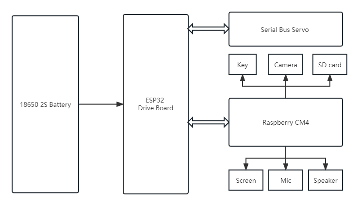
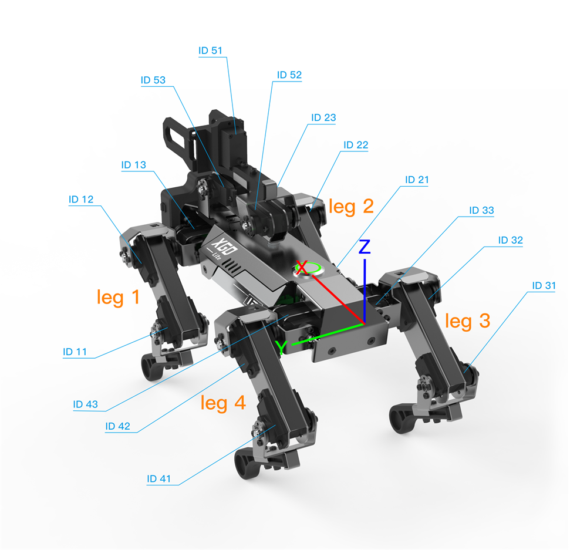
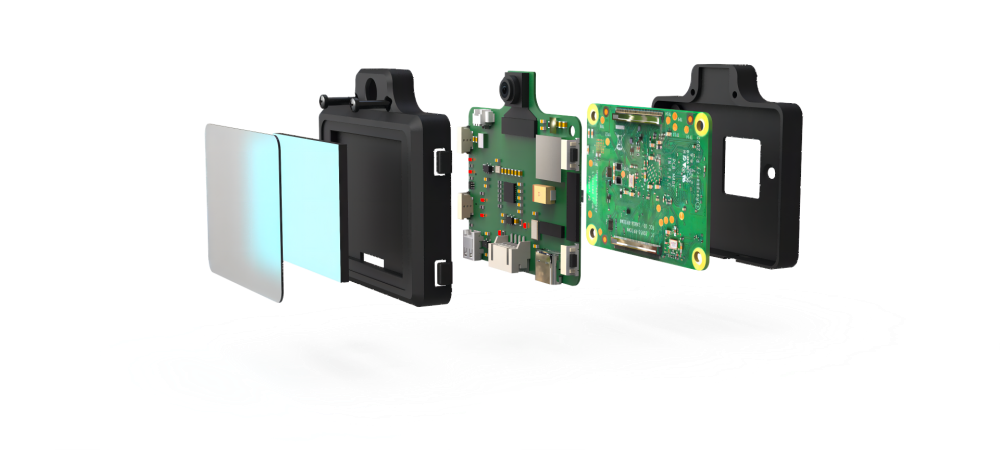

# XGO2 Overview

## XGO2 Architecture Diagram

The XGO2 robot dog features a core architecture comprised of two main components. The first is the Raspberry XGO-CM4, an artificial intelligence module serving as the host computer responsible for all AI tasks. The second is a slave computer developed with ESP32, which manages the power system, servo drive, and core gait algorithm of the robot dog. Communication between the host and slave occurs through a serial port.

XGO2 architecture

## XGO2 Structure

The primary physical framework of XGO2 is made up of aluminum alloy structural parts and serial bus servos. The legs are made of ABS. PH2.0 4-pin cables connect the XGO-CM4 module and driver board, and everything is powered by two 18650 lithium batteries inside.

The structure is depicted in the exploded diagrams below.

XGO-lite2  3D : [XGO-lite2 3D model Download](https://drive.google.com/drive/folders/1m7UkYkFK1r1mkiaNGKb9vu-NmsO1vhvu?usp=share_link) .

XGO-mini2 3D: [XGO-mini2 3D model Download](https://drive.google.com/drive/folders/15PVrd4aRQLLVUnuNcEL2TR3LvbrGuc87?usp=share_link) .

XGO-lite2

XGO-mini2

leg , servo ID

## XGO-CM4

XGO-CM4 is powered by a Raspberry Pi Computer Module 4 (CM4), featuring a quad-core Cortex-A72 CPU that runs at 1.5GHz, and a 2-inch IPS screen with a resolution of 320 x 240. The device has ample RAM (2GB) for multitasking and a reasonable amount of storage (32GB Micro SD card) for installing an operating system, allowing for fast boot up times and a smooth overall operating experience. It supports wireless connectivity through dual-band 2.4GHz/5GHz Wi-Fi and Bluetooth 5.0 BLE.

XGO-CM4 also includes a high-speed expansion interface with 4 programmable keys, two speaker ports for playing media, a USB 2.0 Type-C port, and a micro-HDMI port for external devices. Additionally, the 4-pin PH2.0 allows for a wide range of other hardware applications with serial communication.

[XGO-CM4 carrier board schematic Download](https://drive.google.com/file/d/1QnI0QfcOz2QENuufSl5sco3uHnJT6hEt/view?usp=share_link).

XGO-CM4

## XGO2 Driver

This is a bus servo control board based on [ESP32](https://drive.google.com/file/d/1g_VkQ1Yl64d9Jzcs3MkiN2hhNxQXjvLK/view?usp=share_link) ，it controls XGO2's 15 bus servos and reads the current angle, load, voltage, mode, and other information of each servo, and can use the serial port to communicate with the Raspberry Pi computer.

[XGO-lite2 driver board schematic Download](https://drive.google.com/drive/folders/1BOxCXLa-zUld4KJEwGjWyR7R4VV0N0T2?usp=share_link).

[XGO-mini2 driver board schematic Download](https://drive.google.com/drive/folders/1Bn9FrDBKyHysEEdINcRndsG4CmKC1Rr7?usp=share_link).

## XGO-mini2 Servo

The modular servo joint of XGO-mini is composed of a DC hollow cup motor, a metal reduction gear set, a 12-bit magnetic encoder and an integrated control circuit. It has its own closed-loop control and planning algorithm, high-speed bus communication, 360-degree angle control, and supports speed, position, current, temperature feedback and control parameter adjustment functions providing high-performance. The customized joints provides PID parameter adjustment, optimizes the joint impedance characteristics (compliance), and based on the basic kinematic gait planning, combined with the consideration of the center of gravity and the feedback of the IMU, as well as the requirements of the upper-level control commands, real-time adjustments can be performed. At the same time, a large speed ratio and high-efficiency reducer is used, which ensures lexibility and improves on the load-to-weight ratio.

