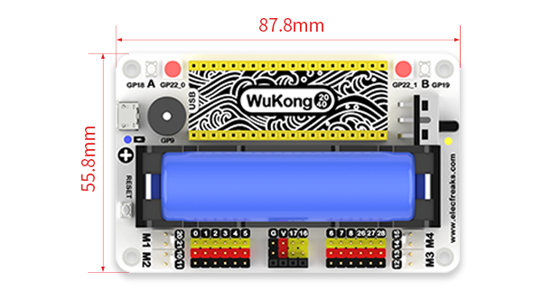
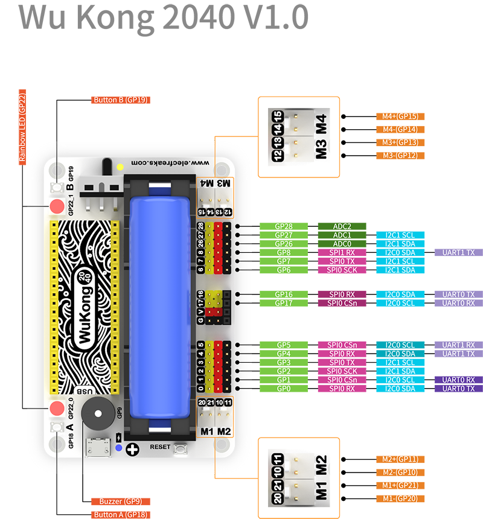
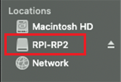
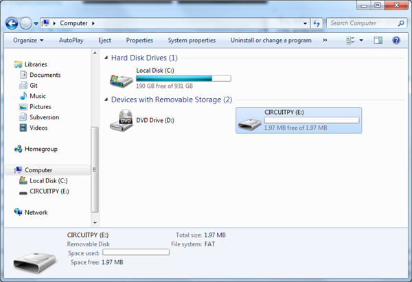
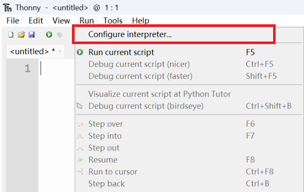
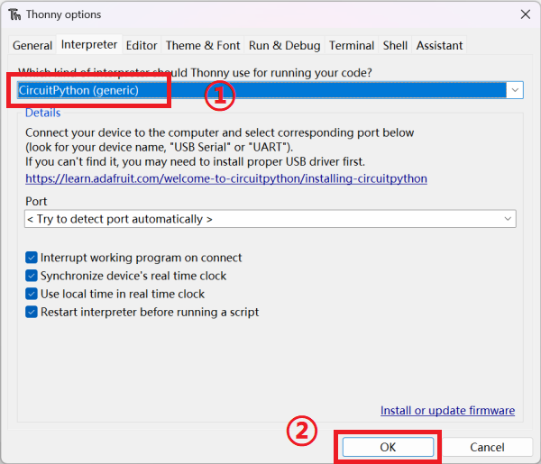
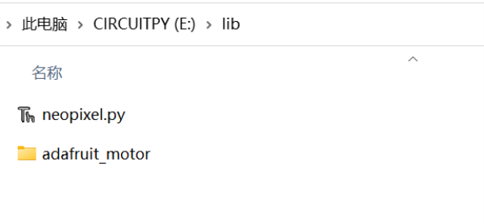

# Wukong2040

## Introduction


**WuKong2040** is a multifunctional expansion board designed for Raspberry Pi Pico.

In terms of functionality, it has an on-board buzzer, A\B button, rainbow light, motor interface, reset button, etc. to meet the creators' IO programming and expansion of peripherals required. 

In terms of battery life, it supports a high-capacity 18650 battery with an on-board intelligent power management chip and thoughtful power indication, which can last for more than 120 minutes of normal use.  

In terms of structure, it uses a standard 7 × 11 square block frame as the base, which can be expanded for Wukong 2040 in a variety of vivid shapes.

What's more thoughtful is that ELECFREAKS provides beginners with a wealth of learning examples that can help you quickly get started in the world of creators and apply them to real life.

> Raspberry Pi Pico is an official Raspberry Pi design high performance, small size microcontroller development board. It uses Raspberry Pi's own RP2040 microcontroller chip, equipped with ARM Cortex M0 + dual-core processor, running at 133MHz, 264KB of SRAM and 2MB of memory, and up to 26 multi-functional GPIO pins on board.

## Characteristics

* On-board components such as buzzer, A\B button, rainbow light, reset button, etc. are highly integrated and powerful.
* Support high-capacity 18650 battery, onboard intelligent power management chip with power indication, allowing learners to get rid of power worries and enjoy creating fun anytime, anywhere.
* Up to 14 general-purpose IO pins are extended, and a separate I2C interface is introduced, making it very convenient for learners to connect various peripherals.
* Standard building block frame base for easy structure building. 
* Support multiple programming methods: MicroPython, CircuitPython, C, C++.
* Rich learning examples.

## Dimensional Parameters



## Module Introduction



## Detailed parameters

| Parameters             | Details                          | Remarks                                                |
| :--------------------- | -------------------------------- | ------------------------------------------------------ |
| Product Number         | EF02054                          | SKU                                                    |
| Size                   | 87.80 × 55.80 × 36.33mm          | Subject to the actual product                              |
| Weight                 | 97g                              | Includes dock, includes lithium battery                |
| Power supply system    | Toggle Switch                    | -                                                      |
| Power supply battery   | 18650 lithium battery            | Fast charging 60 minutes, full working over 40 minutes |
| Working Voltage        | 2.8v~4.2v                        | Charging temperature 0°C~40°C                          |
| Working temperature    | -20°C~60°C                       | -                                                      |
| Motor Drive            | 4 Pins（M1、M2、M3、M4）         | Battery voltage                                        |
| GPIO interface         | 12 Pins                          | 0，1，2，3，4，5，6，7，8，26，27，28                  |
| IIC Interface          | 3 Pins                           | Pins are 16, 17                                        |
| Full color light beads | 2 pcs                            | The lamp bead model is ws2812b                         |
| Buzzer                 | Passive buzzer                   | Model：SEN-OASS2P0905-DIP                              |
| Block base             | Standard 11×7 square block frame | -                                                      |
| Reset button           | RESET button                     | -                                                      |

## Programming environment configuration

### Preface

Raspberry Pi Pico supports C, C++, MicroPython, CircuitPython and other programming methods, click the link below to download the corresponding driver file.。

>All cases in this article are based on CircuitPython. If you are new to Raspberry Pi Pico, it is recommended to download the CircuitPython driver first and refer to the cases for learning.
>
>CircuitPython is a programming language designed to simplify experimentation and learning of coding on low-cost microcontroller boards.
>
>CircuitPython is the easiest way to program microcontrollers.
>
>You can find out more details on the CircuitPython website and forums.
>
>[CircuitPython Official Website](https://circuitpython.org/)
>
>[CircuitPython Forum](https://forums.adafruit.com/viewforum.php?f=60)

| Firmware      | Link                                               |
| ------------- | -------------------------------------------------- |
| CircuitPython | https://circuitpython.org/board/raspberry_pi_pico/ |

After clicking on the firmware download page, click on the link in the following location:


### Firmware Installation


The complete firmware burn-in demonstration is shown below：

Step 1: Press the Raspberry Pi Pico on-board BOOSEL button and do not release it.


Step 2: Connect the Raspberry Pi Pico to your computer using a good USB cable and release the Raspberry Pi Pico on-board BOOSEL button when the computer disk directory shows the "RPI-RP2" drive.



Step 3: Drag the previously downloaded UF2 file to the "RPI-RP2" disk, and when the copy is complete, the "RPI-RP2" disk drive will disappear and the "CIRCUITPY" drive will appear. Congratulations, you have successfully installed CircuitPython.



### Programming platform settings

If you are new to Raspberry Pi Pico, we recommend that you start with Thonny. Click the link below to select the Thonny for your computer's operating system and download it.

>Thonny is an entry-level Python IDE for beginners, designed for learning and teaching programming.Developed by Tartu University in Estonia, Thonny is friendly to hardware programming users, with different interpreters to choose from depending on the open source hardware.

| Name   | Link                |
| ------ | ------------------- |
| Thonny | https://thonny.org/ |


### Selecting Thonny interpreter

Open Thonny on your computer, click the "Configure interperter" menu in the "Run" option, under the "Interperter" option, click the Select interpreter drop-down menu and select "CircuitPython(generic)", click "OK" to complete the interpreter configuration.

The steps are shown in the figure:





## Getting Started

### Wukong 2040 expansion board power on and charging method

* As shown in picture (1) below, turn up the power switch and the Wukong 2040 expansion board is turned off.
* Turn down the power switch, the Wukong 2040 expansion board turns on and the power indicator lights up.
* Connect the USB power cable to the charging port as the picture shown below (2) and the power indicator lights up.


(picture 1)


(picture 2)


Power indicator status.

The indicator color is red when the power level is below 20%.

The power level is between 20% and 80% and the indicator color is orange.

The indicator color is green when the power level is higher than 80%.


Charging indicator status：

Not full state, the indicator color is red.

Full state, the indicator color is green.

### Project Case

##### Case 1: Lighting Up the Raspberry Pi Pico Onboard LEDs

The Raspberry Pi Pico comes with one LED on board, pin GP25, which is programmed to give the LEDs a breathing effect.

Code reference(1)：

```python
import board  # Import the board library and access the hardware from over the pins
import time  # Import time libraries to control code execution, such as suspending program execution by different hibernation times
import digitalio # Import digitalio library to allow access and set hardware as input and output

led_onboard = digitalio.DigitalInOut(board.LED)  # Create the board.
led_onboard.direction = digitalio.Direction.OUTPUT  # Set to output mode

while True:
    led_onboard.value = True  # Set the on-board led to high (lit)
    time.sleep(1)
    led_onboard.value = False  # Set the onboard led to low (off)
    time.sleep(1)
```

Code reference(2)：

```python
import time
import board
import pwmio  # Import pwmio, the module containing the classes for basic pulse access

led_onboard = pwmio.PWMOut(board.LED, frequency=5000, duty_cycle=0)  # Create pwm object output from pins

while True:
    for i in range(100):
        if i < 50:
            led_onboard.duty_cycle = int(i * 2 * 65535 / 100)  # Set duty cycle value
        else:
            led_onboard.duty_cycle = 65535 - int((i - 50) * 2 * 65535 / 100)
        time.sleep(0.01)
```

##### Case 2: Programmable buttons A \ B

The Wukong 2040 has two onboard programmable buttons A \ B. Programmed to achieve the Raspberry Pi Pico onboard LEDs will light up when the Wukong 2040 onboard A button is pressed, and the LEDs will turn off when the B button is pressed.

Code Reference：

```python
import board
import digitalio

led_onboard = digitalio.DigitalInOut(board.LED)

led_onboard.direction = digitalio.Direction.OUTPUT

button_a = digitalio.DigitalInOut(board.GP18)  # Create the wukong2040 button A object from the pins
button_b = digitalio.DigitalInOut(board.GP19)

button_a.direction = digitalio.Direction.INPUT  # Set button_a to output mode
button_b.direction = digitalio.Direction.INPUT
button_a.pull = digitalio.Pull.UP  # Set the pull-up
button_b.pull = digitalio.Pull.UP

while True:
    if button_a.value == False:  #  The value of button_a.value is the status value of button A. Pressing is 0, releasing is 1.
        led_onboard.value = True
    elif button_b.value == False:  # The value of button_b.value is the status value of button B. Pressing is 0, releasing is 1.
        led_onboard.value = False
```

##### Case 3: Light up full-color light beads

Wukong 2040 has two full-color LED beads (ws2812b) on board, pin numbers GP22_0 and GP22_1. Program the two beads to change colors and blink.

>To program the full color bead (ws2812b) using CircuitPython, you need to use the neopixel library file, you can download the neopixel library file by clicking the link below and save it to the "lib" directory of the "CIRCUITPY" driver.

| Links to neopixel library files | https://github.com/adafruit/Adafruit_CircuitPython_NeoPixel |
| ------------------------------- | ----------------------------------------------------------- |

As shown in the figure：


Code reference:

```python
import time
import board
from rainbowio import colorwheel
import neopixel

NUMPIXELS = 2
SPEED = 0.05
BRIGHTNESS = 0.2  # Values in (0.0, 1.0), where 0.0 is off and 1.0 is maximum
PIN = board.GP22  # Rainbow bead pins are GP22

pixels = neopixel.NeoPixel(PIN, NUMPIXELS, brightness=BRIGHTNESS, auto_write=False)


def rainbow_cycle(wait):
    for color in range(255):
        for pixel in range(len(pixels)):
            pixel_index = (pixel * 256 // len(pixels)) + color * 5
            pixels[pixel] = colorwheel(pixel_index & 255)
        pixels.show()
        time.sleep(wait)


while True:
    rainbow_cycle(SPEED)
```

##### Case 4: Driving the buzzer

The Wukong 2040 has an on-board buzzer, pin number GP9, programmed to play a piece of music when the buzzer is pressed.

Code reference:

```python
import time
import array
import math
import board
import digitalio
from audiocore import RawSample

try:
    from audioio import AudioOut
except ImportError:
    try:
        from audiopwmio import PWMAudioOut as AudioOut
    except ImportError:
        pass

button = digitalio.DigitalInOut(board.GP18)
button.switch_to_input(pull=digitalio.Pull.UP)

tone_volume = 0.9
frequency = 440
length = 8000 // frequency
sine_wave = array.array("H", [0] * length)
for i in range(length):
    sine_wave[i] = int((1 + math.sin(math.pi * 2 * i / length)) * tone_volume * (2 ** 15 - 1))

audio = AudioOut(board.GP9)
sine_wave_sample = RawSample(sine_wave)

while True:
    if not button.value:
        audio.play(sine_wave_sample, loop=True)
        time.sleep(1)
        audio.stop()
```

##### Case V: Drive motors

Wukong 2040 on-board 4-way motor interface: M1, M2, M3, M4, programmed to stop after 5 seconds of motor M2 rotation.

Code reference:

```python
import board
import digitalio
import time 

motor = digitalio.DigitalInOut(board.GP10)
motor.direction = digitalio.Direction.OUTPUT

while True:
    motor.value = True
    time.sleep(5)
    motor.value = False
    time.sleep(5)
```

##### Case 5: Drive S90 Servo

The Wukong 2040 has 12 expansion IO interfaces on board (pins: 0, 1, 2, 3, 4, 5, 6, 7, 8, 26, 27, 28), which can be used to drive [S90 servos](https://shop.elecfreaks.com/products/elecfreaks-micro-servo-360-degrees-digital-servo?_pos=3&_sid=323aff898&_ss=r)。If you use an adapter cable to connect the servo to the Wukong 2040 on-board pin interface (pins: 16, 17) you can also drive the S90 servo.

| adafruit_motor library file links | https://github.com/adafruit/Adafruit_CircuitPython_Motor/archive/refs/heads/main.zip |
| --------------------------------- | ------------------------------------------------------------ |

> Programming Servos with CircuitPython
>
> To use the adafruit_motor library, click on the link above to download the adafruit_motor library file and save it to the "lib" directory of the "CIRCUITPY" drive.

As shown in the figure：



Code reference:

```python
import time
import board
import pwmio
from adafruit_motor import servo

pwm = pwmio.PWMOut(board.GP0, duty_cycle=2 ** 15, frequency=50)

my_servo = servo.Servo(pwm)

while True:
    for angle in range(0, 180, 5):
        my_servo.angle = angle
        time.sleep(0.05)
    for angle in range(180, 0, -5):
        my_servo.angle = angle
        time.sleep(0.05)
```

##### Case 6: Using GPIO pins to drive LEDs

The Wukong 2040 has 12 expansion IO interfaces on board (pins: 0, 1, 2, 3, 4, 5, 6, 7, 8, 26, 27, 28), which can be used to drive digital signal sensors such as LED lights.

>Case demonstration using ELECFREAK' [Octopus](https://shop.elecfreaks.com/search?type=product&q=octopus) Series sensors.

Code reference:

```python
# Importing the modules needed for the program
import board
from digitalio import *
from time import *

# Set the pin and pin direction for LED light connection
led_0 = DigitalInOut(board.GP0)
led_1 = DigitalInOut(board.GP1)
led_0.direction = Direction.OUTPUT
led_1.direction = Direction.OUTPUT

# Set the status of the 2 LEDs to switch between on and off
while True:
    led_0.value = True
    led_1.value = False
    sleep(1)
    led_0.value = False
    led_1.value = True
    sleep(1)
```

##### Case 7: Reading potentiometer values

The GP26, GP27, and GP28 pins on the Raspberry Pi Pico can be used as GPIO or ADC (Analog to Digital Converter) inputs, and can be programmed to select modes.。

>Case demonstration using ELECFREAK' [Octopus](https://shop.elecfreaks.com/search?type=product&q=octopus) Series sensors.

Code reference:

```python
import time
import board
from analogio import AnalogIn

analog_in = AnalogIn(board.GP26)

while True:
    print(analog_in.value)
    time.sleep(0.1)
```

##### Case 8: Driving OLED screens

Wukong 2040 has onboard IIC pins (GP16, GP17), which can drive OLED display through IIC, you need adafruit_ssd1306.py library file and adafru_framebuf.py library file, click the link below to download, and save adafruit_ssd1306.py, adafru_ framebuf.py to the "lib" directory of the "CIRCUITPY" drive.

| adafruit_ssd1306.py library file download link | https://github.com/adafruit/Adafruit_CircuitPython_SSD1306   |
| ---------------------------------------------- | ------------------------------------------------------------ |
| adafru_framebuf.py library file download link  | https://github.com/adafruit/Adafruit_CircuitPython_framebuf/releases/tag/1.4.14 |

As shown in the figure.


> Case demonstration using ELECFREAK' [Octopus](https://shop.elecfreaks.com/search?type=product&q=octopus) Series sensors.The resolution of OLED display is: 128*64.

Code reference:

```python
import board
import busio
import adafruit_ssd1306
import time

i2c = busio.I2C(board.GP17, board.GP16)
display = adafruit_ssd1306.SSD1306_I2C(128, 64, i2c, addr=0x3C)
bgColor=0

display.fill(bgColor)
for i in range(0,display.height,4):
    for j in range(0,display.width,4):
        display.pixel(j, i, not bgColor)
    display.show()

display.fill(bgColor)
for i in range(0,display.height,4):
    display.hline(0, i,display.width, not bgColor)
    display.show()

display.fill(bgColor)
for i in range(0,display.width,8):
    display.vline(i, 0,display.height, not bgColor)
    display.show()

display.fill(bgColor)
for i in range(0,display.height,4):
    display.line(0, 0, display.width, i, not bgColor)
    display.line(display.width, display.height, 0, display.height-i, not bgColor)
    display.show()

display.fill(bgColor)
for i in range(0,display.width//2,4):
    display.circle(display.width//2, display.height//2, i, not bgColor)
    display.show()

display.fill(bgColor)
for i in range(0,display.height,16):
    for j in range(0,display.width,16):
        display.rect(j, i, 12, 12, not bgColor)
        display.show()

for i in range(0,display.height,16):
    for j in range(0,display.width,16):
        display.fill_rect(j+2, i+2, 8, 8, not bgColor)
        display.show()

display.fill(bgColor)
```

## Wukong2040Purchase Link

You can buy from this link：[Wukong2040](https://shop.elecfreaks.com/products/elecfreaks-wukong2040-expansion-board-adapter-for-raspberry-pi-pico?_pos=1&_sid=148d50ba0&_ss=r)。
