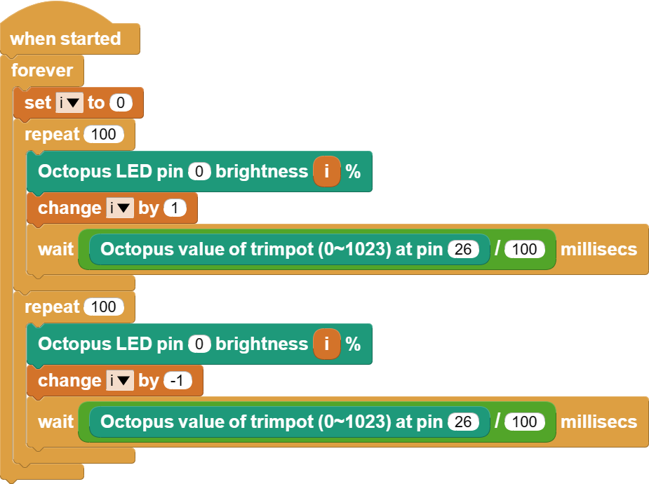

# Case 01: The Flashing Stars


## Introduction

Whenever we see a starry night sky, we feel the beauty of a river of stars. In fact, we can simulate such a scene using LED lights with a trimpotlsensor. In this case, we will use a trimpot sensor to control the blinking frequency of the LED light to achieve the effect of a starry sky, which is even better in a dark environment.

## Materials Requested

1 × Raspberry Pi Pico

1 × Wukong2040 expansion board

1 × USB cable

1 × Red LED

1 × Blue trimpot

2 × 3P Dupont cables with buckles

## Introduction to main components

### LED Light

LED stands for Light Emitting Diode. It is a semiconductor diode. It converts electrical energy into light energy. When an electric current passes through it, it emits light.

LEDs are essentially also a type of diode. In the case of a normal diode, for example, it conducts when a forward voltage is applied to it, while it cuts off when a reverse voltage is applied. This is because there are more free electrons in the N region and more holes in the P region, when we apply a forward voltage, the electrons will be attracted by the electric field and compound with the holes, the free electrons and holes will release heat when they compound. the principle of the LED lamp is similar to this diode, but when the free electrons and holes compound, it releases light energy to the outside.

Why does one emit heat and why does the other emit light? This depends entirely on the material of the semiconductor.
The semiconductor material used in ordinary diodes is silicon, the outermost layer of the silicon atom has four electrons, the outermost layer of the atom of a pure silicon crystal can form a stable 8-electron structure, its N region is in the pure silicon atom doped with 5-valent phosphorus, so the outermost layer of an extra free electron, while its P region is in the pure silicon atom doped with 3-valent boron, which leads to the outermost layer of his lack of an electron to form a hole, when When we apply a positive voltage to it, the free electron will compound with the hole, and the compound will release heat at the same time. The reason why heat is released is determined by the substance, and the semiconductor material used in LEDs is not silicon but a compound, such as potassium nitride, which has five electrons in the outermost layer of the nitrogen atom and three electrons in the outermost layer of the potassium atom, so the nitrogen and potassium atoms in pure potassium nitride can also form a stable 8-electron structure in the outermost layer. The semiconductor structure of the LED is such that when we add a positive voltage to it, the free electrons compound with the holes, and after the compound produces photons, the LED is so luminous. This is how the LED emits its light, which is blue, due to the material gallium nitride. For other LED lamp colours, please consult the relevant information.


### The Trimpot

A trimpot/potentiometer is an adjustable electronic component. It consists of a resistor body and a rotating or sliding system. When a voltage is applied between the two fixed contacts of the resistor body, the position of the contacts on the resistor body is changed by the rotation or sliding system and a voltage is obtained between the movable and fixed contacts in relation to the position of the movable contacts.


### Hardware Connection

Connect your components according to the following connection diagram:


### Graphical Programming



### Code

```python
from Trimpot import *  # Import the library of the trimpot
import time  # Import the library of time
from LED import *  # Import the library of LED

trimpot = Trimpot(board.GP26)  #  Create a trimpot sensor object and pass in the pin number
led = LED(board.GP0)  # Create the LED object and pass in the pin number

while True:
    for i in range(100):  # The brightness of the led lamp increases during the cycle
        led.set_led_bright(i)  # Setting the brightness of the led lights
        time.sleep(trimpot.get_trimpot() / 6553500)  # Changing the timing of the led light brightness by changing the value of the potentiometer

    for j in range(100):  # The brightness of the led lamp is reduced during the cycle
        led.set_led_bright(100 - j)
        time.sleep(tirmpot.get_trimpot() / 6553500)
```

### Case Display


### Think

Can you change the brightness of the LED lights?

### FAQ


### For more information, please visit:

[micro:bit Accessories Store | ELECFREAKS](https://www.elecfreaks.com/)
