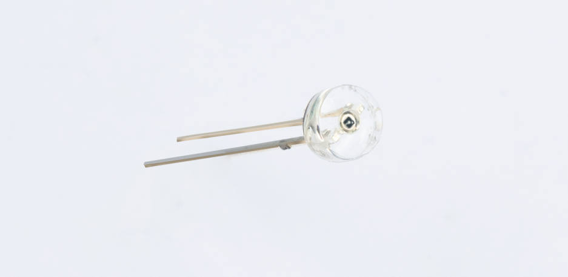
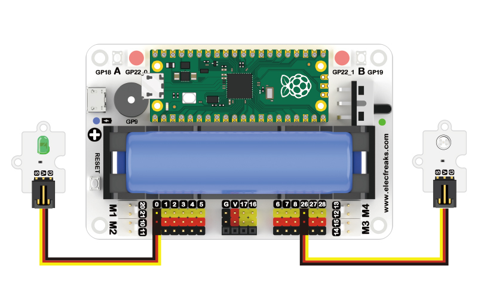
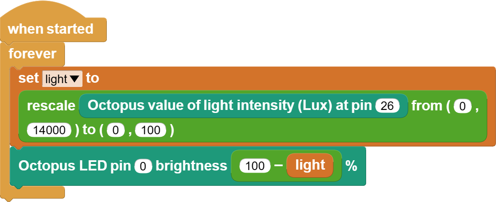

# Case 03: Warmth in the Dark


## Introduction

Being alone in a dark room is not only frightening but also gives you a feeling of helplessness, and if there is a lighted lamp at this time it can bring warmth, wouldn't it be nice if the light was more intelligent, for example if the sky slowly turned dark and the light slowly turned on? We then completed the project using a light sensor and a green LED light.

## Materials Requested

1 × Raspberry Pi Pico

1 × Wukong2040 expansion board

1 × USB cable

1 × Green LED

1 × Light sensor

2 × 3P Dupont cables with buckles

## Introduction to main components

### The light sensor



A light sensor is a sensor that uses a photosensitive element to convert a light signal into an electrical signal. It is sensitive to wavelengths around visible light wavelengths, including infrared wavelengths and ultraviolet wavelengths. A light sensor is not limited to the detection of light, it can also be used as a detection element to form other sensors that detect many non-electric quantities, as long as these non-electric quantities are converted into changes in the light signal.

Light sensors are special resistors made of semiconductor materials such as CdS or CdSe, which operate on the basis of the internal photoelectric effect. The stronger the light, the lower the resistance value. As the light intensity rises, the resistance value decreases rapidly and the bright resistance value can be as small as 1KΩ or less. Photosensitive sensors are very sensitive to light, and when they are not illuminated, they have a high resistance, and the dark resistance is generally up to 1.5MΩ.

Photosensitive sensors are mainly used in solar lawn lights, light-controlled night lights, cameras, monitors, light-controlled toys, sound and light-controlled switches, cameras, anti-theft wallets, light-controlled music boxes, birthday music candles, music cups, human body sensor lights, human body sensor switches and other electronic products light automatic control field.

### Hardware Connection

Connect your components according to the following connection diagram:



### MicroBlocks Graphical Programming



### CircuitPython Code

```python
from Light import *  # Import the library of the light sensor
from LED import *  # Import the library of the LED
import time  # Import the library of the time

light = Light(board.GP26)  #  Create a light sensor object and pass in the pin number
led = LED(board.GP0)  #  Create the led object and pass in the pin number

while True:
    lightness = int(light.get_lightlevel() / 655.35)  # Get light sensor return value and do mapping to (0~100), return value range (0~65535)
    led.set_led_bright(100 - lightness)  # Set the brightness of the LEDs, range (0~100)
    time.sleep(0.5)  # Set program run pause time
```

### Case Display


### Think

Can you change the effect to one where the LED lights go out when dawn arrives? This would save electricity.

### FAQ


### For more information, please visit:

[micro:bit Accessories Store | ELECFREAKS](https://www.elecfreaks.com/)
