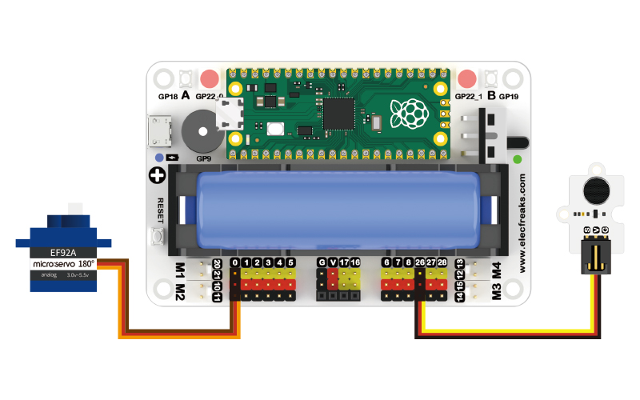

# Case 08: Open Sesame


## Introduction

The spell "Open Sesame", which opens the door to the treasure cave of the Forty Thieves, is a familiar story, but we can use noise sensors and a tiller to achieve this effect.

## Materials Requested

1 × Raspberry Pi Pico

1 × Wukong2040 expansion board

1 × USB cable

1 × Noise sensor

1 × 180° servo

1 × 3P Dupont cable with buckle

## Introduction to main components

### Noise Sensor


The noise sensor is precisely due to the fact that the sensor has a built-in sound-sensitive capacitive electret microphone, with an electret face opposite the back electrode and a very small air gap in the middle, forming a flat capacitor with the air gap and the electret as the insulating medium, with the back electrode and the metal layer on the electret as the two electrodes. The capacitor has an output electrode between the two poles. Due to the electret film there is a free charge distributed on it. When the sound waves cause the electret film to vibrate and produce displacement, the distance between the two electrodes of the capacitor changes, thus causing the capacitance of the capacitor to change, as the number of charges on the electret remains constant, according to the formula: Q = CU, so when C changes, it inevitably causes the voltage U at both ends of the capacitor to change, thus outputting an electrical signal and realising the transformation from sound signal to electrical signal.

### Servo

Often referred to as a servo motor, it is a small device with an output shaft. When we send a control signal to the servo, the output shaft can be turned to a specific position. As long as the control signal remains constant, the servo mechanism keeps the angular position of the shaft unchanged. If the control signal changes, the position of the output shaft will change accordingly. In everyday life, servos are often used in remote control aircraft, remote control cars, robots and other areas.

The control line is used to transmit the angle control signal. This angle is determined by the duration of the control signal pulse, which is called pulse code modulation (PCM). The control of a servo generally requires a time base pulse of around 20 ms. The high level portion of this pulse is generally in the range 0.5 ms - 2.5 ms with a total interval of 2 ms. The width of the pulse will determine how far the motor will turn. For example, with a 1.5 ms pulse, the motor will turn to a position of 90 degrees (often called the neutral position, which for a 180° servo is the 90° position). If the pulse width is less than 1.5 ms, then the motor is axially oriented towards 0 degrees. If the pulse width is greater than 1.5 milliseconds, the axial direction is towards 180 degrees. In the case of a 180° servo, for example, the corresponding control relationship is as follows

> 0.5ms————-0°；
>
> 1.0ms————45°；
>
> 1.5ms————90°；
>
> 2.0ms———–135°；
>
> 2.5ms———–180°；


## Hardware connections

Connect your components according to the following connection diagram:



## MicroBlocks Graphical Programming


## CircuitPython Code

```python
from Noise import *  # Import the library of noise sensor
from Servo import *  # Import the library of 180 degrees servo
import time  # Import the library of time

noise = Noise(board.GP26)  # Create a noise sensor object and pass in the pin number
servo = Servo(board.GP0)  # Create a servo object and pass in the pin number

while True:
    num = noise.get_noise()  # Assign the value obtained from the noise sensor to the variable num
    if num > 60000:
        servo.set_servo(180)  # Set the angle of the servo to 180°
        time.sleep(5)
    else:
        servo.set_servo(0)
```

## Case display


## Think

We found out that whoever is talking out loud can make the servo rotate, can you please add another verification procedure that only you know how to make the servo rotate?


## FAQ


## For more information, please visit:

[micro:bit Accessories Store | ELECFREAKS](https://www.elecfreaks.com/)
