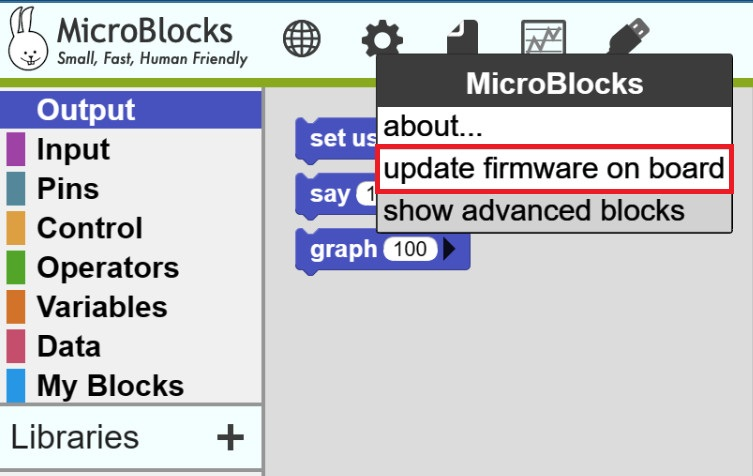
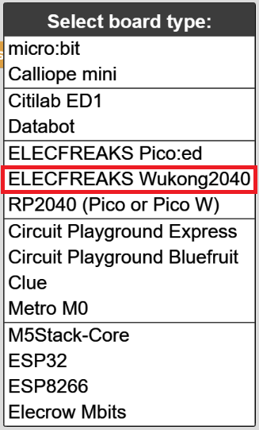
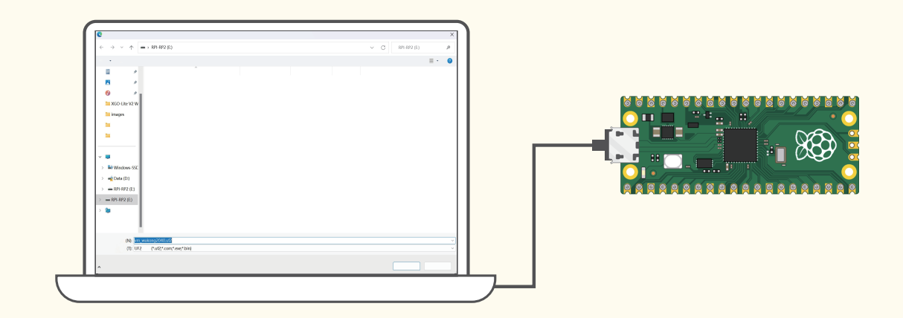
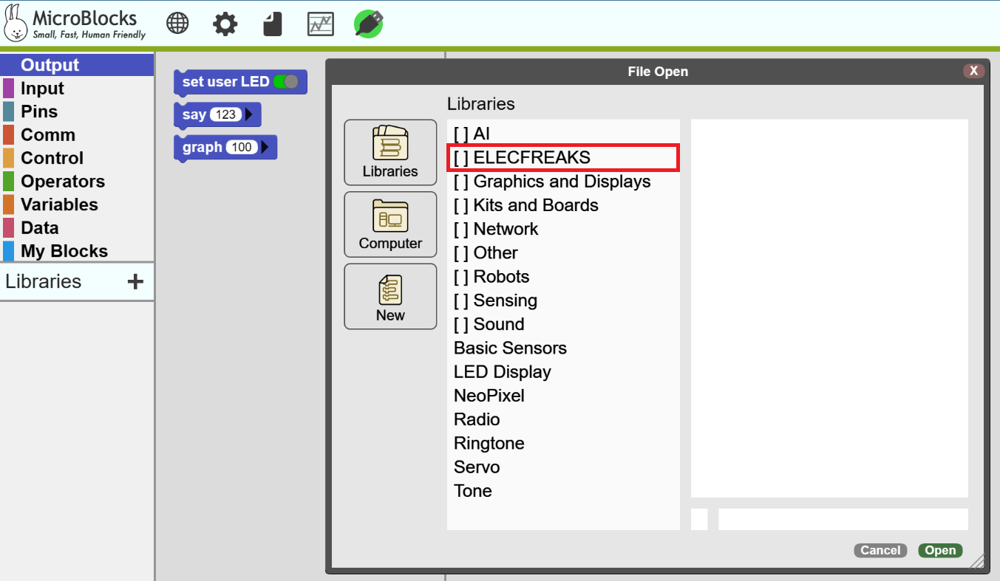
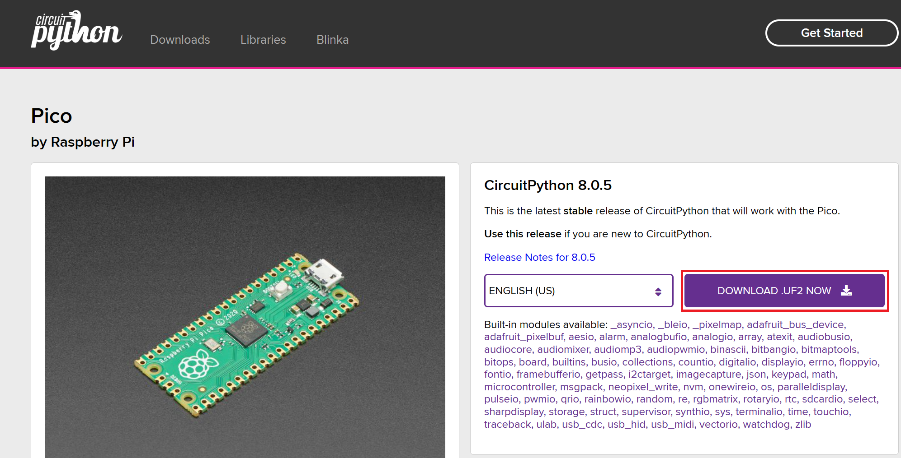
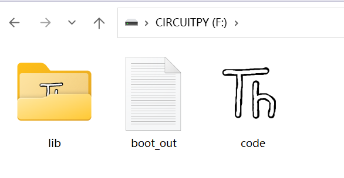
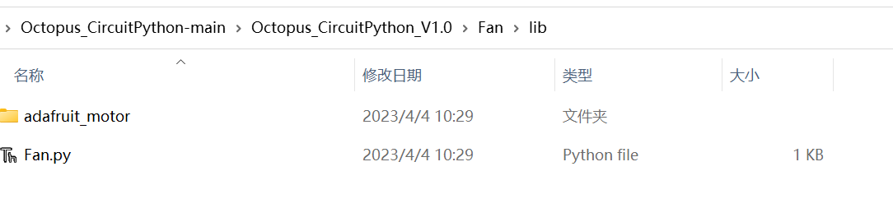
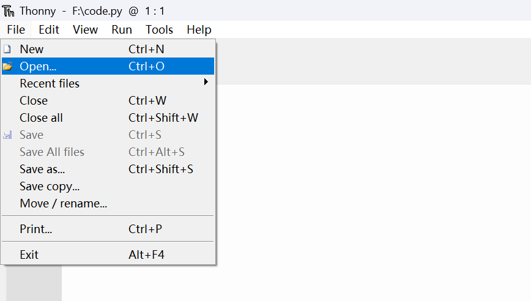
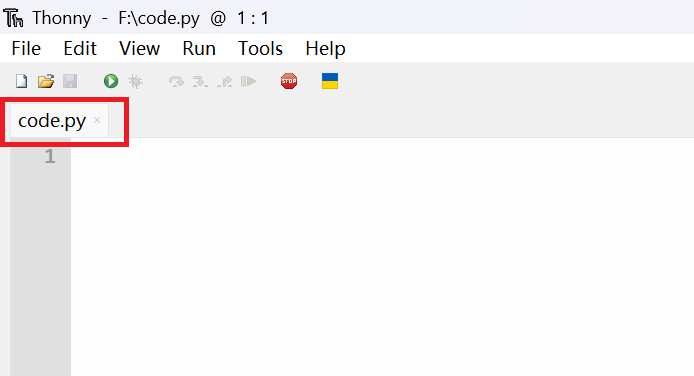

# Programming Environment Preparation

Wukong2040 Inventor Kit can use **MicroBlocks graphical programming** or **CircuitPython code programming**, you can choose a programming method and complete the programming environment preparation.

## Programming method 1: MicroBlocks platform programming preparation

### MicroBlocks Introduction

MicroBlocks is an open graphical programming platform for learning programming knowledge while interacting with microcontrollers. While MicroBlocks is just one of many graphical programming platforms, what really makes MicroBlocks stand out is its combination of real-time compilation and autonomous operation.

Its outstanding features are mainly：

* MicroBlocks is a real-time programming environment, no need to wait for the program to be compiled and downloaded, click the code block, and see the running result immediately.
* MicroBlocks can write individual scripts for each component and run them simultaneously.
* MicroBlocks can run on many microcontroller motherboards, and it classifies components with the same function on different machines and controls them with the same programming method. The code you write has strong portability.
* MicroBlocks can read the program in the microcontroller board, which is convenient for you to review and share.

For more information about the MicroBlocks programming platform, you can browse its official website: [MicroBlocks](http://microblocks.fun/) official website.

* MicroBlocks platform programming preparation steps

1. Open [MicroBlocks](http://microblocks.fun/) official website: https://microblocks.fun/, click “**Run**”. (Google Chrome and Edge browsers are recommended)

2. After clicking the "**gear**" icon in the menu bar, select "**update firmware on board**".

3. In the firmware selection window that appears, select "**ELECFREAKS Wukong2040**", and in the window that appears, prompt us to do the following:

Connect the computer with the USB data cable, press and hold the **BOOTSEL** button of the Raspberry pi pico **do not let go**, and insert the USB interface of the USB data cable into the USB interface of the Raspberry pi pico, and the "RPI-RP2" disk will appear At this time, you can release the **BOOTSEL** button of Raspberry pi pico. Return to the MicroBlocks platform, click the microblocks platform "OK", and save the file to the RPI-RP2 disk.

4. In the menu bar of the microblocks platform, click "**Connect**" (USB icon), select the port and connect, wait for the connection to complete, and the following icon will appear to indicate the connection is successful.

5. Click the "+" add library button on the right side of "Libraries" on the left side of the microblocks platform, and add the "Octopus" library file in the "ELECFREAKS" directory. At this point, the programming environment on the microblocks platform is ready.

6. When you start programming and verifying the project, turn on the power switch button of the wukong2040 expansion board (when not in use, please turn off the power to save electricity):

### Programming method 2: Thonny platform programming environment preparation

1. Open Thonny official website: https://thonny.org and download the matching software version according to your computer system and install the software after the download is complete:

2. Open Thonny, select "Tool" in the menu bar, select "Options" in the options, on the page that appears, under the "Interpreter" option, select "CircuitPython(generic)" for the interpreter, and "< Try to detect port for the port automatically >" and finally click "OK".

3. Download the Raspberry pi pico firmware from the CircuitPython official website: https://circuitpython.org/board/raspberry_pi_pico/.

4. Download the Raspberry pi pico firmware from the CircuitPython official website: https://circuitpython.org/board/raspberry_pi_pico/：

5. Download in Github:
   Wukong2040 library file：https://github.com/elecfreaks/EF_Product_CircuitPython

Octopus_CircuitPython library file：https://github.com/elecfreaks/Octopus_CircuitPython

6. Unzip the downloaded file, open the unzipped file, and copy (all) the files (all) in the lib directory in the Fan folder to the **lib** directory under "CIRCUITPY(F:)".

7. Similarly, find the file shown in the figure below in the decompressed folder and put it into the **lib** directory under "CIRCUITPY(F:)". And place the font5x8.bin file in the OLED library directory in the main directory， As shown below:

8. The CircuitPython interpreter loads and runs the code.py file by default, so we need to use Thonny to open the code.py file in "CIRCUITPY(F:)" and put the project code you want to write into this file to run.

9. When you start programming and verifying the project, turn on the power switch button of the wukong2040 expansion board (when not in use, please turn off the power to save electricity):

